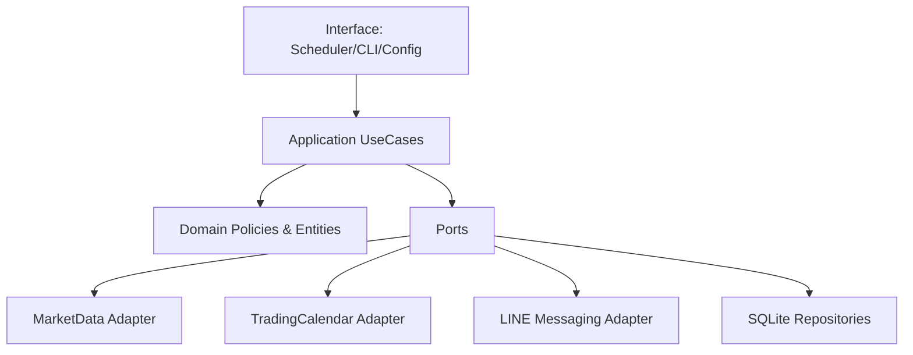
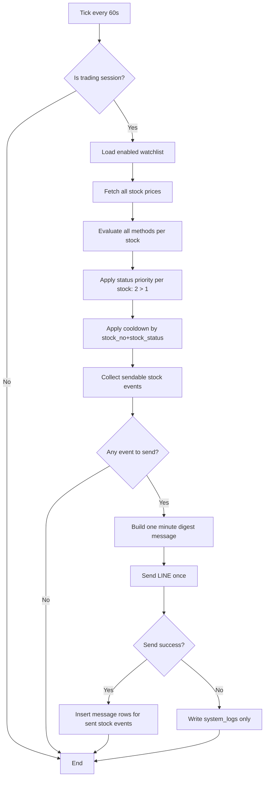
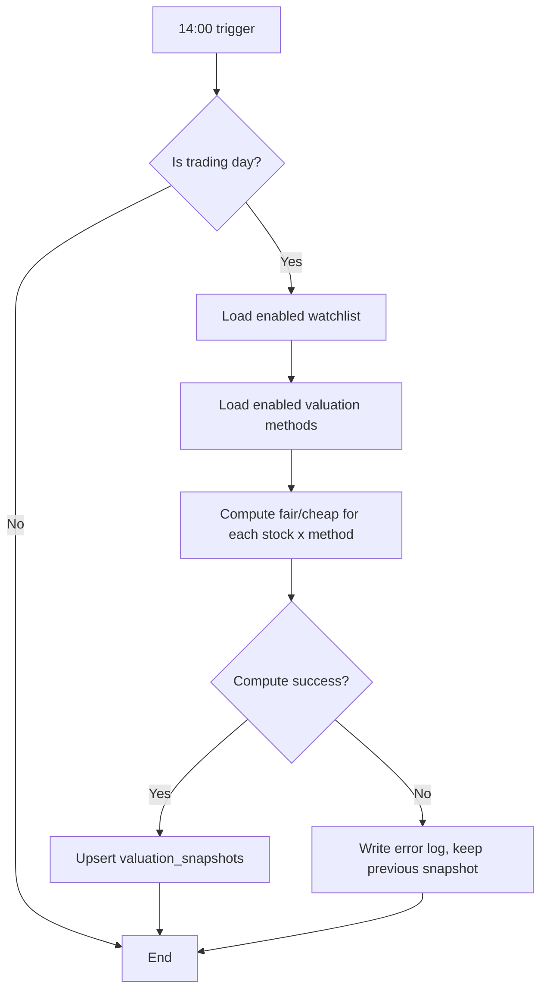

# EDD - 台股監控與 LINE 通知系統

版本：v0.5  
日期：2026-04-10  
對齊文件：[PDD_Stock_Monitoring_System.md](c:/Projects/stock/PDD_Stock_Monitoring_System.md)

變更摘要（v0.5）：
- `message.methods_hit` 約束加嚴為 JSON array（`json_valid + json_type='array'`）。
- 補齊 `MAX_RETRY_COUNT`、`STALE_THRESHOLD_SEC` 執行參數。
- 明確定義 LINE canonical/alias 環境變數與優先序。

變更摘要（v0.4）：
- 明確區分「冷卻鍵」與「同分鐘冪等唯一鍵」語意。
- `message` 寫入策略由純 `DO NOTHING` 升級為可提升狀態的 `DO UPDATE`。
- 補充 JSON1 不可用時的 fail-fast 規則。
- 補上「LINE 成功但 DB 失敗」補償機制與測試案例。

版本歷史：
| Version | Date | Migration Impact | Notes |
|---|---|---|---|
| v0.2 | 2026-04-10 | baseline | 初版 EDD（含單一彙總訊息與 schema） |
| v0.3 | 2026-04-10 | requires migration verification | 冷卻/冪等語意分離、upsert 升級、JSON1/rollback 規範 |
| v0.4 | 2026-04-10 | requires migration verification | 補償流程、DB 硬約束、格式檢核強化 |
| v0.5 | 2026-04-10 | requires migration verification | methods_hit JSON array 約束、參數顯式化、LINE 命名相容規則 |

## 1. 目的與範圍
本文件定義工程實作細節，交付目標：
1. 盤中每分鐘監控台股價格。
2. 低於合理價/便宜價時發 LINE 群組通知。
3. 同 `stock_no + stock_status` 5 分鐘冷卻。
4. 每交易日 14:00 執行估值計算並落地 SQLite。
5. 多估值方法可啟停，結果按股票+方法寫入。
6. 每分鐘只發一封彙總訊息（含多股票/多方法命中）。

## 2. 關鍵業務規則（定版）
### 2.1 訊號狀態
- `stock_status=1`：低於合理價（below fair）
- `stock_status=2`：低於便宜價（below cheap）

### 2.2 狀態優先序
- 若同時符合 1 與 2，**只發 2**（2 優先）。
- 理由：達便宜價必然達合理價，2 才是當下重點。

### 2.3 多方法命中規則
- 同一分鐘，同一股票若多方法都符合 `status=1`，只產生一個股票層級訊號（status=1），訊息內附「命中方法清單」。
- 同一分鐘，同一股票若有方法命中 `status=1` 且另有方法命中 `status=2`，統一產生 `status=2`，訊息內附完整命中方法清單。

### 2.4 冷卻規則
- 冷卻鍵：`stock_no + stock_status`
- 冷卻窗：5 分鐘
- 5 分鐘內命中相同鍵，不發送、不更新 `message` 表。
- `message` 表的 `UNIQUE(stock_no, minute_bucket)` 僅用於同分鐘冪等保護，不取代冷卻判斷。
- 範例：
  - 第 1 分鐘命中 `2330+1`，第 2 分鐘又命中 `2330+1`（即便方法不同） -> 不發。
  - 第 1 分鐘命中 `2330+1`，第 2 分鐘命中 `2330+2` -> 可發。

### 2.5 每分鐘單一訊息
- 每分鐘先收集所有股票訊號，組成單一彙總訊息後發送一次。
- 不做並發發送。
- 發送失敗：只寫 log，不寫 `message` 表。
- 發送成功後寫入 `message` 表時，需使用單一 DB transaction 一次提交該分鐘所有股票事件。
- 若 LINE 已成功但 DB transaction 失敗，需寫入本機補償佇列（JSONL），並在補償完成前視同已通知，避免重複提醒。

## 3. 架構總覽（Clean Architecture）
### 3.1 文字架構圖
```text
+-------------------- Interface Layer --------------------+
| Scheduler(1m/14:00) | CLI | Config | Logger            |
+--------------------------+------------------------------+
                           |
                           v
+-------------------- Application Layer ------------------+
| CheckIntradayPriceUseCase                               |
| RunDailyValuationUseCase                                |
| ComposeMinuteDigestUseCase                              |
+--------------------------+------------------------------+
                           |
                 (Ports / Interfaces)
                           |
                           v
+---------------------- Domain Layer ---------------------+
| Entities: Stock, SignalEvent, ValuationSnapshot         |
| Policies: SignalPolicy, CooldownPolicy, PriorityPolicy  |
+--------------------------+------------------------------+
                           |
                           v
+------------------ Infrastructure Layer -----------------+
| MarketDataAdapter | TradingCalendarAdapter | LineAdapter |
| Sqlite repositories (watchlist, valuation, message, log) |
+---------------------------------------------------------+
```

### 3.2 Mermaid 架構圖


## 4. 流程設計
### 4.1 盤中每分鐘流程


### 4.2 14:00 日結估值流程


## 5. 交易日與開盤判斷
### 5.1 基本規則
- 時區：`Asia/Taipei`
- 週六、週日：非交易日
- 參考台灣政府行事曆（假日）判斷休市
- 開市確認用「**大盤資訊**」而非個股資訊

### 5.2 開盤可交易判斷（簡化）
- 08:45 後開始檢查大盤資料來源是否有當日新資料。
- 09:00 後若大盤仍無當日新資料，視為當日不開市。
- 若資料源故障（非休市）需寫 `system_logs`，避免靜默誤判。
- 若大盤資料來源逾時或不可用，該分鐘直接跳過訊號判斷與通知發送，並寫入 `WARN` log。

## 6. 資料模型（SQLite，含欄位型別）
### 6.1 `watchlist`
```sql
CREATE TABLE IF NOT EXISTS watchlist (
  stock_no TEXT PRIMARY KEY,                     -- ex: '2330'
  manual_fair_price NUMERIC NOT NULL CHECK (manual_fair_price > 0),
  manual_cheap_price NUMERIC NOT NULL CHECK (manual_cheap_price > 0),
  enabled INTEGER NOT NULL DEFAULT 1 CHECK (enabled IN (0,1)),
  created_at INTEGER NOT NULL,                   -- epoch seconds (UTC)
  updated_at INTEGER NOT NULL,                   -- epoch seconds (UTC)
  CHECK (manual_cheap_price <= manual_fair_price)
);
```

### 6.2 `valuation_methods`
```sql
CREATE TABLE IF NOT EXISTS valuation_methods (
  method_name TEXT NOT NULL,                     -- ex: 'pe_band'
  method_version TEXT NOT NULL,                  -- ex: 'v1'
  enabled INTEGER NOT NULL DEFAULT 1 CHECK (enabled IN (0,1)),
  created_at INTEGER NOT NULL,
  updated_at INTEGER NOT NULL,
  PRIMARY KEY (method_name, method_version)
);

-- Hard constraint:
-- 同一 method_name 同時只允許一個 enabled=1
CREATE UNIQUE INDEX IF NOT EXISTS ux_method_single_enabled
ON valuation_methods(method_name)
WHERE enabled = 1;
```

### 6.3 `valuation_snapshots`
```sql
CREATE TABLE IF NOT EXISTS valuation_snapshots (
  id INTEGER PRIMARY KEY AUTOINCREMENT,
  stock_no TEXT NOT NULL,
  trade_date TEXT NOT NULL,                      -- YYYY-MM-DD (Asia/Taipei)
  method_name TEXT NOT NULL,
  method_version TEXT NOT NULL,
  fair_price NUMERIC NOT NULL CHECK (fair_price > 0),
  cheap_price NUMERIC NOT NULL CHECK (cheap_price > 0),
  created_at INTEGER NOT NULL,
  CHECK (cheap_price <= fair_price),
  UNIQUE(stock_no, trade_date, method_name, method_version),
  FOREIGN KEY (stock_no) REFERENCES watchlist(stock_no),
  FOREIGN KEY (method_name, method_version)
    REFERENCES valuation_methods(method_name, method_version)
);

CREATE INDEX IF NOT EXISTS idx_vs_stock_trade_date
ON valuation_snapshots(stock_no, trade_date);
```

### 6.4 `message`
```sql
CREATE TABLE IF NOT EXISTS message (
  id INTEGER PRIMARY KEY AUTOINCREMENT,
  stock_no TEXT NOT NULL,
  message TEXT NOT NULL,
  stock_status INTEGER NOT NULL CHECK (stock_status IN (1,2)),
  methods_hit TEXT NOT NULL
    CHECK (
      json_valid(methods_hit)
      AND json_type(methods_hit) = 'array'
    ),                                           -- JSON array string, ex: ["pe_band","ma_gap"]
  minute_bucket TEXT NOT NULL
    CHECK (
      length(minute_bucket) = 16
      AND minute_bucket GLOB '[0-9][0-9][0-9][0-9]-[0-9][0-9]-[0-9][0-9] [0-9][0-9]:[0-9][0-9]'
      AND substr(minute_bucket,5,1) = '-'
      AND substr(minute_bucket,8,1) = '-'
      AND substr(minute_bucket,11,1) = ' '
      AND substr(minute_bucket,14,1) = ':'
    ),                                           -- fixed format: YYYY-MM-DD HH:mm (Asia/Taipei)
  update_time INTEGER NOT NULL,                 -- epoch seconds (UTC)
  FOREIGN KEY (stock_no) REFERENCES watchlist(stock_no),
  UNIQUE(stock_no, minute_bucket)
);

CREATE INDEX IF NOT EXISTS idx_message_cooldown
ON message(stock_no, stock_status, update_time DESC);
```

### 6.5 `pending_delivery_ledger`（補償佇列，JSONL 對應）
```sql
CREATE TABLE IF NOT EXISTS pending_delivery_ledger (
  id INTEGER PRIMARY KEY AUTOINCREMENT,
  minute_bucket TEXT NOT NULL,
  payload_json TEXT NOT NULL CHECK (json_valid(payload_json)),
  status TEXT NOT NULL CHECK (status IN ('PENDING','RECONCILED','FAILED')),
  retry_count INTEGER NOT NULL DEFAULT 0 CHECK (retry_count >= 0),
  last_error TEXT,
  created_at INTEGER NOT NULL,
  updated_at INTEGER NOT NULL
);

CREATE INDEX IF NOT EXISTS idx_pending_delivery_status
ON pending_delivery_ledger(status, updated_at);
```

### 6.6 `system_logs`
```sql
CREATE TABLE IF NOT EXISTS system_logs (
  id INTEGER PRIMARY KEY AUTOINCREMENT,
  level TEXT NOT NULL CHECK (level IN ('INFO','WARN','ERROR')),
  event TEXT NOT NULL,
  detail TEXT,
  created_at INTEGER NOT NULL                   -- epoch seconds (UTC)
);
```

## 7. LINE Messaging API 設計
### 7.1 環境變數
- 規範名（Canonical）：
  - `LINE_CHANNEL_ACCESS_TOKEN`
  - `LINE_TO_GROUP_ID`
- 相容別名（Legacy alias）：
  - `CHANNEL_ACCESS_TOKEN`
  - `TARGET_GROUP_ID`
- 若規範名與別名同時存在，優先使用規範名。

### 7.2 每分鐘彙總訊息範例
```text
[Stock Minute Digest] 2026-04-10 10:21 +08:00

1) 2330 | status=2 (below_cheap)
   market=998 | fair=1500 | cheap=1000
   methods_hit=[manual_rule, pe_band_v1]

2) 2317 | status=1 (below_fair)
   market=142 | fair=145 | cheap=130
   methods_hit=[manual_rule, pb_band_v2]
```

### 7.3 發送與寫庫規則
- 每分鐘最多發 1 封 LINE 訊息。
- 發送成功後，才寫入 `message` 表（每個股票事件一筆）。
- `message` 寫入需在同一 transaction 完成；任一筆失敗則整批 rollback。
- 寫入策略採 `INSERT ... ON CONFLICT(stock_no, minute_bucket) DO UPDATE`：
  - 當 `excluded.stock_status > message.stock_status`（2 蓋 1）時更新。
  - 或同狀態但 `methods_hit/message` 不同時更新為該分鐘最終聚合內容。
  - `methods_hit`、`message`、`update_time` 同步更新為新值。
  - `methods_hit` 一律覆蓋為「該分鐘最終聚合結果」（去重 + 排序後 JSON array）。
- 參考 SQL（語意示意）：
```sql
INSERT INTO message(stock_no, message, stock_status, methods_hit, minute_bucket, update_time)
VALUES (?, ?, ?, ?, ?, ?)
ON CONFLICT(stock_no, minute_bucket) DO UPDATE SET
  stock_status = excluded.stock_status,
  methods_hit  = excluded.methods_hit,
  message      = excluded.message,
  update_time  = excluded.update_time
WHERE excluded.stock_status > message.stock_status
   OR (excluded.stock_status = message.stock_status
       AND (excluded.methods_hit <> message.methods_hit
            OR excluded.message <> message.message));
```
- `minute_bucket` 必須由 `TimeBucketService` 單一入口產生，不得在多處自行拼字串。
- 發送失敗：不寫 `message`，只寫 `system_logs`。

### 7.5 補償機制（LINE 成功、DB 失敗）
- 情境：LINE API 回傳成功，但 `message` transaction rollback。
- 動作：
  1. 立即寫入 `pending_delivery_ledger`（若 DB 可寫）或 fallback 到 `logs/pending_delivery.jsonl`。
  2. 補償 worker 定期重試將該批事件回補進 `message` 表。
  3. 冷卻判斷需同時檢查 `message` 與 `pending_delivery_ledger/jsonl`，補償完成前視同已通知。
- 目標：避免「已通知但無落盤」造成 5 分鐘內重複通知。

### 7.4 冷卻查詢規格（固定）
- 冷卻判斷查詢：
```sql
SELECT MAX(update_time) AS last_sent_at
FROM message
WHERE stock_no = ?
  AND stock_status = ?;
```
- 判斷條件：`now_utc_epoch - last_sent_at < 300` 則視為冷卻中，不發送。
- 若 `last_sent_at IS NULL`，視為可發送。
- `now_utc_epoch` 由應用層統一提供（UTC 秒），避免多處時間源不一致。

## 8. 設定檔與執行參數
```env
APP_TZ=Asia/Taipei
DB_PATH=./data/stock_monitor.db
PRICE_CHECK_INTERVAL_SEC=60
NOTIFY_COOLDOWN_MIN=5
MAX_RETRY_COUNT=3
STALE_THRESHOLD_SEC=90
TRADING_START=09:00
TRADING_END=13:30
DAILY_VALUATION_TIME=14:00
OPEN_CHECK_START=08:45
PENDING_DELIVERY_LOG_PATH=./logs/pending_delivery.jsonl

LINE_CHANNEL_ACCESS_TOKEN=...
LINE_TO_GROUP_ID=...
```

### 8.1 執行環境前置條件
- SQLite 版本需支援 JSON1（供 `json_valid()`、`json_type()` 約束使用）。
- DB 連線初始化必須執行：`PRAGMA foreign_keys = ON;`
- 啟動健康檢查需回報：
  - `foreign_keys` 是否為 `ON`
  - JSON1 是否可用（例如 `SELECT json_valid('[]')` 成功）
- 若 JSON1 不可用，採 **fail-fast**：服務啟動失敗並輸出明確錯誤，禁止自動降級。

## 9. Phase 規劃
### Phase 1（手動門檻）
- 使用 `watchlist.manual_fair_price/manual_cheap_price`。
- 支援多股票，但先以 `2330` 驗證主流程。
- 完成「每分鐘單一彙總訊息 + 冷卻 + status 2 優先」。

### Phase 2（多估值方法）
- 估值方法介面：
  - `compute(stock_no, trade_date) -> {fair_price, cheap_price}`
- 方法開關採全域（方法本身是否參與計算），不做每股方法開關。
- 估值結果按 `stock_no + method_name + method_version + trade_date` 寫入快照。

## 10. 測試計畫（補強版）
### 10.1 單元測試
- `PriorityPolicy`：同時命中 1/2 時只保留 2。
- `CooldownPolicy`：
  - `2330+1` 5 分鐘內重複命中 -> 不發
  - `2330+1` 後 `2330+2` -> 可發
- `DigestComposer`：同分鐘多股票/多方法合併為單一訊息。
- `TimeBucketService`：唯一入口產生 `minute_bucket`（`YYYY-MM-DD HH:mm`, Asia/Taipei）。

### 10.2 整合測試
- 同分鐘多股票多方法命中 -> LINE 只呼叫一次。
- LINE 發送失敗 -> `message` 無新增、`system_logs` 有 ERROR。
- 日結估值部分方法失敗 -> 失敗方法不覆蓋舊值，其它方法正常寫入。
- `message` 批次寫入時模擬中途失敗 -> 驗證整批 rollback（該分鐘 0 筆落庫）。
- `status=1` 先寫入後同分鐘升級 `status=2` -> 最終僅保留 `status=2`，內容為最終聚合結果。
- LINE 成功但 DB 寫入失敗 -> 建立補償紀錄，下一分鐘不重複發送，回補成功後 ledger 狀態為 `RECONCILED`。

### 10.3 UAT 對齊
- 依 PDD 驗收條件逐條驗證，外加「每分鐘只一封」。

## 11. 開發任務拆解
1. 建立 domain policies：`SignalPolicy`, `PriorityPolicy`, `CooldownPolicy`。
2. 建立 SQLite migration（使用本 EDD 型別與 constraint）。
3. 實作 `CheckIntradayPriceUseCase` 與 `ComposeMinuteDigestUseCase`。
4. 實作 `LineMessagingApiAdapter`（單次發送）。
5. 實作 `pending_delivery` 補償 worker（ledger/jsonl 重試回補）。
6. 實作 `RunDailyValuationUseCase`（14:00, fail-no-overwrite）。
7. 補齊單元與整合測試。

## 12. 交付物
1. 可執行 worker（本機）。
2. SQLite schema/migration。
3. `.env.example`。
4. 操作與排障文件。
