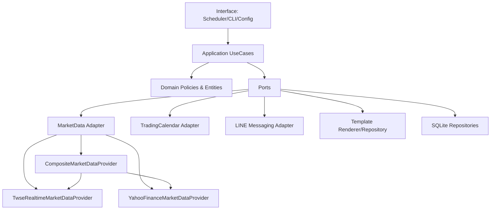
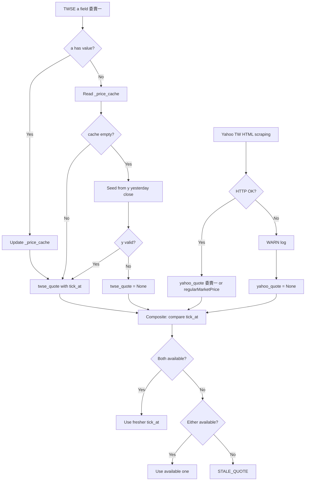
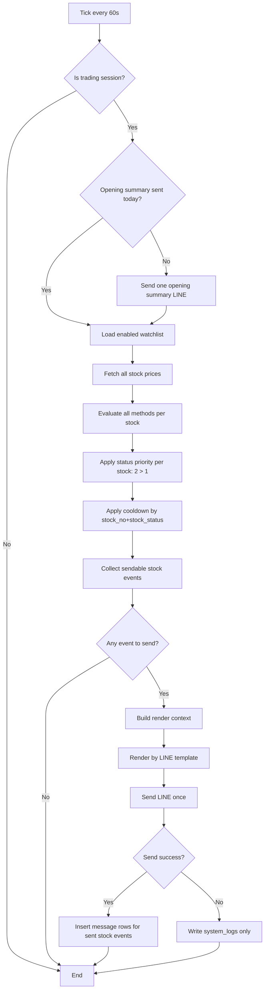
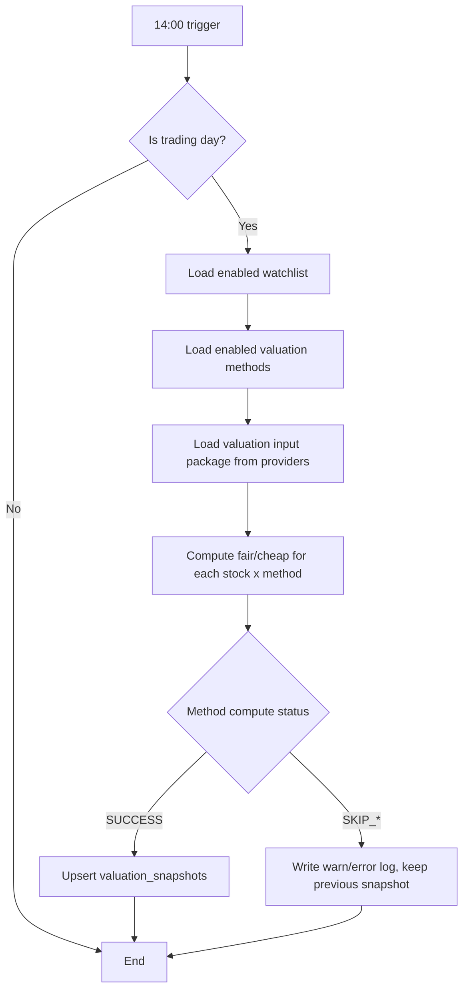
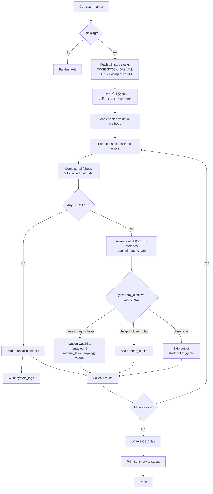
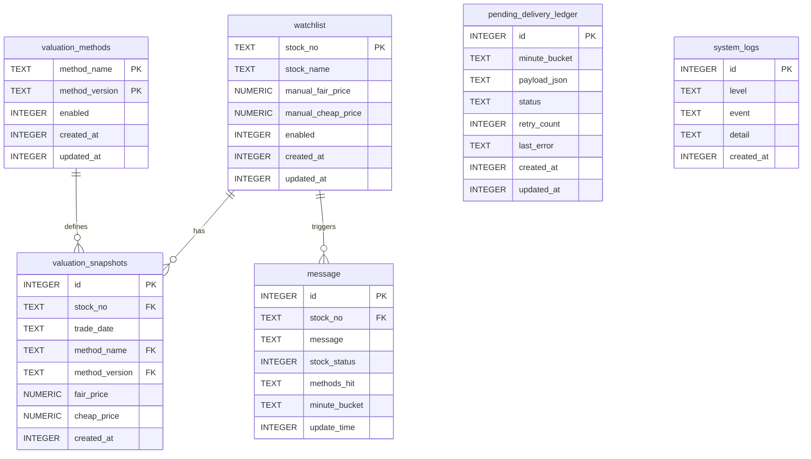
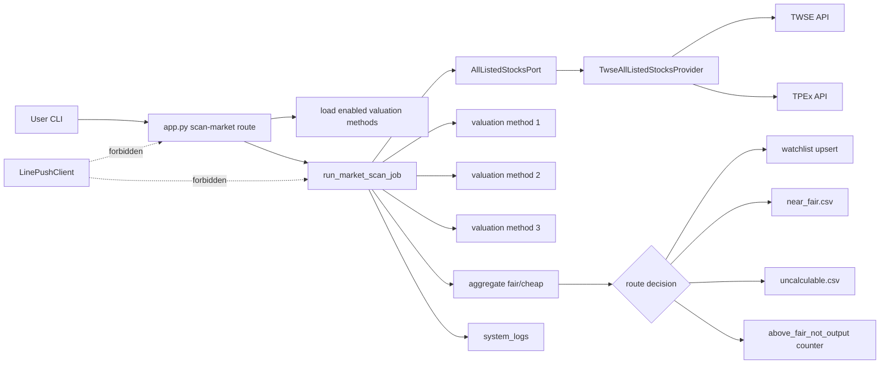
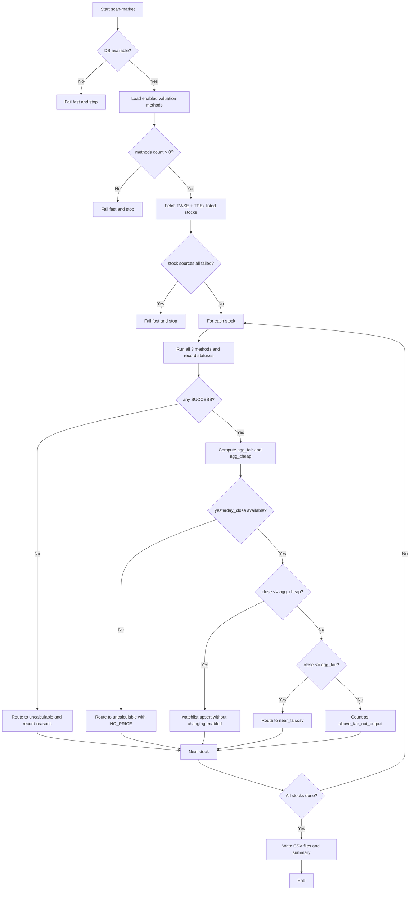
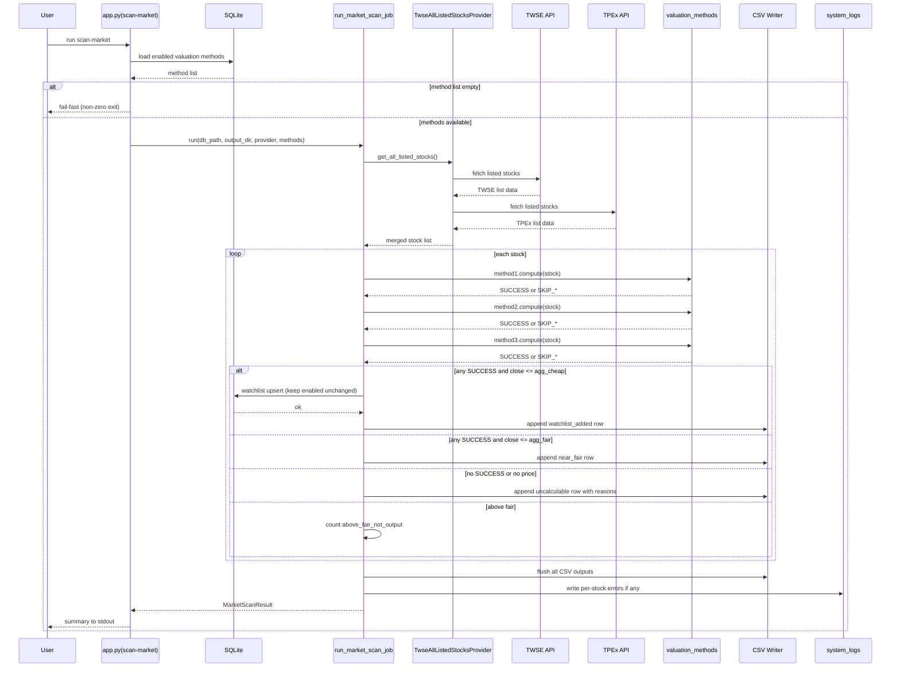
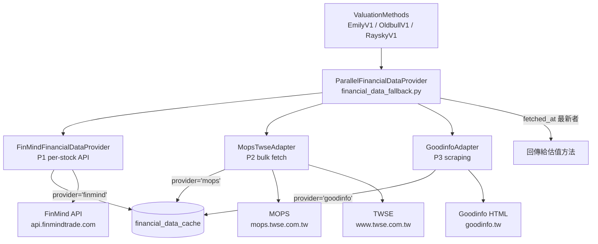

# EDD - 台股監控與 LINE 通知系統

版本：v1.6  
日期：2026-04-17  
對齊文件：[PDD_Stock_Monitoring_System.md](PDD_Stock_Monitoring_System.md)

變更摘要（v1.6）：
- 新增 §9.4 三源平行財務資料備援架構（PDD FR-21）：FinMind（P1）、MOPS+TWSE（P2）、Goodinfo（P3）三源同時執行，`fetched_at` 最新者勝。
- 新增 `ProviderUnavailableError` 例外與 `FinancialDataPort` Protocol（`stock_monitor/adapters/financial_data_port.py`）。
- 新增 `SWRCacheBase` 抽象基底類別（`stock_monitor/adapters/financial_data_cache.py`），三個 Adapter 共用。
- 新增 `MopsTwseAdapter` 規格（P2 bulk-fetch，`stock_monitor/adapters/financial_data_mops.py`）。
- 新增 `GoodinfoAdapter` 規格（P3 per-stock scraping，`stock_monitor/adapters/financial_data_goodinfo.py`）。
- 新增 `ParallelFinancialDataProvider` 規格（`stock_monitor/adapters/financial_data_fallback.py`）：三源並行 + `fetched_at` 最新優先。
- **更新 `financial_data_cache` Schema**：加入 `provider TEXT NOT NULL` 欄位；PRIMARY KEY 從 `(stock_no, dataset)` 改為 `(provider, stock_no, dataset)`；舊資料以 Migration 補 `provider='finmind'`。
- 更新 §16 為 FinMind SWR Cache + 三源架構完整規格（§16.1 Schema、§16.7 Symbol Contract）。
- 新增 §17 三源平行財務資料 — 完整工程規格。
- 更新 Symbol Contract 新增 `FinancialDataPort`、`ProviderUnavailableError`、`SWRCacheBase`、`MopsTwseAdapter`、`GoodinfoAdapter`、`ParallelFinancialDataProvider`。

變更摘要（v1.5）：
- 新增 CR-SEC-06：macOS launchd plist 禁止明文存放 LINE token；改由 `start_daemon.sh` 在執行時從 macOS Keychain 取出。
- 新增 CR-SEC-07：Windows 禁止以 `setx` 將 LINE token 寫入 registry；改存 Windows Credential Manager，由 `start_daemon.ps1` 在執行時以 `Get-StoredCredential` 取出。
- 更新 §15.5 macOS 排程設計：移除 plist `EnvironmentVariables` token 注入，改為 Keychain 取值說明。
- 新增 §15.9 Windows 排程安全設計（Credential Manager）。
- §15.7 CR 禁止清單新增 CR-SEC-06、CR-SEC-07。

變更摘要（v1.2）：
- 新增 §15 FR-20 macOS / Windows 雙平台相容工程設計。

變更摘要（v1.4）：
- 新增 §9.3 `FinMindFinancialDataProvider` 完整設計規格（SWR cache、dataset 對映、ROC 年份/EPS 加總/Liabilities/NT$ 四項實作約束、ETF 降級、db_path 傳遞路徑）。
- 更新 §14.6 Symbol Contract 新增 `FinMindFinancialDataProvider`、`EmilyCompositeV1`、`OldbullDividendYieldV1`、`RayskyBlendedMarginV1`。
- 新增 §16 FinMind 財務資料 SWR Cache 實作。

變更摘要（v1.3）：
- 新增 §15 FR-20 macOS / Windows 雙平台相容工程設計。

變更摘要（v1.1）：
- 新增 §4.3 全市場估値掃描流程（FR-19）。
- 新增 §14 FR-19 全市場估値揃描設計規格（新 CLI 指令、Port、Adapter、Use Case、輸出規格）。
- 更新 §1 範圍加入 FR-19 目標。
- 新增 `AllListedStocksPort` 與 `TwseAllListedStocksProvider` 到架構層設計。
- 新增 `market_scan.run_market_scan_job` 到 symbol contract。

變更摘要（v0.9）：
- 新增 §3.3 雙行情來源架構（`YahooFinanceMarketDataProvider`、`CompositeMarketDataProvider`）。
- 新增 §3.4 Freshness-First 取捨規則說明。
- 新增 §8.2 Yahoo Finance adapter 設定參數。
- 更新 §1 目的範圍：加入 FR-15/FR-16 雙行情來源。
- 更新 §3.1/3.2 架構圖納入 Yahoo adapter 與 Composite adapter。
- 新增 §13.5 品質改善行動：CR-ADP-01、CR-ADP-02。

變更摘要（v0.7）：
- 新增 FR-14 對齊：LINE 訊息改為 Template-driven 渲染規格（不得在業務程式寫死完整文案）。
- 開盤摘要訊息改為支援手機友善精簡模板（例：`台積電(2330) 手動 2000/1500`）。
- 補充模板設定鍵、渲染失敗處理、測試對應。

變更摘要（v0.6）：
- 納入三方法基線：`emily_composite_v1`、`oldbull_dividend_yield_v1`、`raysky_blended_margin_v1`。
- 新增估值資料來源主備援與資料充分性規則（每日可計算）。
- 新增估值方法執行狀態規格：`SUCCESS / SKIP_INSUFFICIENT_DATA / SKIP_PROVIDER_ERROR`。

變更摘要（v0.5）：
- `message.methods_hit` 約束加嚴為 JSON array（`json_valid + json_type='array'`）。
- 補齊 `MAX_RETRY_COUNT`、`STALE_THRESHOLD_SEC` 執行參數。
- 明確定義 LINE canonical/alias 環境變數與優先序。

變更摘要（v0.4）：
- 明確區分「冷卻鍵」與「同分鐘冪等唯一鍵」語意。
- `message` 寫入策略由純 `DO NOTHING` 升級為可提升狀態的 `DO UPDATE`。
- 補充 JSON1 不可用時的 fail-fast 規則。
- 補上「LINE 成功但 DB 失敗」補償機制與測試案例。

版本歷史：
| Version | Date | Migration Impact | Notes |
|---|---|---|---|
| v0.2 | 2026-04-10 | baseline | 初版 EDD（含單一彙總訊息與 schema） |
| v0.3 | 2026-04-10 | requires migration verification | 冷卻/冪等語意分離、upsert 升級、JSON1/rollback 規範 |
| v0.4 | 2026-04-10 | requires migration verification | 補償流程、DB 硬約束、格式檢核強化 |
| v0.5 | 2026-04-10 | requires migration verification | methods_hit JSON array 約束、參數顯式化、LINE 命名相容規則 |
| v0.6 | 2026-04-13 | no schema break | 三方法估值規格、資料來源充分性、日結狀態規範 |
| v0.7 | 2026-04-14 | no schema break | LINE 訊息模板化（FR-14）、開盤摘要手機友善模板規格 |
| v0.8 | 2026-04-14 | no schema break | Code Review 品質改善定版：安全強化（token repr、時區驗證、HTTP 回應邊界）、架構對齊（Calculator → application 層、render 單一入口、SRP）、API 清潔（MinuteCycleConfig、開盤摘要 DB 冪等、觸發容錯）|
| v0.9 | 2026-04-14 | no schema break | 雙行情來源架構：新增 `YahooFinanceMarketDataProvider`（HTML scraping）、`CompositeMarketDataProvider`（Freshness-First）；`TwseRealtimeMarketDataProvider` 加入 `_price_cache` 與 `ex` 快取 |
| v1.0 | 2026-04-14 | no schema break | 行情 price 改為**委賣一**（最佳委賣價）：TWSE 採 `a` 欄位第一值；Yahoo 採 HTML 委賣價區塊委賣一，盤後 fallback `regularMarketPrice` |
| v1.1 | 2026-04-17 | no schema break | 新增 FR-19 全市場估值掃描：新 CLI `scan-market`、`AllListedStocksPort`、`TwseAllListedStocksProvider`、`run_market_scan_job`、CSV 輸出規格 |
| v1.5 | 2026-04-17 | no schema break | Security Review：CR-SEC-06/07 排程 token 明文禁止；macOS 改 Keychain、Windows 改 Credential Manager |
| v1.6 | 2026-04-17 | requires migration: financial_data_cache 新增 provider 欄位 + PK 變更 | 三源平行財務資料備援架構（PDD FR-21）：FinMind P1 + MOPS P2 + Goodinfo P3 三源並行，各自獨立 SWR Cache，以 fetched_at 最新為準；新 Adapter：MopsTwseAdapter、GoodinfoAdapter、ParallelFinancialDataProvider |
## 1. 目的與範圍
本文件定義工程實作細節，交付目標：
1. 盤中每分鐘監控台股價格。
2. 低於合理價/便宜價時發 LINE 群組通知。
3. 同 `stock_no + stock_status` 5 分鐘冷卻。
4. 每交易日 14:00 執行估值計算並落地 SQLite。
5. 多估值方法可啟停，結果按股票+方法寫入。
6. 每分鐘只發一封彙總訊息（含多股票/多方法命中）。
7. 每日 14:00 對三方法逐股估值，資料不足時跳過且不覆蓋舊值。
8. 每交易日開盤第一個可交易分鐘先推送「監控設定摘要」（股票/方法/fair/cheap），同日僅一次。
9. LINE 訊息文本採模板渲染，不將完整文案硬寫於業務流程程式。
10. 盤中行情採雙來源（TWSE MIS 主 + Yahoo Finance TW HTML 副），以 `tick_at` 較新者為準（Freshness-First，PDD FR-15）。行情 `price` 代表**委賣一**（最佳委賣價），反映當下可立即成交之買入價格。
11. 上市上櫃全市場估值掃描（PDD FR-19）：手動執行 CLI 命令 `scan-market`，一次計算全體普通股三方法估值，依是否低於便宜價自動 upsert 監控清單或輸出 CSV，不發送 LINE。
12. 財務資料三源平行備援（PDD FR-21）：估值計算的財務資料輸入採 FinMind（P1）、MOPS+TWSE（P2）、Goodinfo（P3）三源同時執行，各源有獨立 SWR Cache，以 `fetched_at` 最新者為準；任一源失敗不阻斷估值流程。
## 2. 關鍵業務規則（定版）
### 2.1 訊號狀態
- `stock_status=1`：低於合理價（below fair）
- `stock_status=2`：低於便宜價（below cheap）

### 2.2 狀態優先序
- 若同時符合 1 與 2，**只發 2**（2 優先）。
- 理由：達便宜價必然達合理價，2 才是當下重點。

### 2.3 多方法命中規則
- 同一分鐘，同一股票若多方法都符合 `status=1`，只產生一個股票層級訊號（status=1），訊息內附「命中方法清單」。
- 同一分鐘，同一股票若有方法命中 `status=1` 且另有方法命中 `status=2`，統一產生 `status=2`，訊息內附完整命中方法清單。

### 2.4 冷卻規則
- 冷卻鍵：`stock_no + stock_status`
- 冷卻窗：5 分鐘
- 5 分鐘內命中相同鍵，不發送、不更新 `message` 表。
- `message` 表的 `UNIQUE(stock_no, minute_bucket)` 僅用於同分鐘冪等保護，不取代冷卻判斷。
- 範例：
  - 第 1 分鐘命中 `2330+1`，第 2 分鐘又命中 `2330+1`（即便方法不同） -> 不發。
  - 第 1 分鐘命中 `2330+1`，第 2 分鐘命中 `2330+2` -> 可發。

### 2.5 每分鐘單一訊息
- 每分鐘先收集所有股票訊號，組成單一彙總訊息後發送一次。
- 不做並發發送。
- 發送失敗：只寫 log，不寫 `message` 表。
- 發送成功後寫入 `message` 表時，需使用單一 DB transaction 一次提交該分鐘所有股票事件。
- 若 LINE 已成功但 DB transaction 失敗，需寫入本機補償佇列（JSONL），並在補償完成前視同已通知，避免重複提醒。

### 2.6 開盤監控設定摘要規則
- 觸發時機：交易日第一個可交易分鐘（通常 09:00，若延後開市則為首個可交易分鐘）。
- 同一交易日僅允許發送一次；服務重啟不得重複推送同日摘要。
- 摘要內容必含：
  - 逐股票逐方法 `fair_price/cheap_price`
- 價格來源：
  - `manual_rule` 來自 `watchlist`
  - 估值方法來自 `valuation_snapshots`（取 `trade_date <= today` 的最新快照）
- 若某股票某方法無快照，仍要列出方法，價格顯示 `N/A`。
- 股票顯示格式預設為 `中文名(代號)`（例：`台積電(2330)`）。

### 2.7 LINE 訊息模板規則（FR-14）
- 所有對外發送至 LINE 的訊息都必須由模板渲染產生，包含：
  - 每分鐘彙總通知（minute digest）
  - 開盤監控設定摘要通知（opening summary）
  - 單股觸發內容列（trigger row / status 1/2）
  - 測試推播與營運驗證推播（若系統提供）
- 業務流程層只提供 render context（資料），不直接拼接最終文案字串。
- 模板需可獨立調整：
  - 不修改監控主流程程式碼即可調整文案格式。
  - 可依通道/裝置需求提供不同模板（例如 mobile compact）。
- 模板錯誤處理：
  - 模板缺失、語法錯誤、render 失敗需寫 `ERROR` log。
  - 發送路徑不得默默退回未知硬編碼格式。

### 2.8 文字檔模板設計（FR-17）

FR-14 確立「必須走模板渲染」；FR-17 在此之上要求渲染引擎可從外部純文字 `.j2` 檔讀取模板，讓非工程人員以記事本直接修改 wording，無須觸碰 Python 程式。

**Clean Architecture 層次對映**：

| 層次 | 元件 | FR-17 職責 |
|---|---|---|
| Interface Layer | 環境變數 | 透過 `LINE_TEMPLATE_DIR` 指定模板目錄 |
| Application Layer | `render_line_template_message(key, ctx)` | 唯一呼叫入口（CR-ARCH-03）；只傳 context dict，不感知 Jinja2 |
| Infrastructure Layer | `LineTemplateRenderer` / `TemplateRepository` | 持有 Jinja2 Environment，從 `.j2` 檔載入並渲染 |
| 模板檔案 | `templates/line/*.j2` | 純文字「View」層；企劃可直接編輯 |

**MVC 類比**：
- **View**：`templates/line/*.j2`（模板文字檔，企劃可編輯，不涉及 Python）
- **Model**：`context` dict（資料由 Application layer 組裝）
- **Controller**：`render_line_template_message`（渲染引擎，介面永不改變）

**目錄結構與 Key 對映**：

```
templates/
└── line/
    ├── line_trigger_row_v1.j2                    # 單股觸發列（status 1 / 2）
    ├── line_trigger_row_digest_v1.j2             # 彙總中的觸發節
    ├── line_minute_digest_v1.j2                  # 每分鐘彙總外框
    ├── line_opening_summary_mobile_compact_v1.j2 # 開盤監控設定摘要
    └── line_test_push_v1.j2                      # 測試推播
```

`template_key` 直接對應 `{key}.j2`；禁止含 `/`、`\`、`..`（路徑遍歷，OWASP A01）。

**工程實作規格**：

- **Jinja2 環境**：`Environment(loader=FileSystemLoader(template_dir), undefined=StrictUndefined, autoescape=False)`
  - LINE 為純文字，不需 HTML autoescape。
  - `StrictUndefined`：未定義變數立即報錯，禁止靜默空字串。
- **Key → 檔名**：白名單正規表達式 `^[a-z0-9_]+$`；拒絕含路徑字元的 key。
- **目錄覆蓋**：預設 `templates/line/`（相對 working directory）；可由 `LINE_TEMPLATE_DIR` 環境變數覆蓋。
- **Fallback**：`TemplateNotFound` → fallback 至 `message_template.py` 內嵌預設 + 寫 `WARN` log (`TEMPLATE_NOT_FOUND`)；不得靜默降格。
- **渲染失敗**：語法錯誤或 `StrictUndefined` 變數缺失 → 寫 `ERROR` log (`TEMPLATE_RENDER_FAILED`)；不得送出硬編碼未知格式。
- **介面不變**：`render_line_template_message(template_key: str, context: dict) -> str` 簽名永不改變（CR-ARCH-03）。

**範例 — 開盤摘要模板**（`templates/line/line_opening_summary_mobile_compact_v1.j2`）：
```
[開盤監控設定摘要] {{ trade_date }}

{{ item.display_label }}
  合理價 {{ item.fair_price }} ／ 便宜價 {{ item.cheap_price }}

監控方法：{{ m }}、
```

**範例 — 觸發通知列**（`templates/line/line_trigger_row_v1.j2`）：
```
{{ display_label }}目前{{ current_price }}，
低於便宜價{{ cheap_price }}（合理價{{ fair_price }}）
低於合理價{{ fair_price }}

```

## 3. 架構總覽（Clean Architecture）
### 3.1 文字架構圖
```text
+-------------------- Interface Layer --------------------+
| Scheduler(1m/14:00) | CLI | Config | Logger            |
+--------------------------+------------------------------+
                           |
                           v
+-------------------- Application Layer ------------------+
| CheckIntradayPriceUseCase                               |
| RunDailyValuationUseCase                                |
| ComposeMinuteDigestUseCase                              |
| RenderLineMessageUseCase                                |
+--------------------------+------------------------------+
                           |
                 (Ports / Interfaces)
                           |
                           v
+---------------------- Domain Layer ---------------------+
| Entities: Stock, SignalEvent, ValuationSnapshot         |
| Policies: SignalPolicy, CooldownPolicy, PriorityPolicy  |
+--------------------------+------------------------------+
                           |
                           v
+------------------ Infrastructure Layer -----------------+
| MarketDataAdapter | TradingCalendarAdapter | LineAdapter |
| LineTemplateRenderer | TemplateRepository                |
| Sqlite repositories (watchlist, valuation, message, log) |
+---------------------------------------------------------+
```

> **MarketDataAdapter** 由三個 class 共同實現（見 §3.3/3.4）：
> - `TwseRealtimeMarketDataProvider`（主，含 `_price_cache` 與 `ex` 快取）
> - `YahooFinanceMarketDataProvider`（副，Yahoo Finance TW HTML scraping）
> - `CompositeMarketDataProvider`（Freshness-First 聚合，注入以上兩者）

### 3.2 Mermaid 架構圖


## 3.3 雙行情來源 Adapter 規格
### TwseRealtimeMarketDataProvider
- 端點：`https://mis.twse.com.tw/stock/api/getStockInfo.jsp`
- 每次輪詢：
  - 請求所有監控股票的 `tse_{no}.tw` 與 `otc_{no}.tw` channel。
  - 解析 `a`（委賣五檔，`_` 分隔）、`tlong`（毫秒時間戳）、`n`（中文名稱）、`ex`（`tse` 或 `otc`）。
  - `a` 第一欄（`a.split('_')[0]`）= 委賣一（最佳委賣價）= 系統使用的 `price`。
  - `a` 有值 → 更新 `self._price_cache[stock_no]`；回傳 `price=委賣一`、`tick_at=tlong//1000`。
  - `a` 為空或 `-`（訂單薄短暫消失）→ 從 `self._price_cache` 讀取最後已知委賣一；若 cache 冷卻（首次輪詢），以 `y`（昨收）種子填充 cache。
  - `ex` 欄位更新 `self._exchange_cache[stock_no]`（`tse` 或 `otc`）。
  - `tlong` 更新 `self._tick_cache[stock_no]`（最後已知 tick epoch，供 Composite Freshness-First 比較）。
  - 若 cache 也為空且無 `y` 可種子 → 該股票本次輪詢不加入 quotes dict。
- 回傳格式：`dict[stock_no, {"stock_no", "price", "tick_at", "name", "exchange"}]`

### YahooFinanceMarketDataProvider
- 端點：`https://tw.stock.yahoo.com/quote/{stock_no}`（HTML scraping，不使用 v8 API）
- URL 格式：`stock_no` only，不需 `.TW`/`.TWO` suffix（TSE/OTC 均可直接查詢）
- 每次輪詢：對每個 stock_no 發 1 次 HTTP GET，讀取 server-render HTML。
- 優先解析**委賣一**：HTML 委賣價區塊：`委賣價</span><span>量</span>` 後第一個 `<span>` 的數值（去逗號）。
- 若委賣一欄位不存在（盤後/休市/版型異動）→ fallback 解析 `"regularMarketPrice":XXXX`。
- 時間戳：解析 `"regularMarketTime":XXXX`（unix seconds）作為 `tick_at`。
- HTTP 失敗（4xx/5xx/timeout）→ WARN log，回傳空 dict，不中斷主流程。
- `exchange_map` 參數接受但不做 URL 建構用途（介面相容性）。
- 回傳格式：`dict[stock_no, {"stock_no", "price", "tick_at", "name"}]`

### CompositeMarketDataProvider（Freshness-First）
- 依賴注入：`primary: TwseRealtimeMarketDataProvider`、`secondary: YahooFinanceMarketDataProvider`。
- `get_realtime_quotes(stock_nos)` 流程：
  1. 呼叫 `primary.get_realtime_quotes(stock_nos)` → `twse_quotes`。
  2. 以 `primary._exchange_cache` 建立 `exchange_map`，注入 secondary。
  3. 呼叫 `secondary.get_realtime_quotes(stock_nos)` → `yahoo_quotes`。
  4. 對每個 stock_no：
     - 若 twse 有值且 yahoo 有值：`tick_at` 較新者勝；相等時以 twse 為準。
     - 若僅 twse 有值 → 使用 twse。
     - 若僅 yahoo 有值（twse cache 空，冷啟動）→ 使用 yahoo。
     - 兩者皆無 → 不加入結果（呼叫端觸發 `STALE_QUOTE`）。
  5. 回傳同格式 dict。
- `get_market_snapshot(now_epoch)` 直接 delegate 給 `primary`。

## 3.4 取捨流程圖


## 4. 流程設計
### 4.1 盤中每分鐘流程


### 4.2 14:00 日結估值流程


### 4.3 全市場估值掃描流程（FR-19）


## 5. 交易日與開盤判斷
### 5.1 基本規則
- 時區：`Asia/Taipei`
- 週六、週日：非交易日
- 參考台灣政府行事曆（假日）判斷休市
- 開市確認用「**大盤資訊**」而非個股資訊

### 5.2 開盤可交易判斷（簡化）
- 08:45 後開始檢查大盤資料來源是否有當日新資料。
- 09:00 後若大盤仍無當日新資料，視為當日不開市。
- 若資料源故障（非休市）需寫 `system_logs`，避免靜默誤判。
- 若大盤資料來源逾時或不可用，該分鐘直接跳過訊號判斷與通知發送，並寫入 `WARN` log。

## 6. 資料模型（SQLite，含欄位型別）
### 6.1 `watchlist`
```sql
CREATE TABLE IF NOT EXISTS watchlist (
  stock_no TEXT PRIMARY KEY,                     -- ex: '2330'
  stock_name TEXT NOT NULL DEFAULT '',           -- 中文名稱，每交易日 14:00 估值時更新（FR-18）
  manual_fair_price NUMERIC NOT NULL CHECK (manual_fair_price > 0),
  manual_cheap_price NUMERIC NOT NULL CHECK (manual_cheap_price > 0),
  enabled INTEGER NOT NULL DEFAULT 1 CHECK (enabled IN (0,1)),
  created_at INTEGER NOT NULL,                   -- epoch seconds (UTC)
  updated_at INTEGER NOT NULL,                   -- epoch seconds (UTC)
  CHECK (manual_cheap_price <= manual_fair_price)
);
```

> **FR-18**：`stock_name` 欄位在每交易日 14:00 估值作業（`run_daily_valuation_job`）完成後，從即時報價取得中文名稱並 UPDATE。盤中 `run_minute_cycle` 建立 `stock_name_map` 一律讀 `watchlist.stock_name`，不再對即時報價的 `name` 欄位取值；既有資料庫以 `ALTER TABLE ... ADD COLUMN` migration 補欄，預設值為 `''`。

### 6.2 `valuation_methods`
```sql
CREATE TABLE IF NOT EXISTS valuation_methods (
  method_name TEXT NOT NULL,                     -- ex: 'emily_composite'
  method_version TEXT NOT NULL,                  -- ex: 'v1'
  enabled INTEGER NOT NULL DEFAULT 1 CHECK (enabled IN (0,1)),
  created_at INTEGER NOT NULL,
  updated_at INTEGER NOT NULL,
  PRIMARY KEY (method_name, method_version)
);

-- Hard constraint:
-- 同一 method_name 同時只允許一個 enabled=1
CREATE UNIQUE INDEX IF NOT EXISTS ux_method_single_enabled
ON valuation_methods(method_name)
WHERE enabled = 1;
```

### 6.3 `valuation_snapshots`
```sql
CREATE TABLE IF NOT EXISTS valuation_snapshots (
  id INTEGER PRIMARY KEY AUTOINCREMENT,
  stock_no TEXT NOT NULL,
  trade_date TEXT NOT NULL,                      -- YYYY-MM-DD (Asia/Taipei)
  method_name TEXT NOT NULL,
  method_version TEXT NOT NULL,
  fair_price NUMERIC NOT NULL CHECK (fair_price > 0),
  cheap_price NUMERIC NOT NULL CHECK (cheap_price > 0),
  created_at INTEGER NOT NULL,
  CHECK (cheap_price <= fair_price),
  UNIQUE(stock_no, trade_date, method_name, method_version),
  FOREIGN KEY (stock_no) REFERENCES watchlist(stock_no),
  FOREIGN KEY (method_name, method_version)
    REFERENCES valuation_methods(method_name, method_version)
);

CREATE INDEX IF NOT EXISTS idx_vs_stock_trade_date
ON valuation_snapshots(stock_no, trade_date);
```

### 6.4 `message`
```sql
CREATE TABLE IF NOT EXISTS message (
  id INTEGER PRIMARY KEY AUTOINCREMENT,
  stock_no TEXT NOT NULL,
  message TEXT NOT NULL,
  stock_status INTEGER NOT NULL CHECK (stock_status IN (1,2)),
  methods_hit TEXT NOT NULL
    CHECK (
      json_valid(methods_hit)
      AND json_type(methods_hit) = 'array'
    ),                                           -- JSON array string, ex: ["emily_composite_v1","oldbull_dividend_yield_v1"]
  minute_bucket TEXT NOT NULL
    CHECK (
      length(minute_bucket) = 16
      AND minute_bucket GLOB '[0-9][0-9][0-9][0-9]-[0-9][0-9]-[0-9][0-9] [0-9][0-9]:[0-9][0-9]'
      AND substr(minute_bucket,5,1) = '-'
      AND substr(minute_bucket,8,1) = '-'
      AND substr(minute_bucket,11,1) = ' '
      AND substr(minute_bucket,14,1) = ':'
    ),                                           -- fixed format: YYYY-MM-DD HH:mm (Asia/Taipei)
  update_time INTEGER NOT NULL,                 -- epoch seconds (UTC)
  FOREIGN KEY (stock_no) REFERENCES watchlist(stock_no),
  UNIQUE(stock_no, minute_bucket)
);

CREATE INDEX IF NOT EXISTS idx_message_cooldown
ON message(stock_no, stock_status, update_time DESC);
```

### 6.5 `pending_delivery_ledger`（補償佇列，JSONL 對應）
```sql
CREATE TABLE IF NOT EXISTS pending_delivery_ledger (
  id INTEGER PRIMARY KEY AUTOINCREMENT,
  minute_bucket TEXT NOT NULL,
  payload_json TEXT NOT NULL CHECK (json_valid(payload_json)),
  status TEXT NOT NULL CHECK (status IN ('PENDING','RECONCILED','FAILED')),
  retry_count INTEGER NOT NULL DEFAULT 0 CHECK (retry_count >= 0),
  last_error TEXT,
  created_at INTEGER NOT NULL,
  updated_at INTEGER NOT NULL
);

CREATE INDEX IF NOT EXISTS idx_pending_delivery_status
ON pending_delivery_ledger(status, updated_at);
```

### 6.6 `system_logs`
```sql
CREATE TABLE IF NOT EXISTS system_logs (
  id INTEGER PRIMARY KEY AUTOINCREMENT,
  level TEXT NOT NULL CHECK (level IN ('INFO','WARN','ERROR')),
  event TEXT NOT NULL,
  detail TEXT,
  created_at INTEGER NOT NULL                   -- epoch seconds (UTC)
);
```

### 6.7 估值輸入資料與來源規格（無新增資料表）
估值日結使用「當日可得的最新有效資料」，不要求每日都有新財報。

| 輸入欄位 | 主來源 | 備援來源 | 主要方法 |
|---|---|---|---|
| `price_history_10y` | TWSE/TPEx 歷史價格 | Yahoo Finance | 艾蜜莉歷年股價法、PE/PB 區間 |
| `avg_dividend` | MOPS 股利資訊 | TWSE 公開欄位 | 艾蜜莉股利法、股海老牛 |
| `eps_ttm` / `eps_10y_avg` | MOPS 財報 | TWSE 財報彙整 | 艾蜜莉 PE、雷司紀 PE |
| `bps_latest` / `pb_history` | MOPS 財報 | TWSE 財報彙整 | 艾蜜莉 PB、雷司紀 PB |
| `current_assets` / `total_liabilities` / `shares_outstanding` | MOPS 資產負債表與基本資料 | TWSE 公開欄位 | 雷司紀 NCAV |

資料充分性規則：
- 每方法定義 `required_fields`，缺一不可。
- 財報類資料允許沿用最近一期有效值，但必須記錄 `input_asof_date`。
- 若來源不可用或回傳空值，該方法當日狀態標記為 `SKIP_*`，且不得覆蓋既有快照。

### 6.8 ER-Model（資料表關聯圖）


## 7. LINE Messaging API 設計
### 7.1 環境變數
- 規範名（Canonical）：
  - `LINE_CHANNEL_ACCESS_TOKEN`
  - `LINE_TO_GROUP_ID`
- 相容別名（Legacy alias）：
  - `CHANNEL_ACCESS_TOKEN`
  - `TARGET_GROUP_ID`
- 若規範名與別名同時存在，優先使用規範名。
- **安全規則（CR-SEC-01）**：LINE token 持有物件（`LinePushClient`）不得透過 `repr()` 或任何 log 輸出洩漏 token 明文。實作上需設置 `field(repr=False)` 或等效保護。

### 7.2 每分鐘彙總訊息範例
```text
[Stock Minute Digest] 2026-04-10 10:21 +08:00

1) 2330 | status=2 (below_cheap)
   market=998 | fair=1500 | cheap=1000
   methods_hit=[emily_composite_v1, raysky_blended_margin_v1]

2) 2317 | status=1 (below_fair)
   market=142 | fair=145 | cheap=130
   methods_hit=[oldbull_dividend_yield_v1]
```

### 7.3 發送與寫庫規則
- 每分鐘最多發 1 封 LINE 訊息。
- 開盤摘要屬於「每日一次」通知，與每分鐘訊號通知分開計數。
- 發送成功後，才寫入 `message` 表（每個股票事件一筆）。
- `message` 寫入需在同一 transaction 完成；任一筆失敗則整批 rollback。
- 寫入策略採 `INSERT ... ON CONFLICT(stock_no, minute_bucket) DO UPDATE`：
  - 當 `excluded.stock_status > message.stock_status`（2 蓋 1）時更新。
  - 或同狀態但 `methods_hit/message` 不同時更新為該分鐘最終聚合內容。
  - `methods_hit`、`message`、`update_time` 同步更新為新值。
  - `methods_hit` 一律覆蓋為「該分鐘最終聚合結果」（去重 + 排序後 JSON array）。
- 參考 SQL（語意示意）：
```sql
INSERT INTO message(stock_no, message, stock_status, methods_hit, minute_bucket, update_time)
VALUES (?, ?, ?, ?, ?, ?)
ON CONFLICT(stock_no, minute_bucket) DO UPDATE SET
  stock_status = excluded.stock_status,
  methods_hit  = excluded.methods_hit,
  message      = excluded.message,
  update_time  = excluded.update_time
WHERE excluded.stock_status > message.stock_status
   OR (excluded.stock_status = message.stock_status
       AND (excluded.methods_hit <> message.methods_hit
            OR excluded.message <> message.message));
```
- `minute_bucket` 必須由 `TimeBucketService` 單一入口產生，不得在多處自行拼字串。
- 發送失敗：不寫 `message`，只寫 `system_logs`。

### 7.6 LINE 訊息模板規格（FR-14）
- 模板鍵（最小集合）：
  - `line_minute_digest_v1`
  - `line_trigger_row_v1`
  - `line_opening_summary_mobile_compact_v1`
  - `line_test_push_v1`（若提供測試推播）
- 載入來源：
  - 預設為 `LINE_TEMPLATE_DIR` 目錄下模板檔。
  - 模板內容可獨立調整，不需修改監控主流程程式。
- Render context（opening summary）最低需提供：
  - `stock_display`（例：`台積電(2330)`）
  - `method_label`（例：`手動`、`艾蜜`、`老牛`、`雷司`）
  - `fair_price`
  - `cheap_price`
  - 缺值時允許 `N/A`
- 開盤摘要 mobile compact 模板範例：
```text
{{ stock_display }} {{ method_label }} {{ fair_price }}/{{ cheap_price }}
```
- 渲染後訊息範例：
```text
台積電(2330) 手動 2000/1500
台積電(2330) 艾蜜 1800/1500
台積電(2330) 老牛 1750/1400
台積電(2330) 雷司 1284/1091
```
- 錯誤處理：
  - 模板缺失：`TEMPLATE_NOT_FOUND`（ERROR）
  - 渲染失敗：`TEMPLATE_RENDER_FAILED`（ERROR）
  - 任一模板失敗不得默默回退為程式硬編碼文案。
- **架構規則（CR-ARCH-03）**：`render_line_template_message` 函式只能有唯一一份定義，來源為 `stock_monitor.application.message_template`。其他模組一律從該模組 import，不得重複定義。

### 7.5 補償機制（LINE 成功、DB 失敗）
- 情境：LINE API 回傳成功，但 `message` transaction rollback。
- 動作：
  1. 立即寫入 `pending_delivery_ledger`（若 DB 可寫）或 fallback 到 `logs/pending_delivery.jsonl`。
  2. 補償 worker 定期重試將該批事件回補進 `message` 表。
  3. 冷卻判斷需同時檢查 `message` 與 `pending_delivery_ledger/jsonl`，補償完成前視同已通知。
- 目標：避免「已通知但無落盤」造成 5 分鐘內重複通知。

### 7.4 冷卻查詢規格（固定）
- 冷卻判斷查詢：
```sql
SELECT MAX(update_time) AS last_sent_at
FROM message
WHERE stock_no = ?
  AND stock_status = ?;
```
- 判斷條件：`now_utc_epoch - last_sent_at < 300` 則視為冷卻中，不發送。
- 若 `last_sent_at IS NULL`，視為可發送。
- `now_utc_epoch` 由應用層統一提供（UTC 秒），避免多處時間源不一致。

## 8. 設定檔與執行參數
```env
APP_TZ=Asia/Taipei
DB_PATH=./data/stock_monitor.db
PRICE_CHECK_INTERVAL_SEC=60
NOTIFY_COOLDOWN_MIN=5
MAX_RETRY_COUNT=3
STALE_THRESHOLD_SEC=90
TRADING_START=09:00
TRADING_END=13:30
DAILY_VALUATION_TIME=14:00
OPEN_CHECK_START=08:45
PENDING_DELIVERY_LOG_PATH=./logs/pending_delivery.jsonl

LINE_CHANNEL_ACCESS_TOKEN=...
LINE_TO_GROUP_ID=...
LINE_TEMPLATE_DIR=./templates/line
LINE_TEMPLATE_MINUTE_DIGEST=line_minute_digest_v1
LINE_TEMPLATE_OPENING_SUMMARY=line_opening_summary_mobile_compact_v1
```

### 8.1 執行環境前置條件
- SQLite 版本需支援 JSON1（供 `json_valid()`、`json_type()` 約束使用）。
- DB 連線初始化必須執行：`PRAGMA foreign_keys = ON;`
- 啟動健康檢查需回報：
  - `foreign_keys` 是否為 `ON`
  - JSON1 是否可用（例如 `SELECT json_valid('[]')` 成功）
- 若 JSON1 不可用，採 **fail-fast**：服務啟動失敗並輸出明確錯誤，禁止自動降級。

### 8.2 Yahoo Finance Adapter 參數（無需環境變數，為 code 常數）
| 參數 | 預設值 | 說明 |
|---|---|---|
| `YAHOO_BASE_URL` | `https://tw.stock.yahoo.com/quote/` | Yahoo Finance TW HTML scraping 端點（加 `{stock_no}` 即完整 URL）|
| `YAHOO_TIMEOUT_SEC` | `10` | HTTP 逾時秒數 |
| `MAX_RESPONSE_BYTES` | `1_048_576` | HTTP 回應讀取上限（共用同 TWSE adapter 常數）|

## 9. Phase 規劃
### Phase 1（手動門檻）
- 使用 `watchlist.manual_fair_price/manual_cheap_price`。
- 支援多股票，但先以 `2330` 驗證主流程。
- 完成「每分鐘單一彙總訊息 + 冷卻 + status 2 優先」。

### Phase 2（多估值方法）
- 估值方法介面：
  - `compute(stock_no, trade_date) -> {fair_price, cheap_price}`
- 方法開關採全域（方法本身是否參與計算），不做每股方法開關。
- 估值結果按 `stock_no + method_name + method_version + trade_date` 寫入快照。
- 第一批方法固定：
  - `emily_composite_v1`
  - `oldbull_dividend_yield_v1`
  - `raysky_blended_margin_v1`

### 9.1 三方法公式（工程定版）
1. `emily_composite_v1`
   - 子法輸出 `fair/cheap`：
     - 股利法：`cheap = avg_dividend * 15`，`fair = avg_dividend * 20`
     - 歷年股價法：`cheap = avg(year_low_10y)`，`fair = avg(year_avg_10y)`
     - PE 法：`base_eps = (eps_ttm + eps_10y_avg)/2`，`cheap = base_eps * pe_low_avg`，`fair = base_eps * pe_mid_avg`
     - PB 法：`cheap = bps_latest * pb_low_avg`，`fair = bps_latest * pb_mid_avg`
   - 對可用子法取平均後乘安全邊際（預設 `0.9`）。
2. `oldbull_dividend_yield_v1`
   - `fair = avg_dividend / 0.05`
   - `cheap = avg_dividend / 0.06`
3. `raysky_blended_margin_v1`
   - 子法：PE、股利、PB、NCAV 先各自算 `fair/cheap`。
   - 融合：`fair = median_or_weighted(submethod_fair)`。
   - `cheap = fair * margin_factor`（預設 `0.9`，可配置）。

### 9.2 估值方法執行狀態規格
- `SUCCESS`：方法完成計算並寫入 `valuation_snapshots`。
- `SKIP_INSUFFICIENT_DATA`：缺 required fields，不覆蓋舊快照。
- `SKIP_PROVIDER_ERROR`：來源逾時/錯誤，不覆蓋舊快照。
- 日結任務成功條件：至少有一個 `stock x method` 成功即可視為 job completed（含部分 skip）。

### 9.3 FinMindFinancialDataProvider 設計（P1 主來源）

**模組**：`stock_monitor.adapters.financial_data_finmind.FinMindFinancialDataProvider`

> v1.6 起，本 Adapter 繼承 `SWRCacheBase`（見 §9.4.3），並以 `provider_name = "finmind"` 區分 cache 鍵。
> 估值方法的資料存取入口改為 `ParallelFinancialDataProvider`（見 §9.4.6）。

#### 資料集對映

| 估值輸入 | FinMind Dataset | type 過濾 |
|---|---|---|
| 平均股利（5 年） | `TaiwanStockDividend` | — |
| EPS TTM / 10 年平均 | `TaiwanStockFinancialStatements` | `EPS` |
| 流動資產 / 總負債 | `TaiwanStockBalanceSheet` | `CurrentAssets` / `Liabilities` |
| 流通股數 | `TaiwanStockDividend` | `ParticipateDistributionOfTotalShares` |
| PE 低 / 中均 / BPS | `TaiwanStockPER` | — |
| 歷年股價年均 / 年低（10 年） | `TaiwanStockPrice` | — |

#### SWR Cache 架構（四層）

```
請求 get_*(stock_no)
  ├─ L1：_mem[(provider, stock_no, dataset)]（同進程記憶體）
  ├─ L2：DB financial_data_cache WHERE provider='finmind' AND fetched_at ≤ 15 天 → 直接回傳 + 升入 L1
  ├─ L3：DB 已有但 > 15 天（陳舊）→ 立即回傳 + 背景 daemon thread 刷新（去重 _refreshing set）
  └─ L4：DB 沒有 → API 擷取 → 存 DB（provider='finmind'）→ 升入 L1
       DB 沒有且 API 失敗 → raise ProviderUnavailableError（不存快取）
```

- **SWR TTL**：15 天（`SWR_TTL_SECONDS = 86400 * 15`）
- **背景刷新去重**：`_refreshing: set` + `threading.Lock()` 保護，同 dataset 最多一個刷新執行緒
- **DB 不可用降級**：db_path 為 None 時跳過 DB 層，直接呼叫 API
- **快取毒化防護**：API 回傳非 2xx（rate limit 402 等）時，`_fetch_finmind` 回傳 `None`；`SWRCacheBase._fetch` 見 `None` 時不寫快取、改 raise `ProviderUnavailableError`

#### 關鍵實作約束

1. **ROC 年份問題**：FinMind `TaiwanStockDividend` 的 `year` 欄位為 ROC 格式（`'98年'`、`'114年第3季'`）；必須改用 `date` 欄位的 ISO 日期前 4 碼（`str(row["date"])[:4]`）取西曆年份。
2. **EPS 年度加總**：FinMind 回傳季度 EPS；`eps_10y_avg` 計算必須將同年度所有季度加總再取年均（不可只取最後一季）。
3. **資產負債表型別名稱**：FinMind `TaiwanStockBalanceSheet` 負債欄位 `type = 'Liabilities'`（非 `'TotalLiabilities'`）；讀取時必須以 `'Liabilities'` 過濾。
4. **NT$ 單位正規化**：FinMind 資產負債表值為實際 NT$（如 `3,817,130,817,000`）；NCAV 公式期望 NT$ 千元為單位，因此讀取後需除以 1,000 再儲存。

#### ETF 降級行為

ETF（如 0050）無 EPS / PE / PB / 負債表資料；`FinMindFinancialDataProvider` 對這些方法回傳 `None`，對應方法的 `emily_composite_v1` 子法跳過，不阻斷股利法與歷年股價法子法執行。

#### `db_path` 傳遞路徑

```
app.py scan-market / valuation 路由
  → load_enabled_scan_methods(conn, as_of_date, db_path=args.db_path)
    → ParallelFinancialDataProvider.default(db_path=db_path)
      → FinMindFinancialDataProvider(db_path=db_path)
```

### 9.4 三源平行財務資料備援架構（PDD FR-21）

#### 9.4.1 設計總覽

```
估值方法 (EmilyCompositeV1 / OldbullDividendYieldV1 / RayskyBlendedMarginV1)
         │
         │  get_avg_dividend / get_eps_data / ...
         ▼
 ┌──────────────────────────────────────────────────┐
 │         ParallelFinancialDataProvider             │
 │   同時觸發三個 provider，取 fetched_at 最新者     │
 └────┬─────────────┬─────────────────┬─────────────┘
      │             │                 │
      ▼             ▼                 ▼
 FinMind P1    MopsTwse P2      Goodinfo P3
 per-stock     bulk-fetch       per-stock
 API           MOPS+TWSE        scraping
      │             │                 │
      ▼             ▼                 ▼
 financial_data_cache (provider='finmind')
                     (provider='mops')
                                      (provider='goodinfo')
```

**核心原則**：
- 三源同時執行（`concurrent.futures.ThreadPoolExecutor`），互不等待。
- 每源有獨立快取（`financial_data_cache` 以 `provider` 區分）。
- 每次請求後比較三源各自的 `fetched_at`，取最新的非 `None` 值返回。
- 某源 `ProviderUnavailableError` 或未命中快取時，該源靜默跳過，不影響其他源。
- 三源全失敗（均回傳 `None`） → 回傳 `None` → 估值方法記 `SKIP_INSUFFICIENT_DATA`。

#### 9.4.2 `ProviderUnavailableError` 與 `FinancialDataPort`

**模組**：`stock_monitor/adapters/financial_data_port.py`

```python
class ProviderUnavailableError(Exception):
    """Rate limit、網路逾時、或其他暫時性失敗。
    
    語意：來源目前無法提供資料（transient），不代表股票真的沒有資料。
    與 None 回傳的語意差異：
      - None  → API 正常回應，股票確實無此資料（如 ETF 無 EPS）
      - raise → 來源不可用，不知道股票是否有資料
    """

class FinancialDataPort(Protocol):
    """六個財務資料方法的共用 Protocol。"""
    provider_name: str  # class attribute, e.g. "finmind", "mops", "goodinfo"

    def get_avg_dividend(self, stock_no: str, years: int = 5) -> float | None: ...
    def get_eps_data(self, stock_no: str, years: int = 10) -> dict | None: ...
    def get_balance_sheet_data(self, stock_no: str) -> dict | None: ...
    def get_pe_pb_stats(self, stock_no: str, years: int = 10) -> dict | None: ...
    def get_price_annual_stats(self, stock_no: str, years: int = 10) -> dict | None: ...
    def get_shares_outstanding(self, stock_no: str) -> float | None: ...
```

**回傳語意規則**（三個 Adapter 均須遵守）：

| 狀況 | 回傳 |
|------|------|
| 正常資料 | `float / dict`（非 None） |
| 股票確實無此資料（如 ETF 無 EPS） | `None` |
| 來源暫時失敗（rate limit、timeout、HTTP 錯誤） | `raise ProviderUnavailableError` |

#### 9.4.3 `SWRCacheBase` 共用抽象基底

**模組**：`stock_monitor/adapters/financial_data_cache.py`

```python
class SWRCacheBase:
    """三個 Adapter 共用的 SWR Cache 基底。
    
    Subclass 需實作：
      provider_name: str          — cache 鍵中的 provider 識別
      _fetch_raw(dataset, stock_no) -> list[dict] | None
                                  — 呼叫真實資料來源；None = 暫時失敗（不寫 cache）
    """
```

快取讀取流程（`_fetch(dataset, stock_no)`）：

```
1. _mem 命中（同進程同次 scan）→ 直接回傳 list
2. DB fresh（fetched_at 在 stale_days 內）→ 回傳 + 升入 _mem
3. DB stale（fetched_at 超期）→ 立即回傳舊值 + 背景刷新執行緒（去重 _refreshing set）
4. DB miss → 同步呼叫 _fetch_raw（阻塞直到完成）：
     - 回傳 list（含空 []）→ 寫 DB（provider=self.provider_name）→ 升入 _mem → 回傳
     - 回傳 None（暫時失敗）→ 不寫 cache → raise ProviderUnavailableError
```

> SWR 語意要點：**stale 才背景**，**miss 是同步**。兩者不可對調。
> Goodinfo 在 miss 時同步 scraping 可能耗時，由上層 `ParallelFinancialDataProvider` 的 `future.result(timeout=60)` 控制最長等待時間。

**關鍵約束**：
- `None` 從 `_fetch_raw` 回傳時，`_fetch` 絕不寫快取、必須 raise `ProviderUnavailableError`。
- `[]`（空 list）代表股票確實無資料，視為有效回應，**可寫快取**。
- 快取 key 為 `(provider, stock_no, dataset)`，三個 Adapter 之間快取不互相覆蓋。
- `stale_days` 預設 15 天，全三個 Adapter 使用相同預設值。

#### 9.4.4 `MopsTwseAdapter`（P2 — MOPS + TWSE 批量來源）

**模組**：`stock_monitor/adapters/financial_data_mops.py`  
**識別**：`provider_name = "mops"`

**核心設計**：MOPS/TWSE 公開 API 支援「一次取全市場所有公司」的批量資料，大幅降低呼叫次數。

| 資料方法 | 來源 API | 批量策略 |
|---|---|---|
| `get_eps_data` | MOPS `ajax_t163sb04`（每季一次呼叫，回傳全市場） | 首次 miss 觸發 bulk fetch：40 次呼叫（10 年 × 4 季） |
| `get_balance_sheet_data` | MOPS `ajax_t164sb03`（每季一次呼叫） | 首次 miss 觸發 bulk fetch：40 次呼叫（10 年 × 4 季） |
| `get_pe_pb_stats` | TWSE `BWIBBU_d`（每日全市場 PE/PB） | 首次 miss 觸發 bulk fetch：120 次呼叫（10 年 × 12 月） |
| `get_price_annual_stats` | TWSE `STOCK_DAY_ALL`（每月全市場股價） | 首次 miss 觸發 bulk fetch：120 次呼叫（10 年 × 12 月） |
| `get_avg_dividend` | MOPS `ajax_t05st09`（個股股利） | 個股 per-request（無全市場批量 API） |
| `get_shares_outstanding` | 同 `get_avg_dividend` | 個股 per-request |

**Bulk Fetch 協調機制**：
- 每個 dataset 維護一個 `_bulk_done: set` + `threading.Lock()`。
- 第一次 miss 時：取 lock → 啟動 bulk fetch 背景執行緒 → 將所有資料寫入 DB（provider='mops'）→ 標記 `_bulk_done`。
- 後續同 dataset miss：若 bulk 尚未完成則直接 raise `ProviderUnavailableError`（不等待）；若已完成則從 DB 取值（此時應命中）。
- Bulk fetch 執行緒失敗時：記 WARN log，清除 `_bulk_done` 標記，下次 miss 重試。

**MOPS API 端點**：
- EPS：`https://mops.twse.com.tw/mops/web/ajax_t163sb04` (POST)，參數：`year`, `season`, `TYPEK=all`
- Balance Sheet：`https://mops.twse.com.tw/mops/web/ajax_t164sb03` (POST)，參數：`year`, `season`, `TYPEK=all`  
- Dividend（個股）：`https://mops.twse.com.tw/mops/web/ajax_t05st09` (POST)，參數：`co_id={stock_no}`

**TWSE API 端點**：
- PE/PB（每日）：`https://www.twse.com.tw/rwd/zh/BWIBBU/BWIBBU_d?response=json&date={YYYYMMDD}`
- 股價（每月）：`https://www.twse.com.tw/rwd/zh/afterTrading/STOCK_DAY_ALL?response=json&date={YYYYMMDD}`

#### 9.4.5 `GoodinfoAdapter`（P3 — Goodinfo 個股 Scraping）

**模組**：`stock_monitor/adapters/financial_data_goodinfo.py`  
**識別**：`provider_name = "goodinfo"`

**核心設計**：Goodinfo 為個股 HTML scraping，需嚴格限速。

| 資料方法 | Goodinfo 頁面 |
|---|---|
| `get_avg_dividend` | `StockDividendPolicy.asp?StockID={no}` |
| `get_eps_data` | `StockFinDetail.asp?StockID={no}&RPT_CAT=M_QUAR_ACC&ISIN=1` |
| `get_pe_pb_stats` | `StockBW.asp?StockID={no}` |
| `get_price_annual_stats` | `StockBW.asp?StockID={no}` |
| `get_balance_sheet_data` | `StockFinDetail.asp?StockID={no}&RPT_CAT=BS_M_YEAR` |
| `get_shares_outstanding` | `StockDividendPolicy.asp?StockID={no}` |

**限速規則**：
- 全進程（跨所有 stock_no）維護一個全域 `_last_request_time` + `threading.Lock()`。
- 每次請求前強制等待至少 15 秒（`GOODINFO_THROTTLE_SEC = 15`）。
- 快取命中時不發請求，不受限速影響。

**快取策略（標準 SWR）**：
- **MISS（DB 無資料）** → 在當前執行緒同步執行 scraping → 成功則寫 DB + 回傳；失敗（逾時/HTTP 錯誤）則 `_fetch_raw` 回傳 `None` → `SWRCacheBase._fetch` raise `ProviderUnavailableError`（不寫快取）。
- **HIT 但過期（stale）** → 立即回傳舊值 + 背景執行緒刷新（去重：同 stock_no 同 dataset 最多一個刷新執行緒）。
- **HIT 且新鮮** → 直接回傳，無任何背景動作。

> 注意：Goodinfo 有 15 秒限速，首次全市場掃描時多數股票 MISS，各 scraping 執行緒會被 `ParallelFinancialDataProvider._call` 的 `future.result(timeout=60)` 在 60 秒後截斷並視為 `ProviderUnavailableError`。這是預期行為：P3 資料在第一次掃描後會逐漸建立快取供後續使用；當前掃描仍依賴 P1/P2 結果。

**HTTP 行為**：
- User-Agent：`Mozilla/5.0` 仿瀏覽器（Goodinfo 對 bot UA 有封鎖）。
- timeout：30 秒。
- 請求失敗（逾時、HTTP 錯誤）：`_fetch_raw` 回傳 `None`（SWRCacheBase 轉為 raise `ProviderUnavailableError`）。

#### 9.4.6 `ParallelFinancialDataProvider`（三源並行聚合）

**模組**：`stock_monitor/adapters/financial_data_fallback.py`  
**注意**：本類別雖檔名含 fallback，實際為並行執行模式（保留檔名以維持 import 相容性）。

**公開介面**：與 `FinancialDataPort` Protocol 完全一致（六個方法）。

**並行執行流程（以 `get_eps_data` 為例）**：

```python
def get_eps_data(self, stock_no: str, years: int = 10) -> dict | None:
    return self._call("get_eps_data", stock_no, years=years)

def _call(self, method: str, stock_no: str, **kwargs):
    # 同時觸發三個 provider
    with ThreadPoolExecutor(max_workers=3) as pool:
        futures = {
            pool.submit(getattr(p, method), stock_no, **kwargs): p
            for p in self._providers
        }
    
    # 收集結果（含 fetched_at 比較）
    best_result, best_fetched_at = None, 0
    for future, provider in futures.items():
        try:
            result = future.result()
            if result is None:
                continue  # 確實無資料
            fa = provider._latest_fetched_at(stock_no)  # DB 最新快取時間
            if fa > best_fetched_at:
                best_result, best_fetched_at = result, fa
        except ProviderUnavailableError:
            continue  # 此源暫時失敗，跳過
    
    return best_result  # 三源均 None/失敗 → 回傳 None
```

**`fetched_at` 比較語意**：
- 各 provider 執行完後，查詢 `financial_data_cache WHERE provider=? AND stock_no=? AND dataset=?` 取最新 `fetched_at`。
- `fetched_at` 為 Unix timestamp（秒）。
- 有效資料中 `fetched_at` 最大者獲選。
- 若某 provider 回傳 `None`（確實無資料），其 `fetched_at` 不參與比較。

**工廠方法**：
```python
@classmethod
def default(cls, db_path=None, stale_days=15):
    return cls([
        FinMindFinancialDataProvider(db_path=db_path, stale_days=stale_days),
        MopsTwseAdapter(db_path=db_path, stale_days=stale_days),
        GoodinfoAdapter(db_path=db_path, stale_days=stale_days),
    ])
```

#### 9.4.7 `financial_data_cache` Schema（v1.6 更新）

> **DB Migration 要求**：v1.6 前已有 `(stock_no, dataset)` PK 的現存資料，需執行 migration：
> 1. `ALTER TABLE financial_data_cache ADD COLUMN provider TEXT NOT NULL DEFAULT 'finmind'`
> 2. 重建 PRIMARY KEY：SQLite 不支援直接改 PK；需建新表、遷移、改名。
>
> `SWRCacheBase._migrate_cache_table()` 需在首次連線時自動執行此 migration。

```sql
CREATE TABLE IF NOT EXISTS financial_data_cache (
  provider   TEXT    NOT NULL,              -- 'finmind' | 'mops' | 'goodinfo'
  stock_no   TEXT    NOT NULL,
  dataset    TEXT    NOT NULL,              -- e.g. 'TaiwanStockDividend', 'eps', 'balance_sheet'
  data_json  TEXT    NOT NULL CHECK (json_valid(data_json)),
  fetched_at INTEGER NOT NULL,              -- Unix timestamp（seconds）
  PRIMARY KEY (provider, stock_no, dataset)
);
CREATE INDEX IF NOT EXISTS idx_fdc_fetched_at
  ON financial_data_cache(fetched_at);
CREATE INDEX IF NOT EXISTS idx_fdc_stock_no
  ON financial_data_cache(stock_no, dataset, fetched_at DESC);
```

**新增輔助查詢（`SWRCacheBase._latest_fetched_at`）**：
```sql
SELECT MAX(fetched_at) FROM financial_data_cache
WHERE provider = ? AND stock_no = ?
```
供 `ParallelFinancialDataProvider` 比較三源 `fetched_at`。

## 10. 測試計畫（補強版）
### 10.1 單元測試
- `PriorityPolicy`：同時命中 1/2 時只保留 2。
- `CooldownPolicy`：
  - `2330+1` 5 分鐘內重複命中 -> 不發
  - `2330+1` 後 `2330+2` -> 可發
- `DigestComposer`：同分鐘多股票/多方法合併為單一訊息。
- `TimeBucketService`：唯一入口產生 `minute_bucket`（`YYYY-MM-DD HH:mm`, Asia/Taipei）。

### 10.2 整合測試
- 同分鐘多股票多方法命中 -> LINE 只呼叫一次。
- 交易日開盤第一個可交易分鐘 -> 發送 1 封監控設定摘要（股票/方法/fair/cheap），且內容由 template 渲染。
- 同一交易日再次觸發開盤摘要（含服務重啟）-> 不得重複發送。
- LINE 發送失敗 -> `message` 無新增、`system_logs` 有 ERROR。
- 模板缺失或渲染失敗 -> `TEMPLATE_NOT_FOUND` / `TEMPLATE_RENDER_FAILED` 錯誤日誌，且不得用未知硬編碼格式送出。
- 每分鐘彙總/觸發列/開盤摘要（與測試推播，若提供）都必須經 template renderer；任一路徑不得直接硬編碼最終 LINE 文案。
- 日結估值部分方法失敗 -> 失敗方法不覆蓋舊值，其它方法正常寫入。
- `message` 批次寫入時模擬中途失敗 -> 驗證整批 rollback（該分鐘 0 筆落庫）。
- `status=1` 先寫入後同分鐘升級 `status=2` -> 最終僅保留 `status=2`，內容為最終聚合結果。
- LINE 成功但 DB 寫入失敗 -> 建立補償紀錄，下一分鐘不重複發送，回補成功後 ledger 狀態為 `RECONCILED`。
- 三方法在同一交易日皆有足夠輸入 -> 每股產生三筆快照（method/version 不同）。
- 單方法資料不足 -> 僅該方法 `SKIP_INSUFFICIENT_DATA`，其它方法照常入庫。
- 單來源失敗但備援可用 -> 該方法仍可 `SUCCESS`（需有來源切換 log）。

### 10.3 UAT 對齊
- 依 PDD 驗收條件逐條驗證，外加「每分鐘只一封」。

## 11. 開發任務拆解
1. 建立 domain policies：`SignalPolicy`, `PriorityPolicy`, `CooldownPolicy`。
2. 建立 SQLite migration（使用本 EDD 型別與 constraint）。
3. 實作 `CheckIntradayPriceUseCase` 與 `ComposeMinuteDigestUseCase`。
4. 實作 `LineMessagingApiAdapter`（單次發送）。
5. 實作 `pending_delivery` 補償 worker（ledger/jsonl 重試回補）。
6. 實作 `RunDailyValuationUseCase`（14:00, fail-no-overwrite）。
7. 實作 `LineTemplateRenderer` / 模板載入流程（minute digest + opening summary）。
8. 補齊單元與整合測試。

## 12. 交付物
1. 可執行 worker（本機）。
2. SQLite schema/migration。
3. `.env.example`。
4. 操作與排障文件。

## 13. 品質改善行動清單（Code Review v0.8）

本節記錄 2026-04-14 Code Review 定版的改善行動項目。所有 🔴 Critical 與 🟠 High 項目列入 DoD 強制目標，🟡 Medium 為建議優化。

測試追蹤 ID 對齊至 TEST_PLAN `TP-SEC-*`、`TP-ARCH-*`。

### 13.1 安全改善（Security）

| 行動 ID | 優先 | 問題描述 | 現況 | 要求行為 | 測試 ID |
|---|---|---|---|---|---|
| CR-SEC-01 | 🔴 | `LinePushClient` `@dataclass` 自動生成的 `__repr__` 輸出包含明文 `channel_access_token` | ✅ 已修正：`channel_access_token: str = field(repr=False)` | `channel_access_token: str = field(repr=False)`；任何 `repr()` / log 輸出不得包含 token 明文 | TP-SEC-001 |
| CR-SEC-02 | 🟠 | `_ManualValuationCalculator` 的 `scenario_case = "default"` 分支在生產路徑每次估值都寫入偽造的 `VALUATION_SKIP_INSUFFICIENT_DATA:optional_indicator_v1` log 事件 | ✅ 已修正：`scenario_case` 分支與 `_ManualValuationCalculator` 已從生產路徑完全移除 | 移除 `scenario_case` 生產分支；log 事件僅由真實計算結果產生 | TP-ARCH-001 |
| CR-SEC-03 | 🟠 | `_resolve_timezone(name)` 在無效時區名稱時靜默 fallback 至 `timezone.utc`，造成 +08:00 偏移 8 小時誤差，系統無任何錯誤輸出 | ✅ 已修正：`raise ValueError(f"Invalid timezone name: {name!r}")` | 無效名稱必須 `raise ValueError(f"Invalid timezone: {name!r}")`，不得靜默降級 | TP-SEC-002 |
| CR-SEC-04 | 🟡 | `urllib.request.urlopen` 讀取 HTTP 回應使用無邊界 `resp.read()`，存在過大回應耗盡記憶體風險 | ✅ 已修正：新增 `MAX_RESPONSE_BYTES = 1_048_576`；改為 `resp.read(MAX_RESPONSE_BYTES)` | 讀取回應應設上限（如 `resp.read(MAX_RESPONSE_BYTES)`），`MAX_RESPONSE_BYTES` 預設 `1_048_576`（1 MB） | TP-SEC-003 |
| CR-SEC-05 | 🟡 | `LinePushClient.send()` 讀取 LINE API HTTP 回應使用無邊界 `resp.read()`；雖 LINE API 回應通常極小，但防穩性設計要求與 TWSE/Yahoo adapter 一致設上限 | ✅ 已修正：`line_messaging.py` 新增 `MAX_RESPONSE_BYTES = 1_048_576`；回應讀取改為 `resp.read(MAX_RESPONSE_BYTES)` | `line_messaging.py` 新增 `MAX_RESPONSE_BYTES = 1_048_576`；回應讀取改為 `resp.read(MAX_RESPONSE_BYTES)` | TP-SEC-004 |
| CR-SEC-06 | 🔴 | `register_launchd_agents.sh` 透過 `sed` 將 `LINE_CHANNEL_ACCESS_TOKEN` 明文注入 `~/Library/LaunchAgents/*.plist` 的 `EnvironmentVariables` 區塊；任何能讀取 home 目錄的程序皆可取得 token | ❌ 未修正 | macOS plist 禁止在 `EnvironmentVariables` 存放 token；token 必須在 `start_daemon.sh` 執行時以 `security find-generic-password -s stock_monitor -a LINE_TOKEN -w` 從 Keychain 取出，僅作為執行時環境變數傳入子程序 | TP-SEC-006 |
| CR-SEC-07 | 🔴 | Windows `start_daemon.ps1` 要求以 `setx` 將 `LINE_CHANNEL_ACCESS_TOKEN` 寫入 `HKEY_CURRENT_USER\Environment`（registry 明文）；任何能讀取 registry 的程序皆可取得 token | ❌ 未修正 | Windows 禁止以 `setx` 儲存 token；token 必須以 `cmdkey /add:stock_monitor /user:LINE_TOKEN /pass:<token>` 存入 Windows Credential Manager，並在 `start_daemon.ps1` 執行時以 `(Get-StoredCredential -Target stock_monitor).Password` 取出 | TP-SEC-007 |

### 13.2 架構改善（Architecture）

| 行動 ID | 優先 | 問題描述 | 現況 | 要求行為 | 測試 ID |
|---|---|---|---|---|---|
| CR-ARCH-01 | 🔴 | `_ManualValuationCalculator`（150+ 行 domain 邏輯）定義在 CLI 進入點 `app.py`（Interface Layer）| ✅ 已修正：`ManualValuationCalculator` 已移至 `stock_monitor/application/valuation_calculator.py`；`app.py` 僅保留 CLI 入口與 DI 組裝 | 移至 `stock_monitor/application/valuation_calculator.py`；`app.py` 僅保留 CLI 進入、DI 組裝與指令路由 | TP-ARCH-001 |
| CR-ARCH-02 | 🔴 | `scenario_case="default"` 導致 raysky 估值永遠強制觸發 `TimeoutError`（fallback），主來源資料路徑在生產永遠不執行 | ✅ 已修正：`scenario_case` 分支完全移除；主備援路徑均可於生產執行 | 移除 `scenario_case` 分支；主來源與備援路徑均可在生產真實執行 | TP-ARCH-001 |
| CR-ARCH-03 | 🟠 | `render_line_template_message` 函式在 `message_template.py` 與 `runtime_service.py` 中各有一份完全相同的定義 | ✅ 已修正：`runtime_service.py` 的重複定義已刪除，改從 `message_template` import | 唯一定義來源：`stock_monitor.application.message_template`；其他模組改為 import 使用，不得另行定義 | TP-ARCH-002 |
| CR-ARCH-04 | 🟠 | `app.py` 同時承載 CLI 入口、DI 組裝、daemon 迴圈、估值計算器、指令路由，違反單一職責原則（SRP） | ✅ 已修正：DI 組裝與 daemon 迴圈移至 `stock_monitor/application/daemon_runner.py`；`app.py` 僅保留 CLI 入口（114 行） | `app.py` 拆分後僅保留進入點與指令路由；計算器移至 application 層（見 CR-ARCH-01）| TP-ARCH-005 |
| CR-ARCH-05 | 🟠 | `merge_minute_message` 在 `monitoring_workflow.py` 對外 export，但生產程式碼路徑均未呼叫 | ✅ 已修正：改名為 `_merge_minute_message`（私有）；所有呼叫點（production + test）一併更新 | 若僅作為測試輔助，應標記私有（`_merge_minute_message`）或移入測試層；若為正式 API 需補充真實呼叫點 | TP-ARCH-006 |
| CR-ARCH-06 | 🟡 | `opening_summary_sent_for_date` 以 `LIKE '%date=YYYY-MM-DD%'` 比對 `system_logs.detail` 欄位判斷同日是否已發送，以 log 字串作業務狀態 | ✅ 已修正：新增 `opening_summary_sent_dates(trade_date TEXT PRIMARY KEY)` 專屬資料表；`opening_summary_sent_for_date` 改查此表；新增 `mark_opening_summary_sent` 方法 | 應以 DB 狀態（新增欄位或獨立表）記錄「已發送日期」，與日誌欄位分離，確保可靠冪等 | TP-ARCH-004 |

### 13.3 程式品質改善（Clean Code）

| 行動 ID | 優先 | 問題描述 | 現況 | 要求行為 | 測試 ID |
|---|---|---|---|---|---|
| CR-CODE-01 | 🟠 | `build_minute_rows` 內有 3 段近乎相同的 `render_line_template_message` 呼叫（觸發列、開盤摘要列、測試推播列各一段）| ✅ 已修正：統一成 1 個 `render_context` dict + 1 次 `render_line_template_message` 呼叫 | 統一成 1 個帶參數分派的渲染呼叫，減少重複程式碼 | TP-CODE-001 |
| CR-CODE-02 | 🟠 | `reconcile_pending_once` 接受 `line_client` 參數但 body 首行為 `_ = line_client`（實際未使用） | ✅ 已修正：`reconcile_pending_once` 與 `run_reconcile_cycle` 簽名均已移除 `line_client` 參數；所有呼叫點一併更新 | 若補償流程確實不需要 `line_client`，應從函式簽名移除；若未來需要，應建立 TODO/issue 追蹤 | TP-CODE-002 |
| CR-CODE-03 | 🟠 | `run_minute_cycle` 擁有 12 個 keyword-only 參數，呼叫點繁瑣且易出錯 | ✅ 已修正：新增 `MinuteCycleConfig` dataclass；`run_minute_cycle` 支援接受 `config: MinuteCycleConfig` 參數 | 引入 `MinuteCycleConfig` dataclass 封裝所有設定參數，呼叫點改為傳入 config 物件 | TP-ARCH-003 |
| CR-CODE-04 | 🟡 | `aggregate_minute_notifications` 仍用 f-string 直接組裝 trigger row 字串，未完整施行 FR-14 template render | ✅ 已修正：改用 `render_line_template_message(TRIGGER_ROW_DIGEST_TEMPLATE_KEY, context)` 統一渲染；新增 `TRIGGER_ROW_DIGEST_TEMPLATE_KEY` 常數 | 改用 `render_line_template_message(TRIGGER_ROW_TEMPLATE_KEY, context)` 統一渲染 | TP-CODE-003 |
| CR-CODE-05 | 🟡 | `TimeBucketService.__init__` 在時區名稱無效時靜默設置 `self._tz = None`，後續呼叫才顯露錯誤（與 CR-SEC-03 對應） | ✅ 已修正：`__init__` 對無效時區名稱立即 `raise ValueError` | `__init__` 發現時區名無效時應立即 `raise ValueError`，不延遲到後續呼叫 | TP-SEC-002 |
| CR-CODE-06 | 🟡 | 開盤摘要觸發條件為精確 `09:00` 分鐘桶，daemon 在 09:01 後重啟時當日開盤摘要永不發出 | ✅ 已修正：移除 `09:00` 精確比對；改以 `opening_summary_sent_for_date` 冪等記錄判斷「當日是否已發送」，允許 restart 後補送 | 觸發條件改為「交易日當日第一個尚未發送開盤摘要的分鐘」，允許 09:00 後 restart 觸發補送 | TP-CODE-004 |
| CR-VAL-01 | 🟡 | `run_daily_valuation_job` 內部使用精確 `now_dt.strftime("%H:%M") != "14:00"` 時間檔；daemon 在 14:00 精確分鐘錯過就永遠沒有一個交易日將執行估值 | ✅ 已修正：改為 `< "14:00"`；`daemon_runner.py` 改為 `>= valuation_time` | `valuation_scheduler.py` 內部檔支改為 `< "14:00"`（即 14:00 以後均可執行）；`daemon_runner.py` 將 `== valuation_time` 改為 `>= valuation_time` | TP-VAL-008 |
| CR-DAEMON-01 | 🟠 | `_run_daemon_loop` 只捕捉 `KeyboardInterrupt`；loop body 拋出任何其他 `Exception` 都會讓 daemon 沉默崩潰，無 log 記錄 | ✅ 已修正：每次 loop iteration 以 `try/except Exception` 包覆；捕捉到 exception 時寫入 `DAEMON_LOOP_EXCEPTION` ERROR log，繼續執行下一輪 | TP-DAEMON-001 |
| CR-TPL-01 | 🟡 | `LineTemplateRenderer.render()` 每次呼叫都重建 `Environment(FileSystemLoader(...), ...)` 物件；`render_line_template_message` 同時也每次新建 `LineTemplateRenderer()`，導致每輪分鐘多次不必要的 FileSystem 加載 | ✅ 已修正：新增模組層級 `_env_cache: dict[str, Environment]`；`render()` 處以模板目錄路徑為 cache key，同目錄第二次 render 不再重建 | 建立模組層級 `_env_cache: dict[str, Environment]`，以模板目錄路徑為 cache key；`render()` 改為使用已存 `Environment`，同目錄第二次 render 不再重建 | TP-TPL-005 |

### 13.4 已確認優點（保留）

以下設計在 Code Review 中獲確認，不需修改：
- SQL 全部使用參數化查詢，無 SQL injection 風險
- LINE token 在錯誤訊息與 log 中已正確遮蔽
- Domain layer 完全無 I/O 相依
- Schema 已使用 CHECK 約束 + JSON1 型別驗證
- 補償機制（`pending_delivery_ledger`）正確避免重複通知
- `truststore` 已整合，無 TLS 驗證繞過

### 13.5 雙行情來源 Adapter 規格（v0.9 新增）

| 行動 ID | 優先 | 要求行為 | 狀態 | 測試 ID |
|---|---|---|---|---|
| CR-ADP-01 | 🟠 | `YahooFinanceMarketDataProvider` HTTP 失敗（4xx/5xx/timeout）必須寫 WARN log 並回傳空 dict，不得 raise 影響主流程 | ✅ 已修正 | TP-ADP-001 |
| CR-ADP-02 | 🟠 | `CompositeMarketDataProvider` 必須以 `tick_at` 比較選取較新報價；相等時以 TWSE 為準；兩者皆無時不加入結果 dict（由呼叫端觸發 STALE_QUOTE）| ✅ 已修正 | TP-ADP-002 |
| CR-ADP-03 | 🟡 | `TwseRealtimeMarketDataProvider` 回傳的 quotes dict 需含 `exchange` 欄位（值為 `tse` 或 `otc`），供 Composite 注入 Yahoo adapter symbol mapping | ✅ 已修正 | TP-ADP-003 |
| CR-ADP-04 | 🟡 | Yahoo adapter 的 HTTP 回應也需受 `MAX_RESPONSE_BYTES` 限制（與 TWSE adapter 相同 1 MB 上限） | ✅ 已修正 | TP-ADP-004 |

## 14. FR-19 全市場估值掃描設計規格

### 14.1 新增 Port 介面

```python
# stock_monitor/adapters/all_listed_stocks_port.py  (pure interface, placed in adapters 目錄)
class AllListedStocksPort(ABC):
    @abstractmethod
    def get_all_listed_stocks(self) -> list[dict]:
        """
        回傳全體上市＋上櫃普通股清單。
        每筆 dict 需含：
          stock_no: str          - 股票代碼
          stock_name: str        - 中文名稱
          yesterday_close: float - 前一交易日收盤價
          market: str            - 'TWSE' | 'TPEx'
        失敗時回傳空 list 並寫 ERROR log，不得 raise 影響主流程。
        """
```

      補充：清單來源必須為 TWSE + TPEx 全市場資料，不得退化為僅掃描 `watchlist`。

### 14.2 新增 Adapter：TwseAllListedStocksProvider

```
stock_monitor/adapters/all_listed_stocks_twse.py
```

- **TWSE 來源**：`GET https://www.twse.com.tw/rwd/zh/afterTrading/STOCK_DAY_ALL?response=json`
  - 欄位映射：`證券代號` → `stock_no`、`證券名稱` → `stock_name`、`收盤價` → `yesterday_close`
  - 篩選：代號為 4 位數字（`^\d{4}$`）且名稱不含「存託憑證」「ETF」「DR」「認購」「認售」
- **TPEx 來源**：`GET https://www.tpex.org.tw/openapi/v1/tpex_stk_closingprice`
  - 欄位映射：`SecuritiesCompanyCode` → `stock_no`、`CompanyName` → `stock_name`、`Close` → `yesterday_close`
  - 篩選：同上
- **HTTP 行為**：各請求 timeout 30 秒；失敗時寫 ERROR log，回傳已取得部分（不中斷整批）。
- **價格處理**：`yesterday_close` 若為字串（含逗號）需 `replace(',', '')` 後轉 float；非數字格式的股票跳過（price=None，流入 uncalculable）。

### 14.3 新增 Use Case：run_market_scan_job

```
stock_monitor/application/market_scan.py
```

**函式簽章**：
```python
def run_market_scan_job(
    db_path: str,
    output_dir: str,
    stocks_provider: AllListedStocksPort,
    valuation_methods: list,         # enabled ValuationMethodPort implementations
) -> MarketScanResult:
    ...
```

**MarketScanResult dataclass**：
```python
@dataclass
class MarketScanResult:
    scan_date: str                  # YYYY-MM-DD
    total_stocks: int
    watchlist_upserted: int         # 本次 upsert 總數（new + updated）
    watchlist_new: int              # 本次新插入（upsert 前不存在）
    watchlist_updated: int          # 本次更新既有（upsert 前已存在）
    near_fair_count: int
    uncalculable_count: int
    above_fair_count: int           # 高於所有方法合理價，不輸出但納入計數確保總量對帳
    output_dir: str
```

不變式：`total_stocks == watchlist_upserted + near_fair_count + uncalculable_count + above_fair_count`

**聚合公式**：
- 收集同股票所有 SUCCESS 方法的 `fair_price` 與 `cheap_price`
- `fair_value = max(success_fairs)`；`cheap_value = max(success_cheaps)`
- 觸發判斷、DB 落盤、CSV 輸出全部使用 max 值，與「任一方法中即觸發」語意一致
- 至少 1 個 SUCCESS 才進行分流；否則進 uncalculable
- 每檔股票三方法都要有獨立結果狀態（`SUCCESS` 或 `SKIP_*`），並可追溯至輸出欄位

**分流邏輯**（依序判斷）：
1. 無法取得收盤價（`yesterday_close is None`）→ uncalculable（reason: `NO_PRICE`）
2. 所有方法 SKIP_* → uncalculable（reason：各方法原因彙整）
3. `yesterday_close <= max(success_cheaps)` → watchlist upsert（任一方法便宜價 ≥ 市價）
4. `max(success_cheaps) < yesterday_close <= max(success_fairs)` → near_fair CSV（任一方法合理價 ≥ 市價）
5. `yesterday_close > max(success_fairs)` → 不輸出（已高於所有方法合理價，不需列出）

補充：每支股票都必須有明確去向（`watchlist_added` / `near_fair` / `uncalculable` / `above_fair_not_output`）。

**Watchlist Upsert SQL**：
```sql
INSERT INTO watchlist (stock_no, stock_name, manual_fair_price, manual_cheap_price, enabled, created_at, updated_at)
VALUES (?, ?, ?, ?, 1, ?, ?)
ON CONFLICT(stock_no) DO UPDATE SET
    stock_name = excluded.stock_name,
    manual_fair_price = excluded.manual_fair_price,
    manual_cheap_price = excluded.manual_cheap_price,
    updated_at = excluded.updated_at;
-- 注意：不更改 enabled 欄位（保留現有狀態）
```

**錯誤隔離**：每支股票計算以 try/except 包住，exception 寫 `system_logs`（level=ERROR, event=`MARKET_SCAN_STOCK_ERROR`），繼續下一支。

### 14.3a 三條分流規則工程設計

#### 規則 A：低於便宜價 → DB watchlist upsert

| 項目 | 說明 |
|---|---|
| **觸發條件** | `yesterday_close <= max(success_cheap_prices)`（至少 1 個方法 SUCCESS） |
| **觸發語意** | 只要有任一啟用方法的便宜價 ≥ 市價，即視為符合進入觀察名單的條件（任一中即進） |
| **處理步驟** | 1. 取 `fair_db = max(success_fairs)`、`cheap_db = max(success_cheaps)`<br>2. **upsert 前先 SELECT**：`SELECT 1 FROM watchlist WHERE stock_no = ?` 判斷是否已存在，設 `is_new = (result is None)`<br>3. `_upsert_watchlist(conn, stock_no, stock_name, fair_db, cheap_db)`（DB 存 max，與觸發判斷一致）<br>4. `conn.commit()` 後：`watchlist_upserted += 1`；若 `is_new` 則 `watchlist_new += 1`，否則 `watchlist_updated += 1`<br>5. CSV 輸出欄位 `agg_fair_price / agg_cheap_price` 同樣使用 max 值 |
| **Upsert 行為** | 新股票：`enabled=1`；已存在股票：只更新 `stock_name / manual_fair_price / manual_cheap_price / updated_at`，**不改 `enabled`** |
| **輸出** | DB `watchlist` 表 + `scan_{YYYYMMDD}_watchlist_added.csv` 記錄本次 upsert 明細 |
| **相關模組** | `market_scan._upsert_watchlist()`、`market_scan.run_market_scan_job()` |

#### 規則 B：高於便宜價且低於等於合理價 → near_fair 清單

| 項目 | 說明 |
|---|---|
| **觸發條件** | `max(success_cheaps) < yesterday_close <= max(success_fairs)`（至少 1 個方法 SUCCESS） |
| **觸發語意** | 所有方法的便宜價都低於市價（任一方法都不認為便宜），但至少有一個方法的合理價 ≥ 市價，列為「接近合理價」觀察清單供參考（任一中即列） |
| **處理步驟** | 1. 取 `cheap_trigger = max(success_cheaps)`、`fair_trigger = max(success_fairs)`<br>2. 組 `row_base` dict（`agg_fair_price = max(success_fairs)`、`agg_cheap_price = max(success_cheaps)`、yesterday_close / methods_success / methods_skipped）<br>3. `near_fair_rows.append(row_base)` |
| **輸出** | `scan_{YYYYMMDD}_near_fair.csv`（不寫 DB） |
| **相關模組** | `market_scan.run_market_scan_job()` 內 `elif close <= agg_fair` 分支 |

#### 規則 C：三方法均無法計算 → uncalculable 清單

| 項目 | 說明 |
|---|---|
| **觸發條件** | `yesterday_close is None`（無報價）**或** 所有方法回傳狀態均為 `SKIP_*`（無 SUCCESS） |
| **觸發語意** | 無法產生聚合估值，原因需逐方法記錄供後續追蹤 |
| **分支 C1（無報價）** | `methods_skipped` 補上 `NO_PRICE`；`agg_fair_price / agg_cheap_price / yesterday_close` 均為空字串 |
| **分支 C2（所有方法 SKIP）** | `methods_skipped` 記錄每個方法的 `method_label:SKIP_reason`；`agg_fair_price / agg_cheap_price` 均為空字串 |
| **處理步驟** | 組 `row` dict 並 `uncalculable_rows.append(row)` |
| **輸出** | `scan_{YYYYMMDD}_uncalculable.csv`（不寫 DB） |
| **相關模組** | `market_scan.run_market_scan_job()` 內兩段 `uncalculable_rows.append` |

#### 規則分流優先順序（工程實作順序）

```
if yesterday_close is None               → 規則 C1（uncalculable / NO_PRICE）
elif success_count == 0                  → 規則 C2（uncalculable / all SKIP）
elif close <= max(success_cheaps)        → 規則 A（watchlist upsert，任一方法便宜即進）
elif close <= max(success_fairs)         → 規則 B（near_fair CSV，任一方法合理即列）
else                                     → above_fair_not_output（僅計數，不寫檔）
```

### 14.4 CSV 輸出規格

**共用欄位**（全三張 CSV 均含）：
```
stock_no, stock_name, agg_fair_price, agg_cheap_price, yesterday_close, methods_success, methods_skipped
```

**欄位說明**：
| 欄位 | 說明 |
|------|------|
| `methods_success` | 成功方法清單，如 `emily_composite_v1|oldbull_dividend_yield_v1` |
| `methods_skipped` | 跳過方法及原因，如 `raysky_blended_margin_v1:SKIP_INSUFFICIENT_DATA` |

**檔案名稱規則**：
- `{output_dir}/scan_{YYYYMMDD}_watchlist_added.csv`
- `{output_dir}/scan_{YYYYMMDD}_near_fair.csv`
- `{output_dir}/scan_{YYYYMMDD}_uncalculable.csv`

輸出目錄若不存在，自動建立（`mkdir -p`）。檔案若已存在，覆蓋（overwrite）。

### 14.5 CLI 新增指令

```
# stock_monitor/app.py 新增 subcommand
python -m stock_monitor scan-market \
    [--output-dir ./output]          # 預設 ./output
    [--db-path data/stock_monitor.db]  # 預設同現有 --db-path
```

CLI 路由行為補充（強制）：
- `scan-market` 進入點必須先從資料庫載入 `valuation_methods.enabled=1` 的方法清單，並注入 `run_market_scan_job(..., valuation_methods=...)`。
- 禁止硬編碼 `valuation_methods=[]` 或等效空清單。
- 若啟用方法清單為空（0 筆），CLI 必須 fail-fast（回傳非 0 / 錯誤訊息），不得輸出「全數 uncalculable」作為成功結果。

與現有 `run-daemon` / `valuation-once` 並列，在 Interface Layer `app.py` 路由，計算邏輯禁止放進 `app.py`（CR-ARCH-01）。

### 14.6 Symbol Contract 新增項目

| 模組 | Symbol |
|---|---|
| `stock_monitor.application.market_scan` | `run_market_scan_job`, `MarketScanResult` |
| `stock_monitor.adapters.all_listed_stocks_twse` | `TwseAllListedStocksProvider` |
| `stock_monitor.adapters.financial_data_port` | `ProviderUnavailableError`, `FinancialDataPort` |
| `stock_monitor.adapters.financial_data_cache` | `SWRCacheBase`（含 `SWR_TTL_SECONDS`） |
| `stock_monitor.adapters.financial_data_finmind` | `FinMindFinancialDataProvider`（含 `_fetch_finmind`、`_mem`） |
| `stock_monitor.adapters.financial_data_mops` | `MopsTwseAdapter` |
| `stock_monitor.adapters.financial_data_goodinfo` | `GoodinfoAdapter` |
| `stock_monitor.adapters.financial_data_fallback` | `ParallelFinancialDataProvider`（含 `.default(db_path)` 工廠方法） |
| `stock_monitor.application.valuation_methods_real` | `EmilyCompositeV1`, `OldbullDividendYieldV1`, `RayskyBlendedMarginV1` |
| `stock_monitor.application.market_scan_methods` | `load_enabled_scan_methods`（含 `db_path` 參數） |

### 14.7 設計約束

1. 此功能不發送任何 LINE 訊息（不呼叫 `LinePushClient`）。
2. 若 DB 不可用 → fail-fast，不輸出 CSV。
3. 若股票清單 API 全部失敗 → fail-fast（無法掃描），不輸出空 CSV。
4. 若 `valuation_methods.enabled=1` 方法數為 0 → fail-fast，不輸出 CSV。
5. 每支股票計算用同一批估值方法實例（不重建），複用 §9.1 的三方法公式。
6. 輸出 `watchlist_added.csv` 紀錄本次 upsert 的股票（包含原本已存在的）；`MarketScanResult` 以 `watchlist_new` / `watchlist_updated` 分別計數，CLI stdout 摘要須顯示「已加入監控清單：N（其中新增 X，更新 Y）」。
7. 不可使用假公式或未對應資料來源的捷徑；每一方法結果都需能對應真實估值來源與理由。
8. 執行時間與過程應反映逐檔逐方法實際計算，不得以未計算結果直接產生分類輸出。
9. 本功能不更改 `valuation_snapshots`，僅操作 `watchlist`。

### 14.8 對應工程設計補充（FR-19）

為避免 FR-19 僅停留在規則描述，本節明確定義工程落地：

1. **逐檔逐方法執行模型**
  - 掃描主迴圈以「每檔股票」為單位執行；每檔股票固定遍歷同一批 `valuation_methods`。
  - 每個方法都必須產生一筆結果狀態：`SUCCESS` 或 `SKIP_*`（不可缺漏）。
  - 單一方法失敗不得中斷該股票剩餘方法；單一股票失敗不得中斷整批掃描。

2. **聚合計算模型**
  - 僅收集 `SUCCESS` 方法的 `fair_price` / `cheap_price` 進行平均。
  - 當 `success_count = 0` 時，`agg_fair_price` 與 `agg_cheap_price` 必須為空值，且分流至 `uncalculable`。

3. **分流決策模型（單一路徑）**
  - 每支股票只能有一個最終決策：`watchlist_added`、`near_fair`、`uncalculable`、`above_fair_not_output`。
  - 決策順序依 §14.3 分流邏輯執行，禁止同股多重輸出。

4. **可追溯資料模型**
  - `methods_success`：記錄 SUCCESS 方法名稱列表（`|` 分隔）。
  - `methods_skipped`：記錄 `method:reason` 列表（`,` 分隔），skip 原因直接內嵌，**不另設獨立欄位**。
  - `uncalculable.csv` 必須保留每方法 skip 原因；`near_fair.csv` / `watchlist_added.csv` 必須保留成功方法資訊。
  - `above_fair_not_output` 不寫入三張輸出檔，但 `MarketScanResult.above_fair_count` 必須計數，確保以下對帳不變式成立：
    `total_stocks == watchlist_upserted + near_fair_count + uncalculable_count + above_fair_count`

5. **watchlist upsert 行為模型**
  - upsert 前先 `SELECT 1 FROM watchlist WHERE stock_no = ?` 判斷是否已存在（`is_new` flag），用於區分 `watchlist_new` 與 `watchlist_updated` 計數。
  - 當決策為 `watchlist_added` 時：只更新 `stock_name`、`manual_fair_price`、`manual_cheap_price`、`updated_at`。
  - `enabled` 一律保留資料庫既有值，不可在 upsert 路徑強制改寫。

6. **真實估值來源約束（反假算）**
  - 方法輸入必須來自實際資料來源（資料庫/行情/財報來源），不可使用與來源無關之硬編碼公式替代。
  - 方法結果需可由 `method_name + status + reason` 回溯判定依據。

7. **不發 LINE 的流程隔離**
  - `scan-market` 僅可呼叫市場掃描、CSV 輸出、watchlist persistence、system log。
  - 禁止依賴或呼叫任何 LINE push 路徑。

### 14.9 FR-19 架構圖（Architecture Diagram）



### 14.10 FR-19 流程圖（Flowchart）



### 14.11 FR-19 循序圖（Sequence Diagram）



### 14.12 FR-19 DB 影響與 Schema 同步要求

- 本次 FR-19 目前僅涉及 `watchlist` 資料寫入行為（upsert），**不新增資料表、不新增欄位、不變更欄位型別/約束**。
- 若後續 FR-19 實作有任何 DB 結構異動（新增/刪除/變更 table、column、index、constraint），必須在同一變更批次同步更新：
  - 本文件 §6.x Table Schema
  - 本文件 §6.8 ER-Model
  - `stock_monitor/db/schema.py` 的 `SCHEMA_SQL`
  - 對應 `TP-DB-*` 測試條目（至少包含 schema 與約束驗證）
- 禁止只改程式碼或只改 SQL 而未同步 EDD 的 ER-Model / Table Schema。

---

## 15. FR-20 macOS / Windows 雙平台相容工程設計

### 15.1 設計目標

所有業務功能（daemon、估值、掃描、LINE 推播）需在以下兩個平台無差異運作：

| 平台 | 版本 | Python | Shell |
|------|------|--------|-------|
| macOS | 14+（Apple Silicon / Intel） | 3.11+（Homebrew） | zsh / bash |
| Windows | 10 / 11 | 3.11+（官方安裝） | PowerShell 5.1+ |

---

### 15.2 路徑操作規範

**規則**：所有檔案路徑操作必須使用 `pathlib.Path`，禁止字串拼接 `/` 或 `\`。

```python
# 禁止（CR-PLAT-01）
db_path = "data/stock_monitor.db"
log_dir = "logs/" + "daemon.log"

# 正確
from pathlib import Path
db_path = Path("data") / "stock_monitor.db"
log_dir = Path("logs") / "daemon.log"
```

**禁止清單（CR-PLAT-01）**：生產程式碼中禁止出現 `os.path.join`、`"/" +`、`"\\" +` 等硬編碼路徑分隔符。

---

### 15.3 SIGTERM 優雅關閉設計

**問題**：`daemon_runner.py` 目前只處理 `KeyboardInterrupt`，在 macOS 用 `kill` 或 launchd 停止時送出 SIGTERM，現行程式會強制終止。

**解法**：在 daemon 啟動時安裝 SIGTERM handler，將訊號轉換為停止旗標：

```python
import signal
import sys

def _install_signal_handlers(stop_event):
    """安裝跨平台訊號處理器（SIGTERM + KeyboardInterrupt）"""
    if sys.platform != "win32":
        # SIGTERM 僅在 Unix-like 系統存在
        signal.signal(signal.SIGTERM, lambda sig, frame: stop_event.set())
    # KeyboardInterrupt（Ctrl+C）透過 try/except 處理，兩平台均支援
```

- daemon 主迴圈改為檢查 `stop_event`，收到停止訊號後在當前分鐘週期結束時乾淨退出。
- Windows 不支援 `SIGTERM`；在 Windows 使用 `taskkill /PID` 發送 `CTRL_C_EVENT` 或依賴 PowerShell 腳本的 `Stop-Process`。

---

### 15.4 macOS 啟動腳本設計

**新增檔案**：`scripts/start_daemon.sh`、`scripts/stop_daemon.sh`

```bash
# start_daemon.sh（重點邏輯）
#!/usr/bin/env bash
PYTHON=/opt/homebrew/bin/python3.11
PID_FILE=logs/daemon.pid
LOG_FILE=logs/daemon.log

mkdir -p logs
nohup $PYTHON -m stock_monitor --db-path data/stock_monitor.db run-daemon \
  --poll-interval-sec 60 --valuation-time 14:00 \
  >> "$LOG_FILE" 2>&1 &
echo $! > "$PID_FILE"
echo "Daemon started (PID=$(cat $PID_FILE))"
```

```bash
# stop_daemon.sh（重點邏輯）
#!/usr/bin/env bash
PID_FILE=logs/daemon.pid
if [ -f "$PID_FILE" ]; then
  PID=$(cat "$PID_FILE")
  kill -TERM "$PID" 2>/dev/null && echo "Sent SIGTERM to PID=$PID"
  rm -f "$PID_FILE"
else
  echo "No PID file found."
fi
```

---

### 15.5 macOS 排程（launchd）範本

**CR-SEC-06 合規設計**：plist 不得存放任何 token 值。token 由 `start_daemon.sh` 在執行時從 **macOS Keychain** 讀取後以環境變數注入子程序。

**新增檔案**：`scripts/com.stock_monitor.daemon.plist`

```xml
<?xml version="1.0" encoding="UTF-8"?>
<!DOCTYPE plist PUBLIC "-//Apple//DTD PLIST 1.0//EN"
  "http://www.apple.com/DTDs/PropertyList-1.0.dtd">
<plist version="1.0">
<dict>
  <key>Label</key>
  <string>com.stock_monitor.daemon</string>
  <key>ProgramArguments</key>
  <array>
    <string>/bin/bash</string>
    <string>/Users/USERNAME/projects/stock_monitor/scripts/start_daemon.sh</string>
  </array>
  <key>StartCalendarInterval</key>
  <array>
    <!-- 週一至週五 08:50 啟動 -->
    <dict>
      <key>Hour</key><integer>8</integer>
      <key>Minute</key><integer>50</integer>
      <key>Weekday</key><integer>1</integer>
    </dict>
    <!-- ... 2~5 同理 -->
  </array>
  <key>StandardOutPath</key>
  <string>/Users/USERNAME/projects/stock_monitor/logs/launchd_start.log</string>
  <key>StandardErrorPath</key>
  <string>/Users/USERNAME/projects/stock_monitor/logs/launchd_start.log</string>
  <key>WorkingDirectory</key>
  <string>/Users/USERNAME/projects/stock_monitor</string>
</dict>
</plist>
```

> **禁止**（CR-SEC-06）：plist 的 `EnvironmentVariables` 區塊不得出現 `LINE_CHANNEL_ACCESS_TOKEN` 或任何 token 值。

**一次性 Keychain 設定**（由使用者手動執行，不進 script）：
```bash
security add-generic-password -s stock_monitor -a LINE_TOKEN    -w "<YOUR_TOKEN>"
security add-generic-password -s stock_monitor -a LINE_GROUP_ID -w "<YOUR_GROUP_ID>"
```

**`start_daemon.sh` 執行時取值方式**：
```bash
export LINE_CHANNEL_ACCESS_TOKEN=$(security find-generic-password -s stock_monitor -a LINE_TOKEN    -w)
export LINE_TO_GROUP_ID=$(security find-generic-password -s stock_monitor -a LINE_GROUP_ID -w)
```

**安裝方式**（文件化，不自動執行）：
```bash
# 1. 先完成 Keychain 一次性設定（見上）
# 2. 複製並載入 agent
cp scripts/com.stock_monitor.daemon.plist ~/Library/LaunchAgents/
launchctl load ~/Library/LaunchAgents/com.stock_monitor.daemon.plist
```

---

### 15.6 Symbol Contract 新增項目（FR-20）

| 模組 | Symbol | 說明 |
|------|--------|------|
| `stock_monitor.application.daemon_runner` | `_install_signal_handlers` | SIGTERM + KeyboardInterrupt 跨平台處理 |

---

### 15.7 CR 禁止清單（FR-20）

| ID | 禁止事項 |
|----|---------|
| CR-PLAT-01 | 生產程式碼中禁止 `os.path.join`、字串硬編碼路徑分隔符（`"/"+`、`"\\"+`）；一律使用 `pathlib.Path` |
| CR-PLAT-02 | `signal.SIGTERM` 必須有平台判斷（`sys.platform != "win32"`）才可安裝，禁止直接在 Windows 呼叫 `signal.signal(signal.SIGTERM, ...)`（AttributeError） |
| CR-PLAT-03 | `start_daemon.sh` / `stop_daemon.sh` 必須 `chmod +x`；plist 中 WorkingDirectory 與 ProgramArguments 必須使用絕對路徑 |
| CR-SEC-06 | macOS launchd plist 禁止在 `EnvironmentVariables` 存放 `LINE_CHANNEL_ACCESS_TOKEN` 或任何 token 明文；token 必須在 `start_daemon.sh` 執行時從 macOS Keychain 取出（`security find-generic-password`） |
| CR-SEC-07 | Windows 禁止以 `setx` 將 `LINE_CHANNEL_ACCESS_TOKEN` 寫入 registry；token 必須存於 Windows Credential Manager（`cmdkey`），並在 `start_daemon.ps1` 執行時以 `Get-StoredCredential` 取出 |

---

### 15.8 DB 影響

FR-20 不新增資料表、不變更 Schema。

---

### 15.9 Windows 排程安全設計（Credential Manager）

**CR-SEC-07 合規設計**：Windows Scheduled Task 與 ps1 script 不得存放任何 token 值。token 由 `start_daemon.ps1` 在執行時從 **Windows Credential Manager** 讀取後以環境變數注入子程序。

**一次性 Credential Manager 設定**（由使用者手動執行）：
```powershell
cmdkey /add:stock_monitor_LINE_TOKEN    /user:LINE_TOKEN    /pass:"<YOUR_TOKEN>"
cmdkey /add:stock_monitor_LINE_GROUP_ID /user:LINE_GROUP_ID /pass:"<YOUR_GROUP_ID>"
```

**`start_daemon.ps1` 執行時取值方式**：
```powershell
$token   = (Get-StoredCredential -Target stock_monitor_LINE_TOKEN).Password
$groupId = (Get-StoredCredential -Target stock_monitor_LINE_GROUP_ID).Password
$env:LINE_CHANNEL_ACCESS_TOKEN = $token
$env:LINE_TO_GROUP_ID          = $groupId
```

> **禁止**（CR-SEC-07）：`register_scheduled_tasks.ps1` 及所有 ps1 / bat 不得以 `setx`、`[System.Environment]::SetEnvironmentVariable`、或任何方式將 token 明文寫入 registry 或任何持久化檔案。

---

## 16. FinMind 財務資料 SWR Cache 實作（v1.6 已更新）

本節補充 §9.3 設計規格的工程細節。**v1.6 起 `financial_data_cache` Schema 加入 `provider` 欄位**，詳見下方。

### 16.1 `financial_data_cache` Schema（v1.6）

（已納入 `stock_monitor/db/schema.py` 的 `SCHEMA_SQL`）

```sql
CREATE TABLE IF NOT EXISTS financial_data_cache (
  provider   TEXT    NOT NULL,              -- 'finmind' | 'mops' | 'goodinfo'
  stock_no   TEXT    NOT NULL,
  dataset    TEXT    NOT NULL,
  data_json  TEXT    NOT NULL CHECK (json_valid(data_json)),
  fetched_at INTEGER NOT NULL,              -- Unix timestamp（seconds）
  PRIMARY KEY (provider, stock_no, dataset)
);
CREATE INDEX IF NOT EXISTS idx_fdc_fetched_at
  ON financial_data_cache(fetched_at);
CREATE INDEX IF NOT EXISTS idx_fdc_stock_no
  ON financial_data_cache(stock_no, dataset, fetched_at DESC);
```

**Migration 路徑（v1.5 → v1.6）**：既有 `(stock_no, dataset)` PK 的舊表需重建，舊資料補 `provider='finmind'`。`SWRCacheBase._migrate_cache_table()` 在首次連線自動執行。

### 16.2 SWR TTL 常數

| 常數 | 值 | 用途 |
|---|---|---|
| `SWR_TTL_SECONDS` | `86400 * 15` | DB 快取有效期（15 天，三個 Adapter 共用）|

### 16.3 `_fetch_finmind(dataset, stock_no, token)` 規格

- FinMind API endpoint：`https://api.finmindtrade.com/api/v4/data`
- 成功（HTTP 200）：回傳 `list[dict]`；空清單 `[]` = 股票確實無資料
- 失敗（HTTP 非 200、逾時、JSON 解析失敗）：回傳 `None`（不寫快取）
- `SWRCacheBase._fetch` 見 `None` 時 raise `ProviderUnavailableError`

### 16.4 `valuation_methods_real.py` 三方法類別規格

| 類別 | `method_name` | 核心輸入 | 核心輸出 |
|---|---|---|---|
| `EmilyCompositeV1` | `emily_composite_v1` | 4 子法（股利、歷年股價、PE、PB） | `fair = mean(子法 fair) * 0.9`（安全邊際） |
| `OldbullDividendYieldV1` | `oldbull_dividend_yield_v1` | `avg_dividend` | `fair = avg_dividend / 0.05`, `cheap = avg_dividend / 0.06` |
| `RayskyBlendedMarginV1` | `raysky_blended_margin_v1` | 4 子法（PE、股利、PB、NCAV） | `fair = median(子法 fair)`, `cheap = fair * 0.9` |

> v1.6 起，三個方法的 `provider` 參數從 `FinMindFinancialDataProvider` 改為 `ParallelFinancialDataProvider`。

### 16.5 方法缺資料行為

- `avg_dividend` 為 `None` 或 `0`：股利法子法跳過，不計入 mean/median
- `eps_data` 為 `None`：PE 法子法跳過
- `balance_sheet_data` 為 `None` 或 `current_assets ≤ total_liabilities`：NCAV 法跳過
- 所有子法均跳過 → 方法輸出 `None, None`（呼叫端記錄 `SKIP_INSUFFICIENT_DATA`）

### 16.6 測試追蹤 ID

| TP ID | 描述 |
|---|---|
| TP-FIN-001 | SWR cache miss（FinMind）→ API fetch + DB store (provider='finmind') + mem promote |
| TP-FIN-002 | SWR cache fresh（≤ 15 天）→ no API call，直接回傳 |
| TP-FIN-003 | SWR cache stale（> 15 天）→ 立即回傳舊值 + 背景刷新，max 1 刷新執行緒 |
| TP-FIN-004 | DB 不可用（db_path=None）→ 直接呼叫 API，不 raise |
| TP-FIN-005 | FinMind HTTP 402 rate limit → `_fetch_finmind` 回傳 None → ProviderUnavailableError → 不寫快取 |
| TP-FIN-006 | ProviderUnavailableError → ParallelFinancialDataProvider 繼續嘗試其他 provider |
| TP-FIN-007 | 三源均 ProviderUnavailableError → 回傳 None → 估值方法 SKIP_INSUFFICIENT_DATA |
| TP-FIN-008 | P1 miss + P2 命中舊快取 + P3 命中新快取 → 回傳 P3 結果（fetched_at 最新） |
| TP-FIN-009 | P2 bulk fetch 首次觸發 → 一次寫入全市場資料（provider='mops'） |
| TP-FIN-010 | Goodinfo cache miss → 同步 scraping → 成功則寫 DB 並回傳；scraping 失敗（逾時等）→ raise ProviderUnavailableError，不寫快取 |
| TP-FIN-011 | Goodinfo cache stale → 立即回傳舊值 + 背景刷新執行緒（同 dataset 最多一個執行緒） |
| TP-MVAL-001 | `OldbullDividendYieldV1` 公式驗證 |
| TP-MVAL-002 | `EmilyCompositeV1` 子法完整 + 子法部分缺失行為 |
| TP-MVAL-003 | `RayskyBlendedMarginV1` NCAV 計算 + 子法全缺 fallback |

### 16.7 DB 影響與 Schema 同步要求

- v1.6 更新 `financial_data_cache`：加入 `provider` 欄位；PRIMARY KEY 改為 `(provider, stock_no, dataset)`。
- 若後續變更此表結構，必須同步更新：本文件 §16.1 + §9.4.7、`stock_monitor/db/schema.py`、對應 `TP-FIN-*` 測試條目。
- 禁止只改程式碼或只改 SQL 而未同步 EDD 的 Schema 定義。

---

## 17. 三源平行財務資料備援 — 完整工程規格（PDD FR-21）

### 17.1 架構圖



### 17.2 並行執行設計

```
_call(method, stock_no, **kwargs):
  ThreadPoolExecutor(max_workers=3):
    f1 = submit(finmind.method, stock_no, **kwargs)
    f2 = submit(mops.method, stock_no, **kwargs)
    f3 = submit(goodinfo.method, stock_no, **kwargs)
  
  results = []
  for future, provider in [(f1,finmind),(f2,mops),(f3,goodinfo)]:
    try:
      val = future.result(timeout=60)  # 最多等 60 秒
      if val is not None:
        fa = provider._latest_fetched_at(stock_no)
        results.append((fa, val))
    except (ProviderUnavailableError, TimeoutError):
      pass  # 此源跳過

  if not results:
    return None   # → SKIP_INSUFFICIENT_DATA
  return max(results, key=lambda x: x[0])[1]  # fetched_at 最大
```

### 17.3 Provider 角色對比

| 特性 | FinMind (P1) | MOPS+TWSE (P2) | Goodinfo (P3) |
|------|-------------|----------------|---------------|
| 資料存取 | 個股 API | Bulk（全市場） | 個股 HTML scraping |
| 速率限制 | 300/h（免費）、600/h（付費） | 無明確上限但有 DDOS 保護 | 每 15 秒 1 req（自律限速） |
| Cache miss 行為 | 同步 fetch（或 background stale） | 觸發 bulk fetch 背景執行緒；當次 raise | 背景 scrape；當次 raise |
| 首次全市場掃描 | ~1,700 req → 觸發 rate limit | 1 次 bulk → 全市場入庫 | 太慢，僅補漏 |
| `fetched_at` 比較優先 | 依實際快取時間 | 依 bulk fetch 完成時間 | 依 scrape 完成時間 |
| 歷史深度 | 10 年（含） | 10 年（含） | 10 年（含） |

### 17.4 Cache 鍵設計

```
(provider, stock_no, dataset)

範例：
('finmind', '2330', 'TaiwanStockDividend')
('mops',    '2330', 'eps')
('goodinfo','2330', 'dividend')
```

各 provider 的 `dataset` 名稱可與 FinMind 不同（各自命名），不需跨 provider 對齊。

### 17.5 新增 Symbol Contract（v1.6）

| 模組 | Symbol | 說明 |
|---|---|---|
| `stock_monitor.adapters.financial_data_port` | `ProviderUnavailableError` | 暫時性來源失敗例外 |
| `stock_monitor.adapters.financial_data_port` | `FinancialDataPort` | 六方法 Protocol |
| `stock_monitor.adapters.financial_data_cache` | `SWRCacheBase` | 三 Adapter 共用快取基底（含 `SWR_TTL_SECONDS`） |
| `stock_monitor.adapters.financial_data_finmind` | `FinMindFinancialDataProvider` | P1，`provider_name='finmind'` |
| `stock_monitor.adapters.financial_data_mops` | `MopsTwseAdapter` | P2，`provider_name='mops'` |
| `stock_monitor.adapters.financial_data_goodinfo` | `GoodinfoAdapter` | P3，`provider_name='goodinfo'` |
| `stock_monitor.adapters.financial_data_fallback` | `ParallelFinancialDataProvider` | 三源並行聚合，`.default(db_path)` 工廠方法 |

### 17.6 `load_enabled_scan_methods` 更新

```python
# stock_monitor/application/market_scan_methods.py
provider = ParallelFinancialDataProvider.default(db_path=db_path)
# （已從 FinMindFinancialDataProvider 更新為 ParallelFinancialDataProvider）
```

### 17.7 CR 禁止清單（v1.6 新增）

| ID | 禁止事項 |
|----|---------|
| CR-FIN-01 | 禁止在 `SWRCacheBase._fetch` 中將 `None` 結果（API 失敗）寫入 DB 快取；`None` 只能觸發 `ProviderUnavailableError` |
| CR-FIN-02 | 禁止在 `ParallelFinancialDataProvider._call` 中以 `try/except ProviderUnavailableError` 直接返回前一個 provider 的結果（sequential fallback）；必須三源全部執行後比較 `fetched_at` |
| CR-FIN-03 | 禁止三個 Adapter 使用相同的 `provider_name`；`provider` 欄位值必須為 `'finmind'`、`'mops'`、`'goodinfo'` 其中之一 |
| CR-FIN-04 | `GoodinfoAdapter` 的 **stale**（HIT 但過期）必須背景刷新並立即回傳舊值，不得阻塞等待新 scraping；**MISS**（DB 無資料）則必須同步 scraping（標準 SWR），禁止顛倒兩者行為 |
| CR-FIN-05 | 估值方法（`EmilyCompositeV1` 等）禁止直接 import `FinMindFinancialDataProvider`；一律使用 `ParallelFinancialDataProvider`（透過依賴注入）|

### 17.8 DB 影響與 Schema 同步要求

- v1.6 更新 `financial_data_cache`（見 §16.1 + §9.4.7）：加入 `provider` 欄位，PK 改為 `(provider, stock_no, dataset)`。
- `stock_monitor/db/schema.py` 的 `SCHEMA_SQL` 需同步更新（已涵蓋新 schema）。
- `SWRCacheBase.__init__` 需在建立連線後執行 `_migrate_cache_table()`（加入 provider 欄位的 migration）。
- 禁止只改程式碼或只改 EDD 而未同步 `schema.py`。

