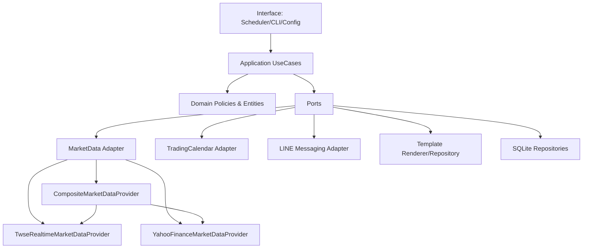
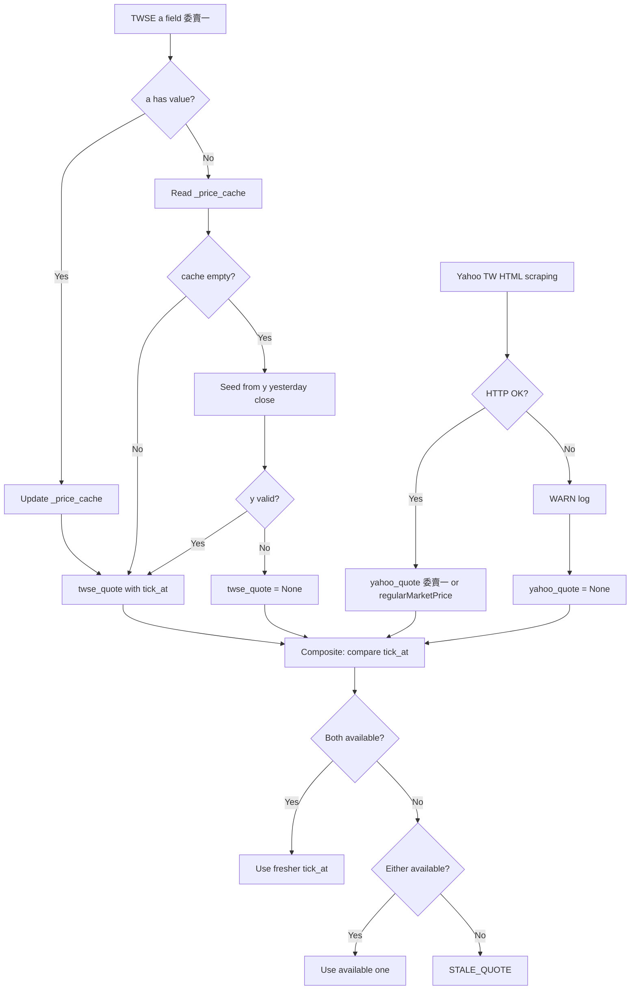
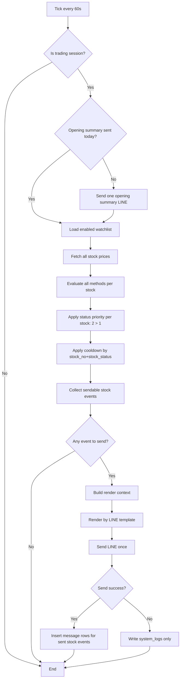
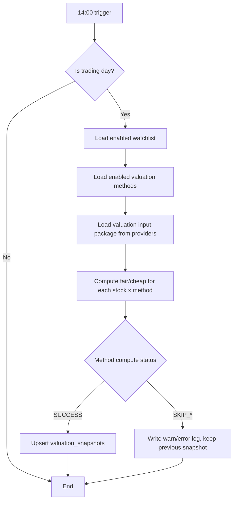

# EDD - 台股監控與 LINE 通知系統

版本：v1.0  
日期：2026-04-14  
對齊文件：[PDD_Stock_Monitoring_System.md](c:/Projects/stock/PDD_Stock_Monitoring_System.md)

變更摘要（v0.9）：
- 新增 §3.3 雙行情來源架構（`YahooFinanceMarketDataProvider`、`CompositeMarketDataProvider`）。
- 新增 §3.4 Freshness-First 取捨規則說明。
- 新增 §8.2 Yahoo Finance adapter 設定參數。
- 更新 §1 目的範圍：加入 FR-15/FR-16 雙行情來源。
- 更新 §3.1/3.2 架構圖納入 Yahoo adapter 與 Composite adapter。
- 新增 §13.5 品質改善行動：CR-ADP-01、CR-ADP-02。

變更摘要（v0.7）：
- 新增 FR-14 對齊：LINE 訊息改為 Template-driven 渲染規格（不得在業務程式寫死完整文案）。
- 開盤摘要訊息改為支援手機友善精簡模板（例：`台積電(2330) 手動 2000/1500`）。
- 補充模板設定鍵、渲染失敗處理、測試對應。

變更摘要（v0.6）：
- 納入三方法基線：`emily_composite_v1`、`oldbull_dividend_yield_v1`、`raysky_blended_margin_v1`。
- 新增估值資料來源主備援與資料充分性規則（每日可計算）。
- 新增估值方法執行狀態規格：`SUCCESS / SKIP_INSUFFICIENT_DATA / SKIP_PROVIDER_ERROR`。

變更摘要（v0.5）：
- `message.methods_hit` 約束加嚴為 JSON array（`json_valid + json_type='array'`）。
- 補齊 `MAX_RETRY_COUNT`、`STALE_THRESHOLD_SEC` 執行參數。
- 明確定義 LINE canonical/alias 環境變數與優先序。

變更摘要（v0.4）：
- 明確區分「冷卻鍵」與「同分鐘冪等唯一鍵」語意。
- `message` 寫入策略由純 `DO NOTHING` 升級為可提升狀態的 `DO UPDATE`。
- 補充 JSON1 不可用時的 fail-fast 規則。
- 補上「LINE 成功但 DB 失敗」補償機制與測試案例。

版本歷史：
| Version | Date | Migration Impact | Notes |
|---|---|---|---|
| v0.2 | 2026-04-10 | baseline | 初版 EDD（含單一彙總訊息與 schema） |
| v0.3 | 2026-04-10 | requires migration verification | 冷卻/冪等語意分離、upsert 升級、JSON1/rollback 規範 |
| v0.4 | 2026-04-10 | requires migration verification | 補償流程、DB 硬約束、格式檢核強化 |
| v0.5 | 2026-04-10 | requires migration verification | methods_hit JSON array 約束、參數顯式化、LINE 命名相容規則 |
| v0.6 | 2026-04-13 | no schema break | 三方法估值規格、資料來源充分性、日結狀態規範 |
| v0.7 | 2026-04-14 | no schema break | LINE 訊息模板化（FR-14）、開盤摘要手機友善模板規格 |
| v0.8 | 2026-04-14 | no schema break | Code Review 品質改善定版：安全強化（token repr、時區驗證、HTTP 回應邊界）、架構對齊（Calculator → application 層、render 單一入口、SRP）、API 清潔（MinuteCycleConfig、開盤摘要 DB 冪等、觸發容錯）|
| v0.9 | 2026-04-14 | no schema break | 雙行情來源架構：新增 `YahooFinanceMarketDataProvider`（HTML scraping）、`CompositeMarketDataProvider`（Freshness-First）；`TwseRealtimeMarketDataProvider` 加入 `_price_cache` 與 `ex` 快取 |
| v1.0 | 2026-04-14 | no schema break | 行情 price 改為**委賣一**（最佳委賣價）：TWSE 採 `a` 欄位第一值；Yahoo 採 HTML 委賣價區塊委賣一，盤後 fallback `regularMarketPrice` |

## 1. 目的與範圍
本文件定義工程實作細節，交付目標：
1. 盤中每分鐘監控台股價格。
2. 低於合理價/便宜價時發 LINE 群組通知。
3. 同 `stock_no + stock_status` 5 分鐘冷卻。
4. 每交易日 14:00 執行估值計算並落地 SQLite。
5. 多估值方法可啟停，結果按股票+方法寫入。
6. 每分鐘只發一封彙總訊息（含多股票/多方法命中）。
7. 每日 14:00 對三方法逐股估值，資料不足時跳過且不覆蓋舊值。
8. 每交易日開盤第一個可交易分鐘先推送「監控設定摘要」（股票/方法/fair/cheap），同日僅一次。
9. LINE 訊息文本採模板渲染，不將完整文案硬寫於業務流程程式。
10. 盤中行情採雙來源（TWSE MIS 主 + Yahoo Finance TW HTML 副），以 `tick_at` 較新者為準（Freshness-First，PDD FR-15）。行情 `price` 代表**委賣一**（最佳委賣價），反映當下可立即成交之買入價格。

## 2. 關鍵業務規則（定版）
### 2.1 訊號狀態
- `stock_status=1`：低於合理價（below fair）
- `stock_status=2`：低於便宜價（below cheap）

### 2.2 狀態優先序
- 若同時符合 1 與 2，**只發 2**（2 優先）。
- 理由：達便宜價必然達合理價，2 才是當下重點。

### 2.3 多方法命中規則
- 同一分鐘，同一股票若多方法都符合 `status=1`，只產生一個股票層級訊號（status=1），訊息內附「命中方法清單」。
- 同一分鐘，同一股票若有方法命中 `status=1` 且另有方法命中 `status=2`，統一產生 `status=2`，訊息內附完整命中方法清單。

### 2.4 冷卻規則
- 冷卻鍵：`stock_no + stock_status`
- 冷卻窗：5 分鐘
- 5 分鐘內命中相同鍵，不發送、不更新 `message` 表。
- `message` 表的 `UNIQUE(stock_no, minute_bucket)` 僅用於同分鐘冪等保護，不取代冷卻判斷。
- 範例：
  - 第 1 分鐘命中 `2330+1`，第 2 分鐘又命中 `2330+1`（即便方法不同） -> 不發。
  - 第 1 分鐘命中 `2330+1`，第 2 分鐘命中 `2330+2` -> 可發。

### 2.5 每分鐘單一訊息
- 每分鐘先收集所有股票訊號，組成單一彙總訊息後發送一次。
- 不做並發發送。
- 發送失敗：只寫 log，不寫 `message` 表。
- 發送成功後寫入 `message` 表時，需使用單一 DB transaction 一次提交該分鐘所有股票事件。
- 若 LINE 已成功但 DB transaction 失敗，需寫入本機補償佇列（JSONL），並在補償完成前視同已通知，避免重複提醒。

### 2.6 開盤監控設定摘要規則
- 觸發時機：交易日第一個可交易分鐘（通常 09:00，若延後開市則為首個可交易分鐘）。
- 同一交易日僅允許發送一次；服務重啟不得重複推送同日摘要。
- 摘要內容必含：
  - 逐股票逐方法 `fair_price/cheap_price`
- 價格來源：
  - `manual_rule` 來自 `watchlist`
  - 估值方法來自 `valuation_snapshots`（取 `trade_date <= today` 的最新快照）
- 若某股票某方法無快照，仍要列出方法，價格顯示 `N/A`。
- 股票顯示格式預設為 `中文名(代號)`（例：`台積電(2330)`）。

### 2.7 LINE 訊息模板規則（FR-14）
- 所有對外發送至 LINE 的訊息都必須由模板渲染產生，包含：
  - 每分鐘彙總通知（minute digest）
  - 開盤監控設定摘要通知（opening summary）
  - 單股觸發內容列（trigger row / status 1/2）
  - 測試推播與營運驗證推播（若系統提供）
- 業務流程層只提供 render context（資料），不直接拼接最終文案字串。
- 模板需可獨立調整：
  - 不修改監控主流程程式碼即可調整文案格式。
  - 可依通道/裝置需求提供不同模板（例如 mobile compact）。
- 模板錯誤處理：
  - 模板缺失、語法錯誤、render 失敗需寫 `ERROR` log。
  - 發送路徑不得默默退回未知硬編碼格式。

### 2.8 文字檔模板設計（FR-17）

FR-14 確立「必須走模板渲染」；FR-17 在此之上要求渲染引擎可從外部純文字 `.j2` 檔讀取模板，讓非工程人員以記事本直接修改 wording，無須觸碰 Python 程式。

**Clean Architecture 層次對映**：

| 層次 | 元件 | FR-17 職責 |
|---|---|---|
| Interface Layer | 環境變數 | 透過 `LINE_TEMPLATE_DIR` 指定模板目錄 |
| Application Layer | `render_line_template_message(key, ctx)` | 唯一呼叫入口（CR-ARCH-03）；只傳 context dict，不感知 Jinja2 |
| Infrastructure Layer | `LineTemplateRenderer` / `TemplateRepository` | 持有 Jinja2 Environment，從 `.j2` 檔載入並渲染 |
| 模板檔案 | `templates/line/*.j2` | 純文字「View」層；企劃可直接編輯 |

**MVC 類比**：
- **View**：`templates/line/*.j2`（模板文字檔，企劃可編輯，不涉及 Python）
- **Model**：`context` dict（資料由 Application layer 組裝）
- **Controller**：`render_line_template_message`（渲染引擎，介面永不改變）

**目錄結構與 Key 對映**：

```
templates/
└── line/
    ├── line_trigger_row_v1.j2                    # 單股觸發列（status 1 / 2）
    ├── line_trigger_row_digest_v1.j2             # 彙總中的觸發節
    ├── line_minute_digest_v1.j2                  # 每分鐘彙總外框
    ├── line_opening_summary_mobile_compact_v1.j2 # 開盤監控設定摘要
    └── line_test_push_v1.j2                      # 測試推播
```

`template_key` 直接對應 `{key}.j2`；禁止含 `/`、`\`、`..`（路徑遍歷，OWASP A01）。

**工程實作規格**：

- **Jinja2 環境**：`Environment(loader=FileSystemLoader(template_dir), undefined=StrictUndefined, autoescape=False)`
  - LINE 為純文字，不需 HTML autoescape。
  - `StrictUndefined`：未定義變數立即報錯，禁止靜默空字串。
- **Key → 檔名**：白名單正規表達式 `^[a-z0-9_]+$`；拒絕含路徑字元的 key。
- **目錄覆蓋**：預設 `templates/line/`（相對 working directory）；可由 `LINE_TEMPLATE_DIR` 環境變數覆蓋。
- **Fallback**：`TemplateNotFound` → fallback 至 `message_template.py` 內嵌預設 + 寫 `WARN` log (`TEMPLATE_NOT_FOUND`)；不得靜默降格。
- **渲染失敗**：語法錯誤或 `StrictUndefined` 變數缺失 → 寫 `ERROR` log (`TEMPLATE_RENDER_FAILED`)；不得送出硬編碼未知格式。
- **介面不變**：`render_line_template_message(template_key: str, context: dict) -> str` 簽名永不改變（CR-ARCH-03）。

**範例 — 開盤摘要模板**（`templates/line/line_opening_summary_mobile_compact_v1.j2`）：
```
[開盤監控設定摘要] {{ trade_date }}

{{ item.display_label }}
  合理價 {{ item.fair_price }} ／ 便宜價 {{ item.cheap_price }}

監控方法：{{ m }}、
```

**範例 — 觸發通知列**（`templates/line/line_trigger_row_v1.j2`）：
```
{{ display_label }}目前{{ current_price }}，
低於便宜價{{ cheap_price }}（合理價{{ fair_price }}）
低於合理價{{ fair_price }}

```

## 3. 架構總覽（Clean Architecture）
### 3.1 文字架構圖
```text
+-------------------- Interface Layer --------------------+
| Scheduler(1m/14:00) | CLI | Config | Logger            |
+--------------------------+------------------------------+
                           |
                           v
+-------------------- Application Layer ------------------+
| CheckIntradayPriceUseCase                               |
| RunDailyValuationUseCase                                |
| ComposeMinuteDigestUseCase                              |
| RenderLineMessageUseCase                                |
+--------------------------+------------------------------+
                           |
                 (Ports / Interfaces)
                           |
                           v
+---------------------- Domain Layer ---------------------+
| Entities: Stock, SignalEvent, ValuationSnapshot         |
| Policies: SignalPolicy, CooldownPolicy, PriorityPolicy  |
+--------------------------+------------------------------+
                           |
                           v
+------------------ Infrastructure Layer -----------------+
| MarketDataAdapter | TradingCalendarAdapter | LineAdapter |
| LineTemplateRenderer | TemplateRepository                |
| Sqlite repositories (watchlist, valuation, message, log) |
+---------------------------------------------------------+
```

> **MarketDataAdapter** 由三個 class 共同實現（見 §3.3/3.4）：
> - `TwseRealtimeMarketDataProvider`（主，含 `_price_cache` 與 `ex` 快取）
> - `YahooFinanceMarketDataProvider`（副，Yahoo Finance TW HTML scraping）
> - `CompositeMarketDataProvider`（Freshness-First 聚合，注入以上兩者）

### 3.2 Mermaid 架構圖


## 3.3 雙行情來源 Adapter 規格
### TwseRealtimeMarketDataProvider
- 端點：`https://mis.twse.com.tw/stock/api/getStockInfo.jsp`
- 每次輪詢：
  - 請求所有監控股票的 `tse_{no}.tw` 與 `otc_{no}.tw` channel。
  - 解析 `a`（委賣五檔，`_` 分隔）、`tlong`（毫秒時間戳）、`n`（中文名稱）、`ex`（`tse` 或 `otc`）。
  - `a` 第一欄（`a.split('_')[0]`）= 委賣一（最佳委賣價）= 系統使用的 `price`。
  - `a` 有值 → 更新 `self._price_cache[stock_no]`；回傳 `price=委賣一`、`tick_at=tlong//1000`。
  - `a` 為空或 `-`（訂單薄短暫消失）→ 從 `self._price_cache` 讀取最後已知委賣一；若 cache 冷卻（首次輪詢），以 `y`（昨收）種子填充 cache。
  - `ex` 欄位更新 `self._exchange_cache[stock_no]`（`tse` 或 `otc`）。
  - `tlong` 更新 `self._tick_cache[stock_no]`（最後已知 tick epoch，供 Composite Freshness-First 比較）。
  - 若 cache 也為空且無 `y` 可種子 → 該股票本次輪詢不加入 quotes dict。
- 回傳格式：`dict[stock_no, {"stock_no", "price", "tick_at", "name", "exchange"}]`

### YahooFinanceMarketDataProvider
- 端點：`https://tw.stock.yahoo.com/quote/{stock_no}`（HTML scraping，不使用 v8 API）
- URL 格式：`stock_no` only，不需 `.TW`/`.TWO` suffix（TSE/OTC 均可直接查詢）
- 每次輪詢：對每個 stock_no 發 1 次 HTTP GET，讀取 server-render HTML。
- 優先解析**委賣一**：HTML 委賣價區塊：`委賣價</span><span>量</span>` 後第一個 `<span>` 的數值（去逗號）。
- 若委賣一欄位不存在（盤後/休市/版型異動）→ fallback 解析 `"regularMarketPrice":XXXX`。
- 時間戳：解析 `"regularMarketTime":XXXX`（unix seconds）作為 `tick_at`。
- HTTP 失敗（4xx/5xx/timeout）→ WARN log，回傳空 dict，不中斷主流程。
- `exchange_map` 參數接受但不做 URL 建構用途（介面相容性）。
- 回傳格式：`dict[stock_no, {"stock_no", "price", "tick_at", "name"}]`

### CompositeMarketDataProvider（Freshness-First）
- 依賴注入：`primary: TwseRealtimeMarketDataProvider`、`secondary: YahooFinanceMarketDataProvider`。
- `get_realtime_quotes(stock_nos)` 流程：
  1. 呼叫 `primary.get_realtime_quotes(stock_nos)` → `twse_quotes`。
  2. 以 `primary._exchange_cache` 建立 `exchange_map`，注入 secondary。
  3. 呼叫 `secondary.get_realtime_quotes(stock_nos)` → `yahoo_quotes`。
  4. 對每個 stock_no：
     - 若 twse 有值且 yahoo 有值：`tick_at` 較新者勝；相等時以 twse 為準。
     - 若僅 twse 有值 → 使用 twse。
     - 若僅 yahoo 有值（twse cache 空，冷啟動）→ 使用 yahoo。
     - 兩者皆無 → 不加入結果（呼叫端觸發 `STALE_QUOTE`）。
  5. 回傳同格式 dict。
- `get_market_snapshot(now_epoch)` 直接 delegate 給 `primary`。

## 3.4 取捨流程圖


## 4. 流程設計
### 4.1 盤中每分鐘流程


### 4.2 14:00 日結估值流程


## 5. 交易日與開盤判斷
### 5.1 基本規則
- 時區：`Asia/Taipei`
- 週六、週日：非交易日
- 參考台灣政府行事曆（假日）判斷休市
- 開市確認用「**大盤資訊**」而非個股資訊

### 5.2 開盤可交易判斷（簡化）
- 08:45 後開始檢查大盤資料來源是否有當日新資料。
- 09:00 後若大盤仍無當日新資料，視為當日不開市。
- 若資料源故障（非休市）需寫 `system_logs`，避免靜默誤判。
- 若大盤資料來源逾時或不可用，該分鐘直接跳過訊號判斷與通知發送，並寫入 `WARN` log。

## 6. 資料模型（SQLite，含欄位型別）
### 6.1 `watchlist`
```sql
CREATE TABLE IF NOT EXISTS watchlist (
  stock_no TEXT PRIMARY KEY,                     -- ex: '2330'
  stock_name TEXT NOT NULL DEFAULT '',           -- 中文名稱，每交易日 14:00 估值時更新（FR-18）
  manual_fair_price NUMERIC NOT NULL CHECK (manual_fair_price > 0),
  manual_cheap_price NUMERIC NOT NULL CHECK (manual_cheap_price > 0),
  enabled INTEGER NOT NULL DEFAULT 1 CHECK (enabled IN (0,1)),
  created_at INTEGER NOT NULL,                   -- epoch seconds (UTC)
  updated_at INTEGER NOT NULL,                   -- epoch seconds (UTC)
  CHECK (manual_cheap_price <= manual_fair_price)
);
```

> **FR-18**：`stock_name` 欄位在每交易日 14:00 估值作業（`run_daily_valuation_job`）完成後，從即時報價取得中文名稱並 UPDATE。盤中 `run_minute_cycle` 建立 `stock_name_map` 一律讀 `watchlist.stock_name`，不再對即時報價的 `name` 欄位取值；既有資料庫以 `ALTER TABLE ... ADD COLUMN` migration 補欄，預設值為 `''`。

### 6.2 `valuation_methods`
```sql
CREATE TABLE IF NOT EXISTS valuation_methods (
  method_name TEXT NOT NULL,                     -- ex: 'emily_composite'
  method_version TEXT NOT NULL,                  -- ex: 'v1'
  enabled INTEGER NOT NULL DEFAULT 1 CHECK (enabled IN (0,1)),
  created_at INTEGER NOT NULL,
  updated_at INTEGER NOT NULL,
  PRIMARY KEY (method_name, method_version)
);

-- Hard constraint:
-- 同一 method_name 同時只允許一個 enabled=1
CREATE UNIQUE INDEX IF NOT EXISTS ux_method_single_enabled
ON valuation_methods(method_name)
WHERE enabled = 1;
```

### 6.3 `valuation_snapshots`
```sql
CREATE TABLE IF NOT EXISTS valuation_snapshots (
  id INTEGER PRIMARY KEY AUTOINCREMENT,
  stock_no TEXT NOT NULL,
  trade_date TEXT NOT NULL,                      -- YYYY-MM-DD (Asia/Taipei)
  method_name TEXT NOT NULL,
  method_version TEXT NOT NULL,
  fair_price NUMERIC NOT NULL CHECK (fair_price > 0),
  cheap_price NUMERIC NOT NULL CHECK (cheap_price > 0),
  created_at INTEGER NOT NULL,
  CHECK (cheap_price <= fair_price),
  UNIQUE(stock_no, trade_date, method_name, method_version),
  FOREIGN KEY (stock_no) REFERENCES watchlist(stock_no),
  FOREIGN KEY (method_name, method_version)
    REFERENCES valuation_methods(method_name, method_version)
);

CREATE INDEX IF NOT EXISTS idx_vs_stock_trade_date
ON valuation_snapshots(stock_no, trade_date);
```

### 6.4 `message`
```sql
CREATE TABLE IF NOT EXISTS message (
  id INTEGER PRIMARY KEY AUTOINCREMENT,
  stock_no TEXT NOT NULL,
  message TEXT NOT NULL,
  stock_status INTEGER NOT NULL CHECK (stock_status IN (1,2)),
  methods_hit TEXT NOT NULL
    CHECK (
      json_valid(methods_hit)
      AND json_type(methods_hit) = 'array'
    ),                                           -- JSON array string, ex: ["emily_composite_v1","oldbull_dividend_yield_v1"]
  minute_bucket TEXT NOT NULL
    CHECK (
      length(minute_bucket) = 16
      AND minute_bucket GLOB '[0-9][0-9][0-9][0-9]-[0-9][0-9]-[0-9][0-9] [0-9][0-9]:[0-9][0-9]'
      AND substr(minute_bucket,5,1) = '-'
      AND substr(minute_bucket,8,1) = '-'
      AND substr(minute_bucket,11,1) = ' '
      AND substr(minute_bucket,14,1) = ':'
    ),                                           -- fixed format: YYYY-MM-DD HH:mm (Asia/Taipei)
  update_time INTEGER NOT NULL,                 -- epoch seconds (UTC)
  FOREIGN KEY (stock_no) REFERENCES watchlist(stock_no),
  UNIQUE(stock_no, minute_bucket)
);

CREATE INDEX IF NOT EXISTS idx_message_cooldown
ON message(stock_no, stock_status, update_time DESC);
```

### 6.5 `pending_delivery_ledger`（補償佇列，JSONL 對應）
```sql
CREATE TABLE IF NOT EXISTS pending_delivery_ledger (
  id INTEGER PRIMARY KEY AUTOINCREMENT,
  minute_bucket TEXT NOT NULL,
  payload_json TEXT NOT NULL CHECK (json_valid(payload_json)),
  status TEXT NOT NULL CHECK (status IN ('PENDING','RECONCILED','FAILED')),
  retry_count INTEGER NOT NULL DEFAULT 0 CHECK (retry_count >= 0),
  last_error TEXT,
  created_at INTEGER NOT NULL,
  updated_at INTEGER NOT NULL
);

CREATE INDEX IF NOT EXISTS idx_pending_delivery_status
ON pending_delivery_ledger(status, updated_at);
```

### 6.6 `system_logs`
```sql
CREATE TABLE IF NOT EXISTS system_logs (
  id INTEGER PRIMARY KEY AUTOINCREMENT,
  level TEXT NOT NULL CHECK (level IN ('INFO','WARN','ERROR')),
  event TEXT NOT NULL,
  detail TEXT,
  created_at INTEGER NOT NULL                   -- epoch seconds (UTC)
);
```

### 6.7 估值輸入資料與來源規格（無新增資料表）
估值日結使用「當日可得的最新有效資料」，不要求每日都有新財報。

| 輸入欄位 | 主來源 | 備援來源 | 主要方法 |
|---|---|---|---|
| `price_history_10y` | TWSE/TPEx 歷史價格 | Yahoo Finance | 艾蜜莉歷年股價法、PE/PB 區間 |
| `avg_dividend` | MOPS 股利資訊 | TWSE 公開欄位 | 艾蜜莉股利法、股海老牛 |
| `eps_ttm` / `eps_10y_avg` | MOPS 財報 | TWSE 財報彙整 | 艾蜜莉 PE、雷司紀 PE |
| `bps_latest` / `pb_history` | MOPS 財報 | TWSE 財報彙整 | 艾蜜莉 PB、雷司紀 PB |
| `current_assets` / `total_liabilities` / `shares_outstanding` | MOPS 資產負債表與基本資料 | TWSE 公開欄位 | 雷司紀 NCAV |

資料充分性規則：
- 每方法定義 `required_fields`，缺一不可。
- 財報類資料允許沿用最近一期有效值，但必須記錄 `input_asof_date`。
- 若來源不可用或回傳空值，該方法當日狀態標記為 `SKIP_*`，且不得覆蓋既有快照。

## 7. LINE Messaging API 設計
### 7.1 環境變數
- 規範名（Canonical）：
  - `LINE_CHANNEL_ACCESS_TOKEN`
  - `LINE_TO_GROUP_ID`
- 相容別名（Legacy alias）：
  - `CHANNEL_ACCESS_TOKEN`
  - `TARGET_GROUP_ID`
- 若規範名與別名同時存在，優先使用規範名。
- **安全規則（CR-SEC-01）**：LINE token 持有物件（`LinePushClient`）不得透過 `repr()` 或任何 log 輸出洩漏 token 明文。實作上需設置 `field(repr=False)` 或等效保護。

### 7.2 每分鐘彙總訊息範例
```text
[Stock Minute Digest] 2026-04-10 10:21 +08:00

1) 2330 | status=2 (below_cheap)
   market=998 | fair=1500 | cheap=1000
   methods_hit=[emily_composite_v1, raysky_blended_margin_v1]

2) 2317 | status=1 (below_fair)
   market=142 | fair=145 | cheap=130
   methods_hit=[oldbull_dividend_yield_v1]
```

### 7.3 發送與寫庫規則
- 每分鐘最多發 1 封 LINE 訊息。
- 開盤摘要屬於「每日一次」通知，與每分鐘訊號通知分開計數。
- 發送成功後，才寫入 `message` 表（每個股票事件一筆）。
- `message` 寫入需在同一 transaction 完成；任一筆失敗則整批 rollback。
- 寫入策略採 `INSERT ... ON CONFLICT(stock_no, minute_bucket) DO UPDATE`：
  - 當 `excluded.stock_status > message.stock_status`（2 蓋 1）時更新。
  - 或同狀態但 `methods_hit/message` 不同時更新為該分鐘最終聚合內容。
  - `methods_hit`、`message`、`update_time` 同步更新為新值。
  - `methods_hit` 一律覆蓋為「該分鐘最終聚合結果」（去重 + 排序後 JSON array）。
- 參考 SQL（語意示意）：
```sql
INSERT INTO message(stock_no, message, stock_status, methods_hit, minute_bucket, update_time)
VALUES (?, ?, ?, ?, ?, ?)
ON CONFLICT(stock_no, minute_bucket) DO UPDATE SET
  stock_status = excluded.stock_status,
  methods_hit  = excluded.methods_hit,
  message      = excluded.message,
  update_time  = excluded.update_time
WHERE excluded.stock_status > message.stock_status
   OR (excluded.stock_status = message.stock_status
       AND (excluded.methods_hit <> message.methods_hit
            OR excluded.message <> message.message));
```
- `minute_bucket` 必須由 `TimeBucketService` 單一入口產生，不得在多處自行拼字串。
- 發送失敗：不寫 `message`，只寫 `system_logs`。

### 7.6 LINE 訊息模板規格（FR-14）
- 模板鍵（最小集合）：
  - `line_minute_digest_v1`
  - `line_trigger_row_v1`
  - `line_opening_summary_mobile_compact_v1`
  - `line_test_push_v1`（若提供測試推播）
- 載入來源：
  - 預設為 `LINE_TEMPLATE_DIR` 目錄下模板檔。
  - 模板內容可獨立調整，不需修改監控主流程程式。
- Render context（opening summary）最低需提供：
  - `stock_display`（例：`台積電(2330)`）
  - `method_label`（例：`手動`、`艾蜜`、`老牛`、`雷司`）
  - `fair_price`
  - `cheap_price`
  - 缺值時允許 `N/A`
- 開盤摘要 mobile compact 模板範例：
```text
{{ stock_display }} {{ method_label }} {{ fair_price }}/{{ cheap_price }}
```
- 渲染後訊息範例：
```text
台積電(2330) 手動 2000/1500
台積電(2330) 艾蜜 1800/1500
台積電(2330) 老牛 1750/1400
台積電(2330) 雷司 1284/1091
```
- 錯誤處理：
  - 模板缺失：`TEMPLATE_NOT_FOUND`（ERROR）
  - 渲染失敗：`TEMPLATE_RENDER_FAILED`（ERROR）
  - 任一模板失敗不得默默回退為程式硬編碼文案。
- **架構規則（CR-ARCH-03）**：`render_line_template_message` 函式只能有唯一一份定義，來源為 `stock_monitor.application.message_template`。其他模組一律從該模組 import，不得重複定義。

### 7.5 補償機制（LINE 成功、DB 失敗）
- 情境：LINE API 回傳成功，但 `message` transaction rollback。
- 動作：
  1. 立即寫入 `pending_delivery_ledger`（若 DB 可寫）或 fallback 到 `logs/pending_delivery.jsonl`。
  2. 補償 worker 定期重試將該批事件回補進 `message` 表。
  3. 冷卻判斷需同時檢查 `message` 與 `pending_delivery_ledger/jsonl`，補償完成前視同已通知。
- 目標：避免「已通知但無落盤」造成 5 分鐘內重複通知。

### 7.4 冷卻查詢規格（固定）
- 冷卻判斷查詢：
```sql
SELECT MAX(update_time) AS last_sent_at
FROM message
WHERE stock_no = ?
  AND stock_status = ?;
```
- 判斷條件：`now_utc_epoch - last_sent_at < 300` 則視為冷卻中，不發送。
- 若 `last_sent_at IS NULL`，視為可發送。
- `now_utc_epoch` 由應用層統一提供（UTC 秒），避免多處時間源不一致。

## 8. 設定檔與執行參數
```env
APP_TZ=Asia/Taipei
DB_PATH=./data/stock_monitor.db
PRICE_CHECK_INTERVAL_SEC=60
NOTIFY_COOLDOWN_MIN=5
MAX_RETRY_COUNT=3
STALE_THRESHOLD_SEC=90
TRADING_START=09:00
TRADING_END=13:30
DAILY_VALUATION_TIME=14:00
OPEN_CHECK_START=08:45
PENDING_DELIVERY_LOG_PATH=./logs/pending_delivery.jsonl

LINE_CHANNEL_ACCESS_TOKEN=...
LINE_TO_GROUP_ID=...
LINE_TEMPLATE_DIR=./templates/line
LINE_TEMPLATE_MINUTE_DIGEST=line_minute_digest_v1
LINE_TEMPLATE_OPENING_SUMMARY=line_opening_summary_mobile_compact_v1
```

### 8.1 執行環境前置條件
- SQLite 版本需支援 JSON1（供 `json_valid()`、`json_type()` 約束使用）。
- DB 連線初始化必須執行：`PRAGMA foreign_keys = ON;`
- 啟動健康檢查需回報：
  - `foreign_keys` 是否為 `ON`
  - JSON1 是否可用（例如 `SELECT json_valid('[]')` 成功）
- 若 JSON1 不可用，採 **fail-fast**：服務啟動失敗並輸出明確錯誤，禁止自動降級。

### 8.2 Yahoo Finance Adapter 參數（無需環境變數，為 code 常數）
| 參數 | 預設值 | 說明 |
|---|---|---|
| `YAHOO_BASE_URL` | `https://tw.stock.yahoo.com/quote/` | Yahoo Finance TW HTML scraping 端點（加 `{stock_no}` 即完整 URL）|
| `YAHOO_TIMEOUT_SEC` | `10` | HTTP 逾時秒數 |
| `MAX_RESPONSE_BYTES` | `1_048_576` | HTTP 回應讀取上限（共用同 TWSE adapter 常數）|

## 9. Phase 規劃
### Phase 1（手動門檻）
- 使用 `watchlist.manual_fair_price/manual_cheap_price`。
- 支援多股票，但先以 `2330` 驗證主流程。
- 完成「每分鐘單一彙總訊息 + 冷卻 + status 2 優先」。

### Phase 2（多估值方法）
- 估值方法介面：
  - `compute(stock_no, trade_date) -> {fair_price, cheap_price}`
- 方法開關採全域（方法本身是否參與計算），不做每股方法開關。
- 估值結果按 `stock_no + method_name + method_version + trade_date` 寫入快照。
- 第一批方法固定：
  - `emily_composite_v1`
  - `oldbull_dividend_yield_v1`
  - `raysky_blended_margin_v1`

### 9.1 三方法公式（工程定版）
1. `emily_composite_v1`
   - 子法輸出 `fair/cheap`：
     - 股利法：`cheap = avg_dividend * 15`，`fair = avg_dividend * 20`
     - 歷年股價法：`cheap = avg(year_low_10y)`，`fair = avg(year_avg_10y)`
     - PE 法：`base_eps = (eps_ttm + eps_10y_avg)/2`，`cheap = base_eps * pe_low_avg`，`fair = base_eps * pe_mid_avg`
     - PB 法：`cheap = bps_latest * pb_low_avg`，`fair = bps_latest * pb_mid_avg`
   - 對可用子法取平均後乘安全邊際（預設 `0.9`）。
2. `oldbull_dividend_yield_v1`
   - `fair = avg_dividend / 0.05`
   - `cheap = avg_dividend / 0.06`
3. `raysky_blended_margin_v1`
   - 子法：PE、股利、PB、NCAV 先各自算 `fair/cheap`。
   - 融合：`fair = median_or_weighted(submethod_fair)`。
   - `cheap = fair * margin_factor`（預設 `0.9`，可配置）。

### 9.2 估值方法執行狀態規格
- `SUCCESS`：方法完成計算並寫入 `valuation_snapshots`。
- `SKIP_INSUFFICIENT_DATA`：缺 required fields，不覆蓋舊快照。
- `SKIP_PROVIDER_ERROR`：來源逾時/錯誤，不覆蓋舊快照。
- 日結任務成功條件：至少有一個 `stock x method` 成功即可視為 job completed（含部分 skip）。

## 10. 測試計畫（補強版）
### 10.1 單元測試
- `PriorityPolicy`：同時命中 1/2 時只保留 2。
- `CooldownPolicy`：
  - `2330+1` 5 分鐘內重複命中 -> 不發
  - `2330+1` 後 `2330+2` -> 可發
- `DigestComposer`：同分鐘多股票/多方法合併為單一訊息。
- `TimeBucketService`：唯一入口產生 `minute_bucket`（`YYYY-MM-DD HH:mm`, Asia/Taipei）。

### 10.2 整合測試
- 同分鐘多股票多方法命中 -> LINE 只呼叫一次。
- 交易日開盤第一個可交易分鐘 -> 發送 1 封監控設定摘要（股票/方法/fair/cheap），且內容由 template 渲染。
- 同一交易日再次觸發開盤摘要（含服務重啟）-> 不得重複發送。
- LINE 發送失敗 -> `message` 無新增、`system_logs` 有 ERROR。
- 模板缺失或渲染失敗 -> `TEMPLATE_NOT_FOUND` / `TEMPLATE_RENDER_FAILED` 錯誤日誌，且不得用未知硬編碼格式送出。
- 每分鐘彙總/觸發列/開盤摘要（與測試推播，若提供）都必須經 template renderer；任一路徑不得直接硬編碼最終 LINE 文案。
- 日結估值部分方法失敗 -> 失敗方法不覆蓋舊值，其它方法正常寫入。
- `message` 批次寫入時模擬中途失敗 -> 驗證整批 rollback（該分鐘 0 筆落庫）。
- `status=1` 先寫入後同分鐘升級 `status=2` -> 最終僅保留 `status=2`，內容為最終聚合結果。
- LINE 成功但 DB 寫入失敗 -> 建立補償紀錄，下一分鐘不重複發送，回補成功後 ledger 狀態為 `RECONCILED`。
- 三方法在同一交易日皆有足夠輸入 -> 每股產生三筆快照（method/version 不同）。
- 單方法資料不足 -> 僅該方法 `SKIP_INSUFFICIENT_DATA`，其它方法照常入庫。
- 單來源失敗但備援可用 -> 該方法仍可 `SUCCESS`（需有來源切換 log）。

### 10.3 UAT 對齊
- 依 PDD 驗收條件逐條驗證，外加「每分鐘只一封」。

## 11. 開發任務拆解
1. 建立 domain policies：`SignalPolicy`, `PriorityPolicy`, `CooldownPolicy`。
2. 建立 SQLite migration（使用本 EDD 型別與 constraint）。
3. 實作 `CheckIntradayPriceUseCase` 與 `ComposeMinuteDigestUseCase`。
4. 實作 `LineMessagingApiAdapter`（單次發送）。
5. 實作 `pending_delivery` 補償 worker（ledger/jsonl 重試回補）。
6. 實作 `RunDailyValuationUseCase`（14:00, fail-no-overwrite）。
7. 實作 `LineTemplateRenderer` / 模板載入流程（minute digest + opening summary）。
8. 補齊單元與整合測試。

## 12. 交付物
1. 可執行 worker（本機）。
2. SQLite schema/migration。
3. `.env.example`。
4. 操作與排障文件。

## 13. 品質改善行動清單（Code Review v0.8）

本節記錄 2026-04-14 Code Review 定版的改善行動項目。所有 🔴 Critical 與 🟠 High 項目列入 DoD 強制目標，🟡 Medium 為建議優化。

測試追蹤 ID 對齊至 TEST_PLAN `TP-SEC-*`、`TP-ARCH-*`。

### 13.1 安全改善（Security）

| 行動 ID | 優先 | 問題描述 | 現況 | 要求行為 | 測試 ID |
|---|---|---|---|---|---|
| CR-SEC-01 | 🔴 | `LinePushClient` `@dataclass` 自動生成的 `__repr__` 輸出包含明文 `channel_access_token` | ✅ 已修正：`channel_access_token: str = field(repr=False)` | `channel_access_token: str = field(repr=False)`；任何 `repr()` / log 輸出不得包含 token 明文 | TP-SEC-001 |
| CR-SEC-02 | 🟠 | `_ManualValuationCalculator` 的 `scenario_case = "default"` 分支在生產路徑每次估值都寫入偽造的 `VALUATION_SKIP_INSUFFICIENT_DATA:optional_indicator_v1` log 事件 | ✅ 已修正：`scenario_case` 分支與 `_ManualValuationCalculator` 已從生產路徑完全移除 | 移除 `scenario_case` 生產分支；log 事件僅由真實計算結果產生 | TP-ARCH-001 |
| CR-SEC-03 | 🟠 | `_resolve_timezone(name)` 在無效時區名稱時靜默 fallback 至 `timezone.utc`，造成 +08:00 偏移 8 小時誤差，系統無任何錯誤輸出 | ✅ 已修正：`raise ValueError(f"Invalid timezone name: {name!r}")` | 無效名稱必須 `raise ValueError(f"Invalid timezone: {name!r}")`，不得靜默降級 | TP-SEC-002 |
| CR-SEC-04 | 🟡 | `urllib.request.urlopen` 讀取 HTTP 回應使用無邊界 `resp.read()`，存在過大回應耗盡記憶體風險 | ✅ 已修正：新增 `MAX_RESPONSE_BYTES = 1_048_576`；改為 `resp.read(MAX_RESPONSE_BYTES)` | 讀取回應應設上限（如 `resp.read(MAX_RESPONSE_BYTES)`），`MAX_RESPONSE_BYTES` 預設 `1_048_576`（1 MB） | TP-SEC-003 |
| CR-SEC-05 | 🟡 | `LinePushClient.send()` 讀取 LINE API HTTP 回應使用無邊界 `resp.read()`；雖 LINE API 回應通常極小，但防禦性設計要求與 TWSE/Yahoo adapter 一致設上限 | ❌ 待修正 | `line_messaging.py` 新增 `MAX_RESPONSE_BYTES = 1_048_576`；回應讀取改為 `resp.read(MAX_RESPONSE_BYTES)` | TP-SEC-004 |

### 13.2 架構改善（Architecture）

| 行動 ID | 優先 | 問題描述 | 現況 | 要求行為 | 測試 ID |
|---|---|---|---|---|---|
| CR-ARCH-01 | 🔴 | `_ManualValuationCalculator`（150+ 行 domain 邏輯）定義在 CLI 進入點 `app.py`（Interface Layer）| ✅ 已修正：`ManualValuationCalculator` 已移至 `stock_monitor/application/valuation_calculator.py`；`app.py` 僅保留 CLI 入口與 DI 組裝 | 移至 `stock_monitor/application/valuation_calculator.py`；`app.py` 僅保留 CLI 進入、DI 組裝與指令路由 | TP-ARCH-001 |
| CR-ARCH-02 | 🔴 | `scenario_case="default"` 導致 raysky 估值永遠強制觸發 `TimeoutError`（fallback），主來源資料路徑在生產永遠不執行 | ✅ 已修正：`scenario_case` 分支完全移除；主備援路徑均可於生產執行 | 移除 `scenario_case` 分支；主來源與備援路徑均可在生產真實執行 | TP-ARCH-001 |
| CR-ARCH-03 | 🟠 | `render_line_template_message` 函式在 `message_template.py` 與 `runtime_service.py` 中各有一份完全相同的定義 | ✅ 已修正：`runtime_service.py` 的重複定義已刪除，改從 `message_template` import | 唯一定義來源：`stock_monitor.application.message_template`；其他模組改為 import 使用，不得另行定義 | TP-ARCH-002 |
| CR-ARCH-04 | 🟠 | `app.py` 同時承載 CLI 入口、DI 組裝、daemon 迴圈、估值計算器、指令路由，違反單一職責原則（SRP） | ✅ 已修正：DI 組裝與 daemon 迴圈移至 `stock_monitor/application/daemon_runner.py`；`app.py` 僅保留 CLI 入口（114 行） | `app.py` 拆分後僅保留進入點與指令路由；計算器移至 application 層（見 CR-ARCH-01）| TP-ARCH-005 |
| CR-ARCH-05 | 🟠 | `merge_minute_message` 在 `monitoring_workflow.py` 對外 export，但生產程式碼路徑均未呼叫 | ✅ 已修正：改名為 `_merge_minute_message`（私有）；所有呼叫點（production + test）一併更新 | 若僅作為測試輔助，應標記私有（`_merge_minute_message`）或移入測試層；若為正式 API 需補充真實呼叫點 | TP-ARCH-006 |
| CR-ARCH-06 | 🟡 | `opening_summary_sent_for_date` 以 `LIKE '%date=YYYY-MM-DD%'` 比對 `system_logs.detail` 欄位判斷同日是否已發送，以 log 字串作業務狀態 | ✅ 已修正：新增 `opening_summary_sent_dates(trade_date TEXT PRIMARY KEY)` 專屬資料表；`opening_summary_sent_for_date` 改查此表；新增 `mark_opening_summary_sent` 方法 | 應以 DB 狀態（新增欄位或獨立表）記錄「已發送日期」，與日誌欄位分離，確保可靠冪等 | TP-ARCH-004 |

### 13.3 程式品質改善（Clean Code）

| 行動 ID | 優先 | 問題描述 | 現況 | 要求行為 | 測試 ID |
|---|---|---|---|---|---|
| CR-CODE-01 | 🟠 | `build_minute_rows` 內有 3 段近乎相同的 `render_line_template_message` 呼叫（觸發列、開盤摘要列、測試推播列各一段）| ✅ 已修正：統一成 1 個 `render_context` dict + 1 次 `render_line_template_message` 呼叫 | 統一成 1 個帶參數分派的渲染呼叫，減少重複程式碼 | TP-CODE-001 |
| CR-CODE-02 | 🟠 | `reconcile_pending_once` 接受 `line_client` 參數但 body 首行為 `_ = line_client`（實際未使用） | ✅ 已修正：`reconcile_pending_once` 與 `run_reconcile_cycle` 簽名均已移除 `line_client` 參數；所有呼叫點一併更新 | 若補償流程確實不需要 `line_client`，應從函式簽名移除；若未來需要，應建立 TODO/issue 追蹤 | TP-CODE-002 |
| CR-CODE-03 | 🟠 | `run_minute_cycle` 擁有 12 個 keyword-only 參數，呼叫點繁瑣且易出錯 | ✅ 已修正：新增 `MinuteCycleConfig` dataclass；`run_minute_cycle` 支援接受 `config: MinuteCycleConfig` 參數 | 引入 `MinuteCycleConfig` dataclass 封裝所有設定參數，呼叫點改為傳入 config 物件 | TP-ARCH-003 |
| CR-CODE-04 | 🟡 | `aggregate_minute_notifications` 仍用 f-string 直接組裝 trigger row 字串，未完整施行 FR-14 template render | ✅ 已修正：改用 `render_line_template_message(TRIGGER_ROW_DIGEST_TEMPLATE_KEY, context)` 統一渲染；新增 `TRIGGER_ROW_DIGEST_TEMPLATE_KEY` 常數 | 改用 `render_line_template_message(TRIGGER_ROW_TEMPLATE_KEY, context)` 統一渲染 | TP-CODE-003 |
| CR-CODE-05 | 🟡 | `TimeBucketService.__init__` 在時區名稱無效時靜默設置 `self._tz = None`，後續呼叫才顯露錯誤（與 CR-SEC-03 對應） | ✅ 已修正：`__init__` 對無效時區名稱立即 `raise ValueError` | `__init__` 發現時區名無效時應立即 `raise ValueError`，不延遲到後續呼叫 | TP-SEC-002 |
| CR-CODE-06 | 🟡 | 開盤摘要觸發條件為精確 `09:00` 分鐘桶，daemon 在 09:01 後重啟時當日開盤摘要永不發出 | ✅ 已修正：移除 `09:00` 精確比對；改以 `opening_summary_sent_for_date` 冪等記錄判斷「當日是否已發送」，允許 restart 後補送 | 觸發條件改為「交易日當日第一個尚未發送開盤摘要的分鐘」，允許 09:00 後 restart 觸發補送 | TP-CODE-004 |
| CR-VAL-01 | 🟡 | `run_daily_valuation_job` 內部使用精確 `now_dt.strftime("%H:%M") != "14:00"` 時間檔；daemon 在 14:00 精確分鐘錯過就永遠沒有一個交易日將執行估值 | ✅ 已修正：改為 `< "14:00"`；`daemon_runner.py` 改為 `>= valuation_time` | `valuation_scheduler.py` 內部檔支改為 `< "14:00"`（即 14:00 以後均可執行）；`daemon_runner.py` 將 `== valuation_time` 改為 `>= valuation_time` | TP-VAL-008 |
| CR-DAEMON-01 | 🟠 | `_run_daemon_loop` 只捕捉 `KeyboardInterrupt`；loop body 拋出任何其他 `Exception` 都會讓 daemon 沉默崩潰，無 log 記錄 | ❌ 待修正 | 每次 loop iteration 以 `try/except Exception` 包覆；捕捉到 exception 時寫入 `DAEMON_LOOP_EXCEPTION` ERROR log，繼續執行下一輪；`KeyboardInterrupt` 及 `SystemExit` 仍從外層傳播 | TP-DAEMON-001 |

### 13.4 已確認優點（保留）

以下設計在 Code Review 中獲確認，不需修改：
- SQL 全部使用參數化查詢，無 SQL injection 風險
- LINE token 在錯誤訊息與 log 中已正確遮蔽
- Domain layer 完全無 I/O 相依
- Schema 已使用 CHECK 約束 + JSON1 型別驗證
- 補償機制（`pending_delivery_ledger`）正確避免重複通知
- `truststore` 已整合，無 TLS 驗證繞過

### 13.5 雙行情來源 Adapter 規格（v0.9 新增）

| 行動 ID | 優先 | 要求行為 | 狀態 | 測試 ID |
|---|---|---|---|---|
| CR-ADP-01 | 🟠 | `YahooFinanceMarketDataProvider` HTTP 失敗（4xx/5xx/timeout）必須寫 WARN log 並回傳空 dict，不得 raise 影響主流程 | ✅ 已修正 | TP-ADP-001 |
| CR-ADP-02 | 🟠 | `CompositeMarketDataProvider` 必須以 `tick_at` 比較選取較新報價；相等時以 TWSE 為準；兩者皆無時不加入結果 dict（由呼叫端觸發 STALE_QUOTE）| ✅ 已修正 | TP-ADP-002 |
| CR-ADP-03 | 🟡 | `TwseRealtimeMarketDataProvider` 回傳的 quotes dict 需含 `exchange` 欄位（值為 `tse` 或 `otc`），供 Composite 注入 Yahoo adapter symbol mapping | ✅ 已修正 | TP-ADP-003 |
| CR-ADP-04 | 🟡 | Yahoo adapter 的 HTTP 回應也需受 `MAX_RESPONSE_BYTES` 限制（與 TWSE adapter 相同 1 MB 上限） | ✅ 已修正 | TP-ADP-004 |
