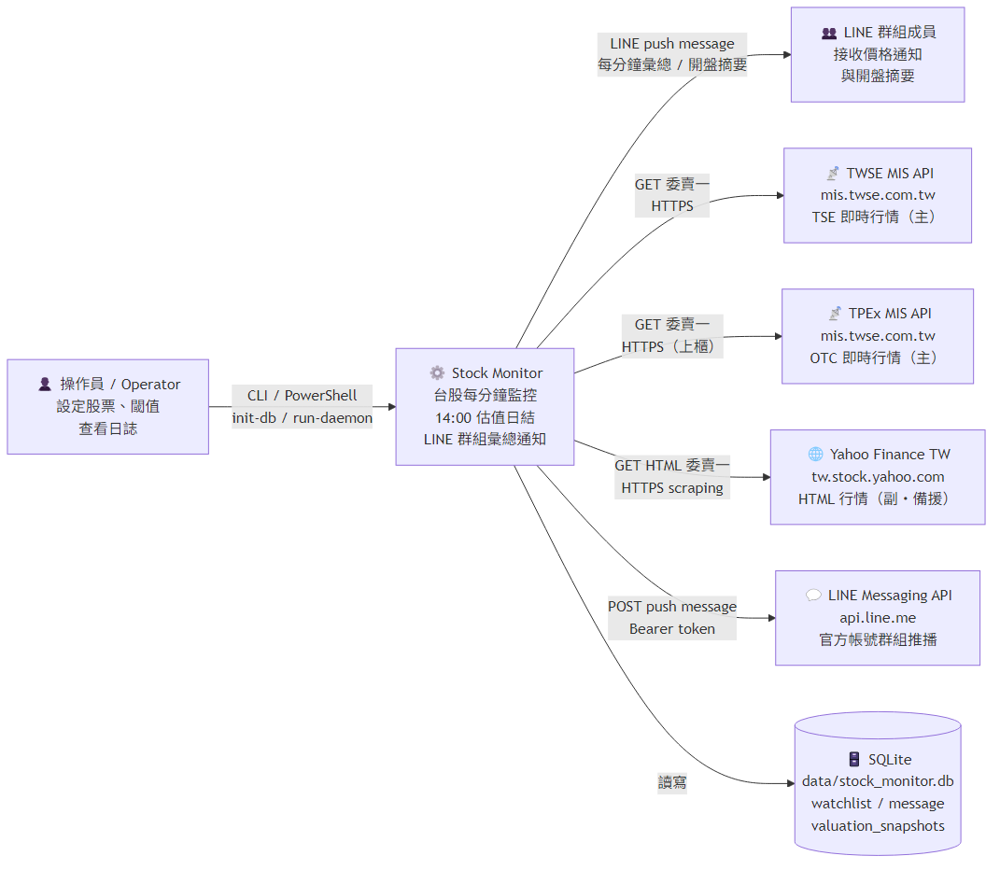
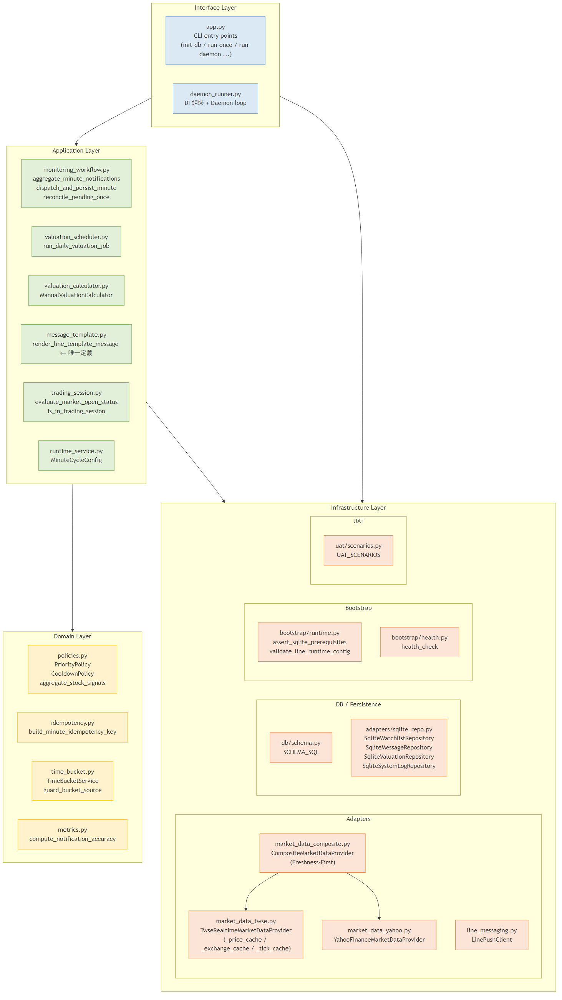
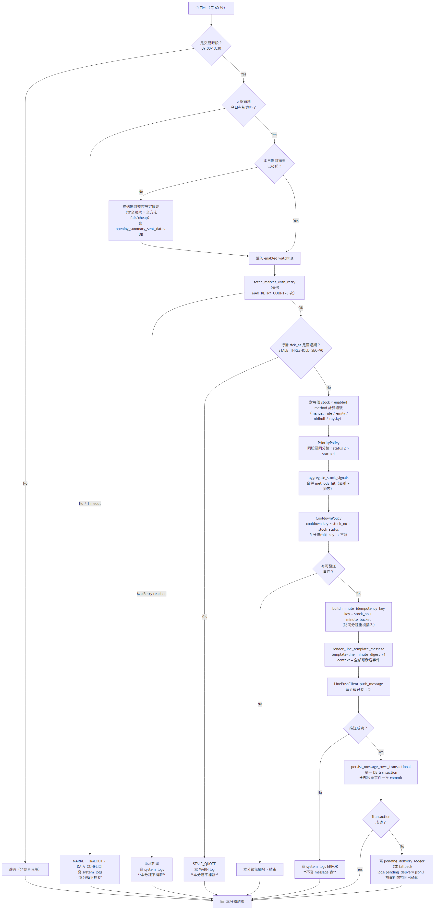
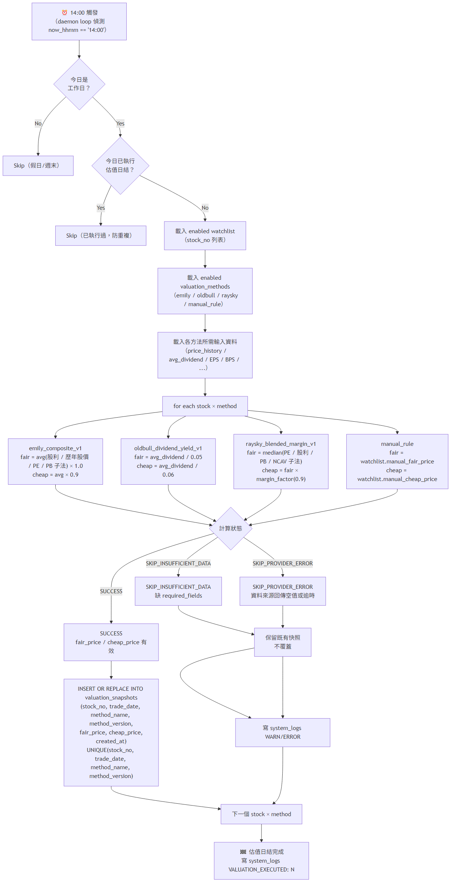
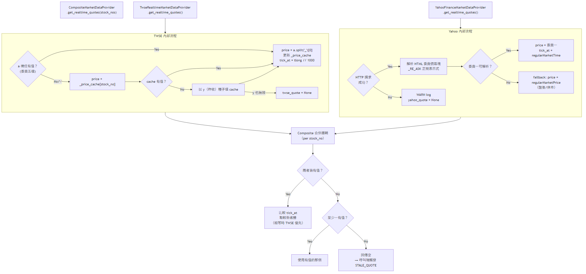
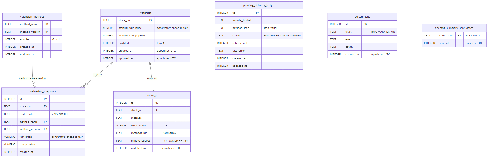
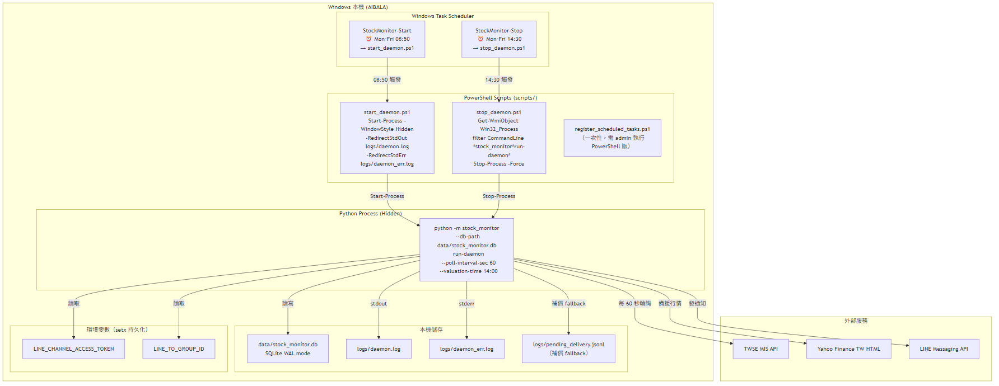

# Architecture Documentation

版本：v1.0 ｜ 最後更新：2026-04-14  
對齊文件：[EDD_Stock_Monitoring_System.md](../../EDD_Stock_Monitoring_System.md)、[ADR.md](../../ADR.md)

---

## 目錄導覽

| 圖 | 層次 | 描述 | PNG 預覽 |
|---|---|---|---|
| [01-system-context.md](diagrams/01-system-context.md) | C4 L1 | 系統邊界、外部參與者與依賴服務 |  |
| [02-clean-architecture.md](diagrams/02-clean-architecture.md) | C4 L2 | Clean Architecture 四層依賴關係與模組對應 |  |
| [03-intraday-flow.md](diagrams/03-intraday-flow.md) | 行為 | 盤中每分鐘監控主流程 |  |
| [04-valuation-flow.md](diagrams/04-valuation-flow.md) | 行為 | 每日 14:00 估值日結流程 |  |
| [05-market-data-adapter.md](diagrams/05-market-data-adapter.md) | 介面 | 雙行情來源 Freshness-First 聚合策略 |  |
| [06-data-model.md](diagrams/06-data-model.md) | 資料 | SQLite ER 圖（[06-data-model.png](images/06-data-model.png)）+ 補償流程（[06-data-model-2.png](images/06-data-model-2.png)） |  |
| [07-deployment.md](diagrams/07-deployment.md) | 部署 | 部署拓撲（[07-deployment.png](images/07-deployment.png)）+ Process 生命週期（[07-deployment-2.png](images/07-deployment-2.png)） |  |

> PNG 檔位於 [images/](images/)，由 `scripts/generate_arch_diagrams.mjs` 自動產生。  
> 更新圖定義後執行 `node scripts/generate_arch_diagrams.mjs` 重新產生所有 PNG。

---

## 圖檔渲染說明

所有圖使用 [Mermaid](https://mermaid.js.org/) 文字格式，支援以下方式直接渲染：

| 工具 | 方式 |
|---|---|
| **GitHub / GitLab** | Push 後在 Web UI 自動渲染 `.md` 內的 ` ```mermaid ` 區塊 |
| **VS Code** | 安裝 [Mermaid Preview](https://marketplace.visualstudio.com/items?itemName=bierner.markdown-mermaid) 擴充套件 |
| **Mermaid Live Editor** | 複製圖定義貼至 [https://mermaid.live](https://mermaid.live) |
| **CLI 匯出 PNG（本專案）** | `node scripts/generate_arch_diagrams.mjs`（從專案根目錄執行） |
| **CLI 匯出 PNG/SVG（單檔 `.mmd`）** | `npx @mermaid-js/mermaid-cli -i input.mmd -o output.png -b white` |

> ⚠️ **注意**：不要直接對 `.md` 執行 `npx mmdc`。mmdc 對 `.md` 輸入會自動加 `-1`、`-2` 索引後綴在輸出檔名，導致產生 `01-system-context-1.png` 等重複副本。本專案統一透過 `scripts/generate_arch_diagrams.mjs` 擷取 `.md` 內的 mermaid 區塊並正確命名輸出。 |

---

## 文件維護原則（業界慣例）

本目錄遵循 **C4 Model** + **arc42** 精神組織文件：

```
docs/
  architecture/
    README.md           ← 本檔（索引 + 維護說明）
    diagrams/           ← 各層次圖
      01-*.md           ← C4 L1: System Context
      02-*.md           ← C4 L2: Container/Component
      03-*.md           ← 行為流程圖（Sequence/Flowchart）
      ...
  adr/                  ← Architecture Decision Records（如需拆出）
```

**何時更新這裡的圖**：
- 新增外部依賴（修改 01、05）
- 新增模組或移動層次（修改 02）
- 修改主流程邏輯（修改 03/04）
- Schema 變更（修改 06）
- 部署方式改變（修改 07）

**不需要更新的情況**：
- 純業務邏輯微調（不影響架構邊界）
- 配置參數調整
- 測試增加

**更新 PNG 的標準流程**：
```bash
# 1. 修改任一 diagrams/*.md 內的 mermaid 區塊
# 2. 在專案根目錄執行（需 Node.js）：
node scripts/generate_arch_diagrams.mjs
# 3. 將更新的 .md + images/*.png 一起 commit
```

---

## 相關文件連結

- [EDD - 工程設計文件](../../EDD_Stock_Monitoring_System.md)
- [ADR - 架構決策記錄](../../ADR.md)
- [PDD - 產品需求文件](../../PDD_Stock_Monitoring_System.md)
- [OPERATIONS_RUNBOOK.md](../../OPERATIONS_RUNBOOK.md)
