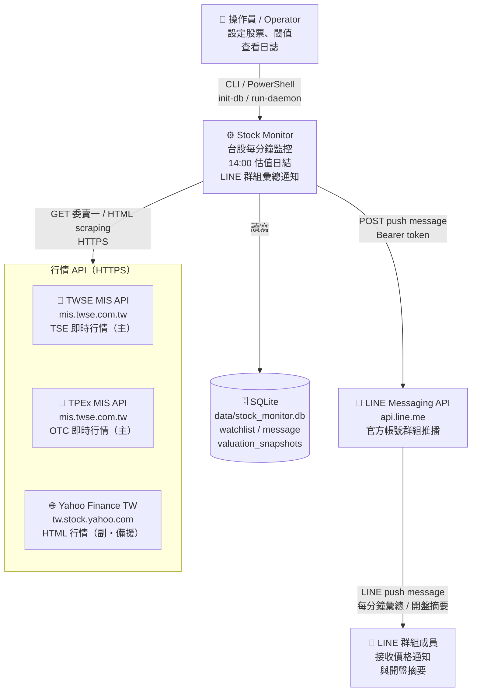

# 01 — System Context（C4 Level 1）

> **C4 L1** 描述系統與外部世界的邊界。  
> 對齊 EDD §1、§3.3、§7。

---

## 1.1 系統說明

| 項目 | 說明 |
|---|---|
| 系統名稱 | Stock Monitor（台股監控與通知系統） |
| 部署形式 | 本機 Windows 單機 Python 程序 |
| 核心功能 | 盤中每分鐘价格監控 + LINE 群組通知 + 每日 14:00 估值日結 |
| 外部依賴 | TWSE MIS API、Yahoo Finance TW HTML、LINE Messaging API、SQLite（本機） |

---

## 1.2 系統情境圖

---

## 1.3 外部系統說明

| 外部系統 | 角色 | 備註 |
|---|---|---|
| TWSE MIS API | 行情主來源 | 委賣五檔 `a` 欄位；`a` 空時讀 `_price_cache` |
| Yahoo Finance TW | 行情副來源 | HTML scraping；盤後 fallback `regularMarketPrice` |
| LINE Messaging API | 通知輸出 | Bearer token；每分鐘最多 1 封；CR-SEC-01 token 不得 log |
| SQLite（本機） | 狀態持久化 | WAL mode；JSON1 必須可用（fail-fast） |
