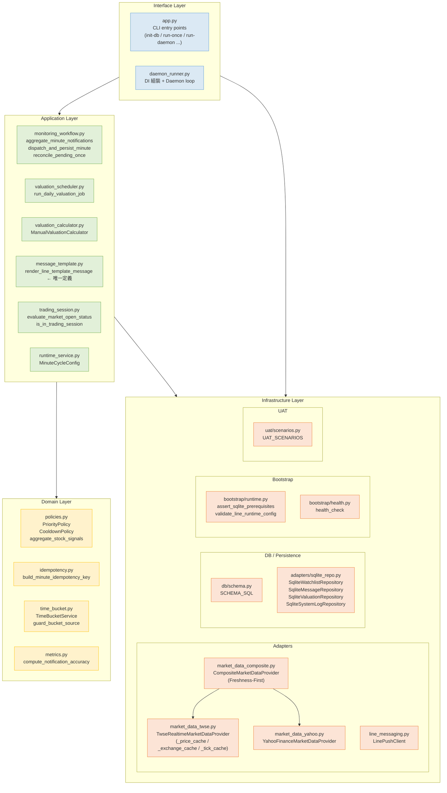

# 02 — Clean Architecture 層次圖（C4 Level 2）

> **C4 L2** 描述系統內部的模組分層與依賴方向。  
> 對齊 EDD §3.1、ADR-001（Clean Architecture 分層）。

---

## 2.1 分層原則

```
外層依賴內層，內層不知道外層存在。
Domain 是核心，不依賴任何 adapter 或框架。
```

| 層次 | 職責 | 禁止 |
|---|---|---|
| **Interface** | CLI 入口、Daemon loop 組裝 | 不可含業務邏輯 |
| **Application** | Use Case / 流程協調、模板渲染 | 不可直接操作 DB 或 HTTP |
| **Domain** | 純業務規則（Policy、Idempotency、TimeBucket） | 不可 import infra 或 application |
| **Infrastructure** | Adapter 實作（HTTP、DB、LINE） | 不可含業務規則 |

---

## 2.2 模組依賴圖



---

## 2.3 關鍵架構規則（CR 改善項）

| 規則 | 描述 | 來源 |
|---|---|---|
| CR-ARCH-01 | 估值計算邏輯在 `application/valuation_calculator.py`，不在 `app.py` | ADR |
| CR-ARCH-03 | `render_line_template_message` 只在 `message_template.py` 定義一次 | EDD §7.6 |
| CR-ARCH-04 | DI 組裝在 `daemon_runner.py`，`app.py` 只做 CLI parse | ADR |
| CR-SEC-01 | `LinePushClient.channel_access_token` 加 `field(repr=False)` | EDD §7.1 |
| CR-SEC-03 | 無效時區名稱立即 `raise ValueError`，禁止靜默 fallback UTC | ADR |
