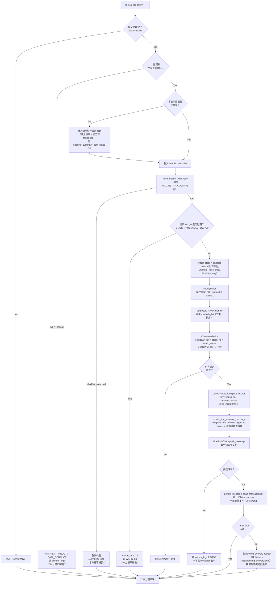

# 03 — 盤中每分鐘監控主流程

> 對齊 EDD §4.1、§2.1–§2.6。

---

## 3.1 主流程 Flowchart

---

## 3.2 冷卻 & 冪等說明

| 機制 | 鍵 | 作用 |
|---|---|---|
| **冷卻** | `stock_no + stock_status` | 5 分鐘內同鍵不重發；冷卻期不更新 `message.update_time` |
| **冪等** | `stock_no + minute_bucket` | 防同分鐘因重啟重複插入；使用 `INSERT ... ON CONFLICT DO UPDATE` |

---

## 3.3 跳過分鐘不補發規則

以下情境直接跳過，**不在後續分鐘補發過期訊號**：
- `MARKET_TIMEOUT` — 大盤資料逾時
- `STALE_QUOTE` — 行情 tick_at 超過 90 秒
- `DATA_CONFLICT` — 大盤資料衝突
- 重試耗盡（`MAX_RETRY_COUNT=3`）
