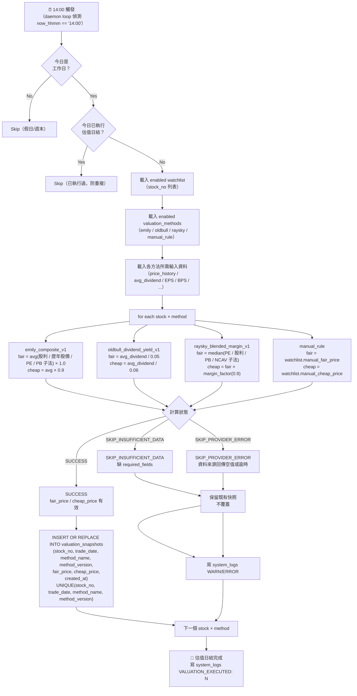

# 04 — 每日 14:00 估值日結流程

> 對齊 EDD §4.2、§9.1、§9.2。

---

## 4.1 估值日結 Flowchart

---

## 4.2 三方法公式速查

| 方法 | fair_price 公式 | cheap_price 公式 |
|---|---|---|
| `emily_composite_v1` | `avg(股利法/歷年股價法/PE法/PB法 fair) × 安全邊際` | `fair × 0.9` |
| `oldbull_dividend_yield_v1` | `avg_dividend ÷ 0.05` | `avg_dividend ÷ 0.06` |
| `raysky_blended_margin_v1` | `median(PE/股利/PB/NCAV 子法 fair)` | `fair × margin_factor(0.9)` |
| `manual_rule` | `watchlist.manual_fair_price` | `watchlist.manual_cheap_price` |

---

## 4.3 估值狀態說明

| 狀態 | 意義 | 對快照的影響 |
|---|---|---|
| `SUCCESS` | 計算完成，資料充足 | 寫入（upsert）`valuation_snapshots` |
| `SKIP_INSUFFICIENT_DATA` | required fields 缺失 | **不覆蓋** 既有快照，寫 WARN log |
| `SKIP_PROVIDER_ERROR` | 資料來源失敗 | **不覆蓋** 既有快照，寫 ERROR log |

> 日結成功條件：至少一個 `stock × method` 為 `SUCCESS` 即視為 job 完成（允許部分 skip）。
