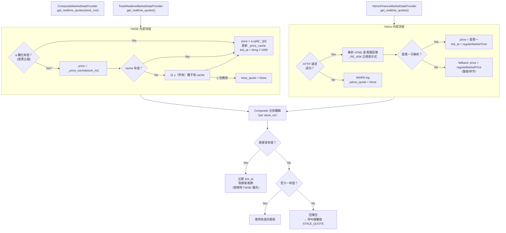

# 05 — 雙行情來源 Freshness-First 聚合策略

> 對齊 EDD §3.3、§3.4、ADR-014。

---

## 5.1 設計動機

| 問題 | 解決方式 |
|---|---|
| TWSE `a` 欄位在兩筆成交間短暫為 `-` | `_price_cache` 保留最後已知委賣一；冷啟動以昨收 `y` 種子 |
| Yahoo Finance v8 API 有 20 分鐘延遲 | 改用 HTML scraping 抓委賣一（即時） |
| 單來源故障造成監控中斷 | `CompositeMarketDataProvider` 以 `tick_at` 判斷新鮮度，自動 fallback |

---

## 5.2 Freshness-First 聚合流程



---

## 5.3 三個 Adapter 職責對比

| Adapter | 端點 | price 來源 | 失敗行為 |
|---|---|---|---|
| `TwseRealtimeMarketDataProvider` | `mis.twse.com.tw/stock/api/getStockInfo.jsp` | `a` 欄位委賣一 → cache → `y` 種子 | 若無任何快取，不加入結果 |
| `YahooFinanceMarketDataProvider` | `tw.stock.yahoo.com/quote/{stock_no}` | HTML 委賣價區塊 → fallback `regularMarketPrice` | WARN log，回傳空 dict，**不 raise** |
| `CompositeMarketDataProvider` | 委派以上兩者 | Freshness-First（tick_at 較新者勝） | 兩者皆空 → STALE_QUOTE |

---

## 5.4 冷啟動行為說明

```
首次輪詢，_price_cache 為空：
  → a 有值 → 正常取值 → cache update
  → a 為 '-' → cache 空 → 以 y（昨收）種子填 cache → 使用昨收作為暫代
  → a 為 '-' 且 y 也無效 → 本次不加入結果（STALE_QUOTE）
```
