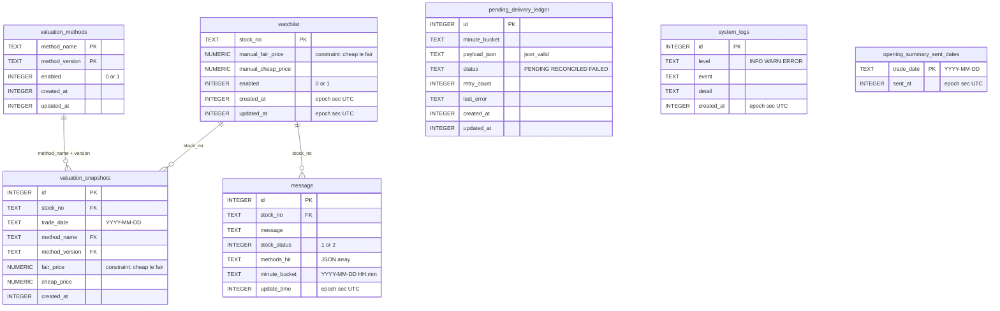
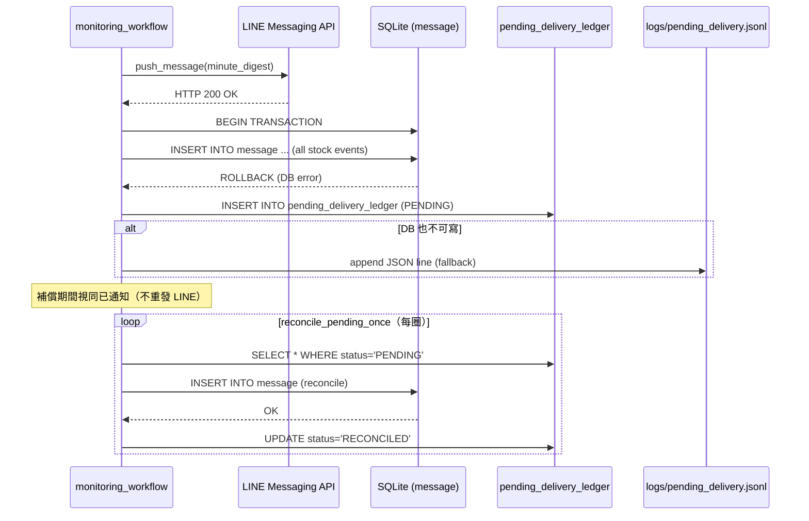

# 06 — 資料模型（SQLite ER 圖）

> 對齊 EDD §6。

---

## 6.1 ER 圖

---

## 6.2 關鍵索引與約束說明

| 表 | 關鍵約束 | 用途 |
|---|---|---|
| `watchlist` | `CHECK (manual_cheap_price <= manual_fair_price)` | 防止非法設定 |
| `valuation_methods` | `UNIQUE INDEX(method_name) WHERE enabled=1` | 同方法名只允許一個 enabled=1 |
| `valuation_snapshots` | `UNIQUE(stock_no, trade_date, method_name, method_version)` | 日結防重複；upsert 冪等 |
| `message` | `UNIQUE(stock_no, minute_bucket)` | 同分鐘冪等保護 |
| `message` | `INDEX(stock_no, stock_status, update_time DESC)` | 冷卻查詢效率 |
| `message.methods_hit` | `json_valid() AND json_type()='array'` | 強制 JSON array 格式 |
| `pending_delivery_ledger.status` | `CHECK IN('PENDING','RECONCILED','FAILED')` | 補償狀態合法性 |

---

## 6.3 補償流程資料流

