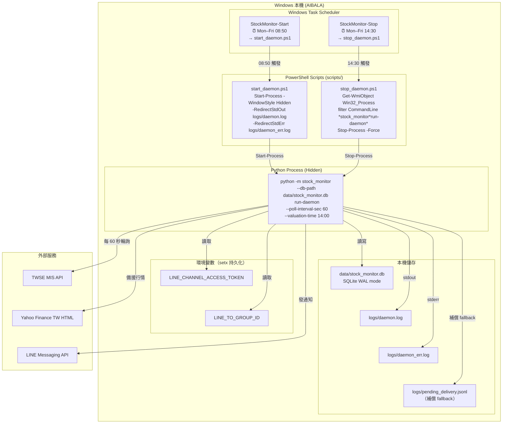
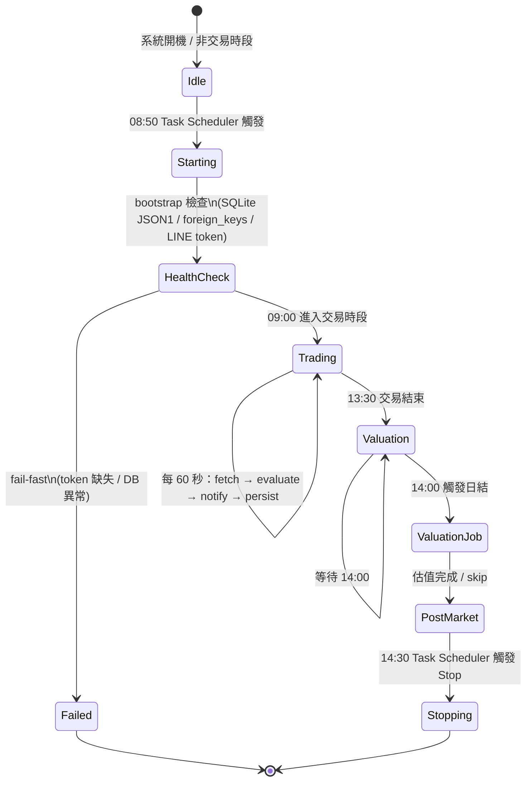

# 07 — 部署拓撲（Windows 本機單機）

> 對齊 OPERATIONS_RUNBOOK.md、EDD §8.1。

---

## 7.1 部署架構圖



---

## 7.2 排程工作清單

| 工作名稱 | 觸發時間 | 執行腳本 | 備註 |
|---|---|---|---|
| `StockMonitor-Start` | 週一至週五 08:50 | `scripts/start_daemon.ps1` | `Start-Process -WindowStyle Hidden`，PID 寫入 Event Log |
| `StockMonitor-Stop` | 週一至週五 14:30 | `scripts/stop_daemon.ps1` | 以 CommandLine 識別 PID，`Stop-Process -Force` |

---

## 7.3 Process 生命週期



---

## 7.4 Log 檔位置

| 檔案 | 內容 |
|---|---|
| `logs/daemon.log` | daemon 標準輸出（INFO / WARN 事件） |
| `logs/daemon_err.log` | daemon 標準錯誤（Python exception traceback） |
| `logs/pending_delivery.jsonl` | DB 不可寫時的補償記錄（JSONL fallback） |
| SQLite `system_logs` 表 | 結構化事件記錄（可 SQL 查詢） |

---

## 7.5 快速維運指令

```powershell
# 查詢排程狀態與下次執行時間
schtasks /Query /TN "StockMonitor-Start" /FO LIST
schtasks /Query /TN "StockMonitor-Stop" /FO LIST

# 手動立即啟動
schtasks /Run /TN "StockMonitor-Start"

# 手動立即停止
schtasks /Run /TN "StockMonitor-Stop"

# 查看最近 system_logs（需進入 Python）
python -c "
import sqlite3
conn = sqlite3.connect('data/stock_monitor.db')
rows = conn.execute('''
  SELECT datetime(created_at, 'unixepoch', '+8 hours') AS ts, level, event, detail
  FROM system_logs ORDER BY id DESC LIMIT 20
''').fetchall()
[print(r) for r in rows]
conn.close()
"

# 手動執行估值（非 14:00 也可強制）
python -m stock_monitor --db-path data/stock_monitor.db valuation-once
```
