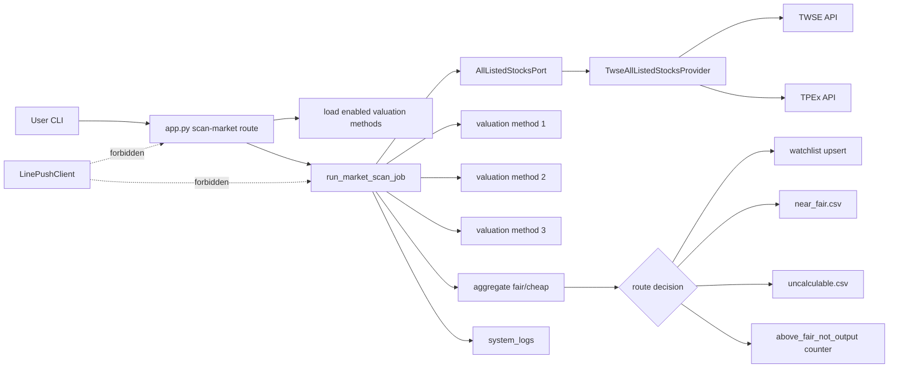
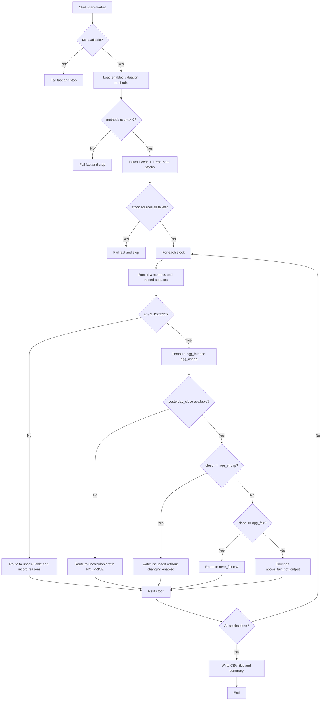
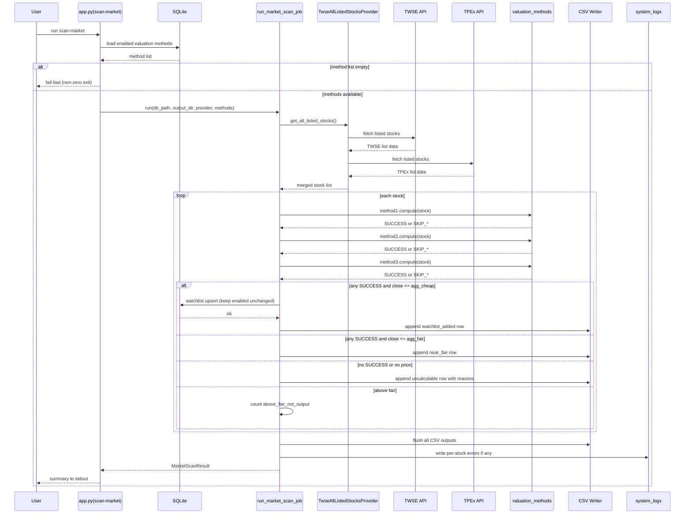

# 08 — 全市場估值掃描（FR-19）

> 對齊 EDD §14.9、§14.10、§14.11。

---

## 8.1 架構圖（Component View）

```mermaid
flowchart LR
  U[User CLI] --> A[app.py scan-market route]
  A --> B[load enabled valuation methods]
  A --> C[run_market_scan_job]

  C --> D[AllListedStocksPort]
  D --> E[TwseAllListedStocksProvider]
  E --> F[TWSE API]
  E --> G[TPEx API]

  C --> H[valuation method 1]
  C --> I[valuation method 2]
  C --> J[valuation method 3]

  C --> K[aggregate fair/cheap]
  K --> L{route decision}
  L --> M[watchlist upsert]
  L --> N[near_fair.csv]
  L --> O[uncalculable.csv]
  L --> P[above_fair_not_output counter]

  C --> Q[system_logs]

  R[LinePushClient] -. forbidden .-> A
  R -. forbidden .-> C
```

---

## 8.2 掃描流程圖（Flowchart）

```mermaid
flowchart TD
  S[Start scan-market] --> DBCHECK{DB available?}
  DBCHECK -- No --> F1[Fail fast and stop]
  DBCHECK -- Yes --> MLOAD[Load enabled valuation methods]

  MLOAD --> MCHECK{methods count > 0?}
  MCHECK -- No --> F2[Fail fast and stop]
  MCHECK -- Yes --> STOCKS[Fetch TWSE + TPEx listed stocks]

  STOCKS --> ACHECK{stock sources all failed?}
  ACHECK -- Yes --> F3[Fail fast and stop]
  ACHECK -- No --> LOOP[For each stock]

  LOOP --> PM[Run all 3 methods and record statuses]
  PM --> SUCCESS{any SUCCESS?}

  SUCCESS -- No --> U1[Route to uncalculable and record reasons]
  SUCCESS -- Yes --> AGG[Compute agg_fair and agg_cheap]
  AGG --> PRICE{yesterday_close available?}

  PRICE -- No --> U2[Route to uncalculable with NO_PRICE]
  PRICE -- Yes --> CHEAP{close <= agg_cheap?}

  CHEAP -- Yes --> W[watchlist upsert without changing enabled]
  CHEAP -- No --> FAIR{close <= agg_fair?}

  FAIR -- Yes --> N[Route to near_fair.csv]
  FAIR -- No --> AFO[Count as above_fair_not_output]

  W --> NEXT[Next stock]
  N --> NEXT
  U1 --> NEXT
  U2 --> NEXT
  AFO --> NEXT
  NEXT --> DONE{All stocks done?}
  DONE -- No --> LOOP
  DONE -- Yes --> OUT[Write CSV files and summary]
  OUT --> END[End]
```

---

## 8.3 循序圖（Sequence Diagram）

```mermaid
sequenceDiagram
  participant U as User
  participant CLI as app.py(scan-market)
  participant Repo as SQLite
  participant Scan as run_market_scan_job
  participant Stocks as TwseAllListedStocksProvider
  participant TWSE as TWSE API
  participant TPEx as TPEx API
  participant VM as valuation_methods
  participant CSV as CSV Writer
  participant LOG as system_logs

  U->>CLI: run scan-market
  CLI->>Repo: load enabled valuation methods
  Repo-->>CLI: method list
  alt method list empty
    CLI-->>U: fail-fast (non-zero exit)
  else methods available
    CLI->>Scan: run(db_path, output_dir, provider, methods)
    Scan->>Stocks: get_all_listed_stocks()
    Stocks->>TWSE: fetch listed stocks
    TWSE-->>Stocks: TWSE list data
    Stocks->>TPEx: fetch listed stocks
    TPEx-->>Stocks: TPEx list data
    Stocks-->>Scan: merged stock list

    loop each stock
      Scan->>VM: method1.compute(stock)
      VM-->>Scan: SUCCESS or SKIP_*
      Scan->>VM: method2.compute(stock)
      VM-->>Scan: SUCCESS or SKIP_*
      Scan->>VM: method3.compute(stock)
      VM-->>Scan: SUCCESS or SKIP_*

      alt any SUCCESS and close <= agg_cheap
        Scan->>Repo: watchlist upsert (keep enabled unchanged)
        Repo-->>Scan: ok
        Scan->>CSV: append watchlist_added row
      else any SUCCESS and close <= agg_fair
        Scan->>CSV: append near_fair row
      else no SUCCESS or no price
        Scan->>CSV: append uncalculable row with reasons
      else above fair
        Scan->>Scan: count above_fair_not_output
      end
    end

    Scan->>CSV: flush all CSV outputs
    Scan->>LOG: write per-stock errors if any
    Scan-->>CLI: MarketScanResult
    CLI-->>U: summary to stdout
  end
```
